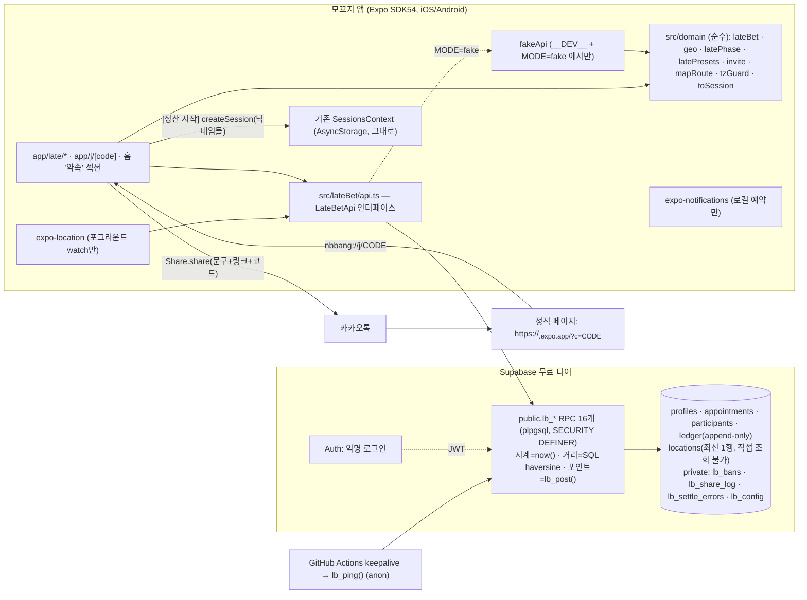
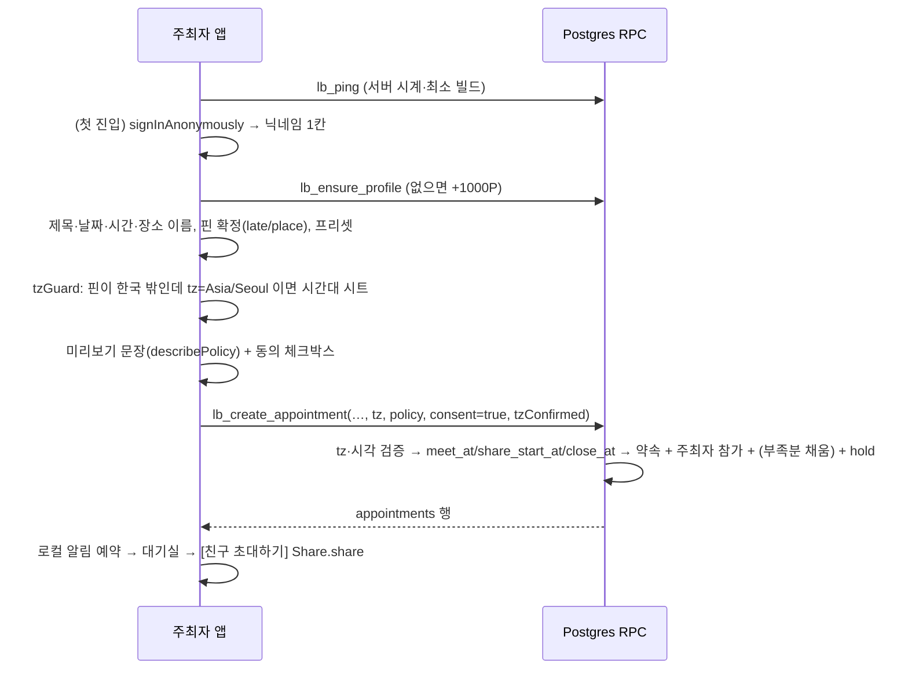

# 모꼬지 '약속 내기' 최종 설계서

- 상태: 구현 착수용 최종본 (2026-09-17). 통합 설계서에 적대적 비평 30건을 판정해 반영했다(맨 끝 부록).
- 이 문서만 읽고 구현할 수 있게 썼다. 마이그레이션 SQL·테스트 SQL 전문이 부록 A~D에 들어 있다. 예전 임시 폴더의 `migration.sql`은 더 이상 기준이 아니다.
- 검증 상태: 부록 A의 SQL은 로컬 PostgreSQL 16.14에서 `stub.sql → 마이그레이션 → scenario.sql`로 돌려 단언 88개가 전부 통과했고, 현재 `src/domain/lateBet.ts`로 만든 패리티 벡터 3,000건에서 불일치 0건이었다(익명 아닌 `authenticated` 롤로 실행). 동시성(병렬 체크인·병렬 정산) 테스트는 아직 안 돌렸다 → P3 과제.
- 리포: `/Users/byungheemin/.openclaw/workspace/nbbang`. 이 문서 외에는 리포에 아무것도 쓰지 않았다.

---

## 요약 (오너용)

1. 친구들과 약속을 만들고 각자 포인트를 건다. 제시간에 장소 반경 안에 들어오면 돌려받고, 늦으면 깎이고, 깎인 포인트는 제시간에 온 사람들이 나눠 갖는다. 끝나면 [정산 시작]으로 기존 정산 화면에 닉네임이 그대로 넘어간다.
2. 서버는 Supabase 하나뿐이다. 돌아가는 서버 프로그램·Edge Function·Realtime·크론이 전부 없다. 앱이 DB 함수 16개를 부르고, 5초마다 새로 물어본다(폴링).
3. 도착 시각·거리·포인트 계산은 전부 서버가 한다. 폰 시계는 화면 카운트다운에만 쓴다.
4. 위치는 "앱을 켜 둔 동안만" 공유된다. 서버에는 사람당 마지막 좌표 1개만 있고, 3분 지나면 친구에게 안 보이고, 10분 지나면 지워지고, 도착하면 바로 지워진다. 화면에 [위치 공유 끄기]가 있다.
5. 위치 공개가 시작된 뒤(=잠금 뒤)에 링크로 들어온 사람은 주최자가 [수락]해야 참여되고, 그 전에는 아무 위치도 못 본다. 초대 코드가 단톡방 밖으로 새도 위치가 새지 않게 하려는 장치다. 당일 번개 약속은 만들자마자 잠기므로 주최자가 친구들을 한 명씩 수락해야 한다.
6. 친구가 한 명이라도 들어온 뒤에는 시간·장소·내기 조건을 못 바꾼다. 바꾸려면 [취소하고 새로 만들기](전원 환불 → 새 링크). 혼자일 때는 뭐든 고칠 수 있다.
7. 포인트는 가상이다. 시작 1,000P, 한 약속에 최대 300P. 포인트가 모자라면 참여할 때 부족분을 자동으로 채워 준다(가진 것 전부가 1,000P 미만일 때). 포인트 때문에 친구가 약속에서 빠지는 일은 없다.
8. 초대 링크는 무료 정적 페이지 1장(EAS Hosting) → [앱에서 열기] 버튼. 앱이 없으면 설치 안내 + 초대 코드 직접 입력.
9. 새 네이티브 빌드(0.4.0)가 한 번 필요하다(지도·위치·알림). 그 뒤 화면·문구·서버 함수 변경은 OTA와 SQL로 나간다.
10. 오너가 직접 할 일: 구글맵 안드로이드 키, Supabase 프로젝트 생성+익명 로그인 켜기+키 전달, `db push`, 빌드·TestFlight 공개 링크, APK 올릴 공개 저장소, GitHub 시크릿 2개. (선택: 카카오 장소 검색 키, Firebase 파일.) Supabase가 없어도 P0·P1(화면 전부·지도·가짜 서버 리허설)은 끝낼 수 있다.
11. 오너가 정해 줘야 하는 것은 §10의 표다. 전부 권장 기본값이 있고, 답이 없으면 기본값으로 간다.
12. 가장 큰 위험 셋: (a) 무료 Supabase가 1주일 조용하면 잠든다 → 하루 2번 깨우는 워크플로를 둔다. (b) GPS 조작은 완전히 못 막는다 → 포인트에 돈 가치를 붙이지 않는다. (c) 위치를 남에게 보여 주는 서비스라 공개 출시 전에 위치정보법 신고를 검토해야 한다.

---

## 0-1. 오너 확정 흐름 (2026-09-18) — 최우선 명세

**이 절이 본문의 어떤 문장보다 우선한다.** 본문 절은 고치지 않았고, 무효가 된 항목은 아래 둘째 표에서 가리킨다. 같은 날 앞서 적었던 '오너 결정 변경 3건'(초대 명단·전원 참여 시 자동 잠금·30분 꼬리) 중 **'전원 참여 시 자동 잠금(rosterCompleteAt = lockedAt)'과 '위치 공개 시점(N분 전)' 설정은 이 절로 폐기**됐고, 초대 명단·시작 전 변경 + 차액·시작 후 미루기/장소만·30분 꼬리는 유지된다. 클라이언트 계약(타입·API·phase)은 `docs/late-bet-p0-handoff.md` 계약서에, SQL(부록 A~D)은 [rules-sql] 이 같은 명세로 고친다. `src/lateBet/fakeApi.ts` 가 참조 구현이다.

### 한 줄 요약

**주최자가 약속을 만들고 친구를 초대 → 친구들이 수락(명단에서 자기 이름 고르고 포인트 걸기) → 주최자가 [시작하기]를 한 번 누르면 그 순간부터 전원 위치가 서로 보임 → 도착·지각 판정 → 정산.**

### 규칙 9개

| # | 주제 | 확정 규칙 |
|---|---|---|
| 1 | 위치 공개 시점 설정 | **삭제.** `LatePolicy.shareLocationMinutesBefore` 를 타입·정규화·프리셋·`describePolicy`·화면 입력·SQL 컬럼/CHECK 에서 전부 뺀다. `locationShareWindow(policy, deadlineMs, startedAtMs)`: `startMs = startedAtMs`, `endMs = closeAtMs`(전액 몰수 시각 + 30분, 상한 마감 + 180분, 전액 몰수 시각이 없으면 마감 + 60분). `startedAtMs` 가 null 이면 공개 창 없음(`isLocationShared = false`) |
| 2 | 잠금 → 시작 | `rosterCompleteAt`/`lockedAt`(전원 참여 시 자동 잠금) 삭제 → **`startedAtMs`** = 주최자가 [시작하기]를 누른 서버 시각(`appointments.started_at`) |
| 3 | 시작 조건 | 주최자만. **약속 시각(마감) 전이면 언제든**(참여 인원 조건 없음 — 혼자면 화면이 "아직 아무도 안 들어왔어요" confirmDialog 뒤 진행). 약속 시각이 지나면 시작 불가(`LB_START_CLOSED`). 한 번 시작하면 되돌릴 수 없음(`LB_ALREADY_STARTED`). 취소는 별개(시작 전까지, 혼자면 언제든) |
| 4 | 시작 전(waiting) | 수락(참여)·나가기(환불)·내보내기(환불)·명단 편집·시간/장소/조건 전부 변경(배너 + 걸 포인트 차액 자동 에스크로/환불) 가능. **위치는 아무도 못 보고 체크인도 안 열림**(`not_open`) |
| 5 | 시작 후(live/overtime) | 위치 공개 = `startedAt` 있음 ∧ now ≤ `closeMs` ∧ 대상 미도착 ∧ 3분 내 갱신. 체크인은 시작 ~ 마감(`closeMs`). **아직 수락 안 한 초대 이름은 약속 시각까지 계속 수락 가능**(`LbJoinResult.started = true`, 들어오면 그때부터 위치 공개·판정 대상). 나가기·내보내기·명단 편집 불가(`LB_LEAVE_CLOSED`·`LB_KICK_CLOSED`·`LB_EDIT_FROZEN`). 변경은 시간 뒤로 미루기(+3h 상한)·장소만(`LB_EDIT_FROZEN` / `LB_POSTPONE_ONLY` / `LB_POSTPONE_TOO_FAR`). 마감 뒤 `LB_EDIT_CLOSED` |
| 6 | 정산(마감) 시점 | **시작이 안 된 약속은 약속 시각에 자동 무효**(`voidReason 'notStarted'`, 전원 환불 `refund/notStarted`, 전원 '오지 않음'). 약속 시각까지 수락 안 한 이름은 자동 삭제(환불 없음). 나머지는 `settleLateBet`. 정산 조건은 셋 중 하나: 마감 + 15초 / 전원 도착 ∧ 약속 시각 이후 / **시작 안 됨 ∧ 약속 시각 이후** |
| 7 | 화면 | 대기실 주최자 하단 primary **[시작하기]** + 설명 "누르면 모두의 위치가 서로 보여요. 아직 안 들어온 친구는 나중에 들어와도 돼요". 게스트에겐 "주최자가 시작하면 위치가 보여요". 시작 후 대기실 대신 live 화면. 홈 카드 배지: [모이는 중](시작 전) / [진행 중](시작 후) / [정산 확인 중] / [끝남]. 변경 배너(version 비교)는 유지 |
| 8 | fakeApi | 봇들이 차례로 수락(시작 후에 들어오는 봇 시나리오 포함), 주최자 시작은 실제 버튼으로. FakeDevPanel: '봇 한 명 수락', '시작 후 봇 수락', 시간 이동, 내 위치 이동, '봇 한 명 도착' 유지 |
| 9 | SQL | `appointments.started_at`, `lb_start`(주최자만·약속 시각 전), `lb_get_live` 공개 조건, `lb_settle` 의 notStarted 무효·미수락 삭제, `share_minutes_before` 컬럼/CHECK 제거, 잠금 관련 로직을 `started_at` 기준으로. 원칙 7개(§1) 유지 |
| R1 | 시작 후 시간 미루기 (공정성, 오너 결정 2026-09-19 — 규칙 5 의 '+3h 상한'을 대체) | **지금 약속 시각 전에만**(서버 시계 now < `meet_at`, 아니면 `LB_POSTPONE_AFTER_MEET` "약속 시각이 지나서 더 미룰 수 없어요"). 한도는 **시작하던 순간의 약속 시각(`start_meet_at`) + 180분 누적**(반복 미루기로 못 늘린다, 넘으면 `LB_POSTPONE_TOO_FAR` "처음 약속 시각에서 3시간까지만 미룰 수 있어요"). 앞당기기 불가(`LB_POSTPONE_ONLY`). 판정 순서: 앞당기기 → 약속 시각 지남 → 누적 초과 → '지금+5분'(`LB_TIME_IN_PAST`). 시작 전은 자유 |
| R2 | 시작 후 장소 바꾸기 (공정성) | 새 핀이 **시작하던 순간의 핀(`start_place_lat/lng`)에서 500m 이내**일 때만(누적 기준, 서버 haversine). 넘으면 `LB_MOVE_TOO_FAR` "시작한 뒤에는 처음 장소에서 500m 안으로만 옮길 수 있어요". 장소 이름만 바꾸는 건 제한 없음. 시작 전은 자유 |
| R3 | 조건 바꾼 직후 시작 금지 (공정성) | 시각·시간대·핀·정책 5개 중 하나라도 실제로 바뀐 순간 **주최자 말고 참가자가 1명 이상** 있으면 `material_changed_at` 기록. `lb_start` 는 그 뒤 5분 동안 `LB_START_COOLDOWN` "친구들이 바뀐 내용을 볼 수 있게, 바꾼 뒤 5분이 지나야 시작할 수 있어요"(`LB_ALREADY_STARTED`·`LB_START_CLOSED` 다음에 본다). 혼자일 때·장소 이름·메모·제목·명단 편집은 기록 안 함. 서버가 `startableAtMs`(변경 + 5분, 아직 미래일 때만)를 내려 준다 |
| R4 | 시작 후 내보내기 (공정성 — 규칙 5 의 '내보내기 불가'를 좁힘) | 주최자는 시작 후에도 **시작 뒤에 들어온 참가자(`claimed_at > started_at`, ms 비교·같은 ms 는 '시작 전')** 를 **마감(`close_at`) 전까지** 내보낼 수 있다: 전액 환불·좌표 즉시 삭제·재참여 금지(ban)·이름 칸은 빈 칸으로(약속 시각 전이면 다른 사람이 수락 가능). **시작 전부터 있던 참가자는 `LB_KICK_CLOSED`**(정산 직전 당첨자를 빼서 주최자 몫을 키우는 악용 방지 — 목적은 초대 코드 유출로 들어온 낯선 사람 대처). `lb_get_live` 참가자에 `joinedAfterStart` |

'마감'이라는 낱말: 이 절과 코드에서 **참여 마감·시작 마감·미수락 삭제·무효 판정의 기준은 약속 시각(`meetAtMs`)** 이고, **체크인·위치 공개·정산의 기준은 `closeMs`**(전액 몰수 + 30분 꼬리)다. 본문 §3.5 의 "마감" 도 약속 시각이다.

### 이로 인해 무효가 된 본문 항목

| 위치 | 무효가 된 내용 | 대신 |
|---|---|---|
| 요약 5 | "위치 공개가 시작된 뒤(=잠금 뒤)에 링크로 들어온 사람은 주최자가 [수락]해야…", "당일 번개 약속은 만들자마자 잠기므로…" | 초대 명단 + 주최자 [시작하기]. 수락제 없음. 시작 전에는 아무도 위치를 못 본다 |
| 요약 6 | "친구가 한 명이라도 들어온 뒤에는 시간·장소·내기 조건을 못 바꾼다. 바꾸려면 [취소하고 새로 만들기]" | 시작 전 전부 변경(차액 에스크로/환불 + 배너), 시작 후 미루기·장소만 |
| §0 표 '잠금 후 참여'·'잠금 후 강퇴'·'강퇴 뒤 재참여'·'시간·장소 변경'·'정책 수정' | 수락제·[참여 마감]·동결 전제 | 규칙 4·5. 차단 목록(`lb_bans`)은 내보내기 때 그대로 쓴다 |
| §0.1 | "`locationShareWindow.endMs = min(전액 시각, 마감+180분)`" | `closeAtMs` = 전액 시각 + 30분(상한 마감 + 180분, 없으면 + 60분). 시작은 `startedAtMs` |
| §1 구조도·§3.3 의 '공개 창 = 약속 N분 전 ~' | `share_start_at`, `shareLocationMinutesBefore` | 공개 창 = `started_at ~ close_at`. 정책에 공개 시점 없음 |
| §2.1 | `participants.state`(active·pending), `appointments.join_closed`, `share_minutes_before`, `share_start_at` | pending·join_closed·share_minutes_before·share_start_at 삭제. `appointments.started_at`(nullable) + 명단 테이블(이름·claimed_by·claimed_at) + 변경 이력(version·전후 스냅샷) — 정확한 DDL 은 [rules-sql] |
| §2.3 #3 `lb_peek_invite` | `needsApproval`·`joinClosed`·"닉네임 목록은 활성 멤버에게만" | 명단(이름·claimed·mine)·`startedAtMs`·`hostNickname` 을 누구에게나(자기 이름을 골라야 하므로) |
| §2.3 #4 `lb_join` | 잠금 전 active / 잠금 후 pending, 닉네임 자유 입력 | `lb_claim_slot(p_appt, p_name, p_version, p_consent)`: 명단의 이름을 고른다. `LB_NOT_INVITED`·`LB_SLOT_TAKEN`. 약속 시각 전이면 시작 뒤에도 가능(`started` 반환) |
| §2.3 #5 `lb_approve`, #8 `lb_set_join_closed` | 전부 | 삭제. 대신 `lb_edit_invitees(p_appt, add[], remove[])`(시작 전, 들어온 이름 삭제는 `LB_INVITEE_JOINED`, 시작 후 `LB_EDIT_FROZEN`) + **`lb_start(p_appt)`**(#17, 주최자만·약속 시각 전·한 번만) |
| §2.3 #6 `lb_leave`, #7 `lb_kick` | "pending 은 언제든", "잠금 전까지" 의 잠금 = 공개 시작 | 시작 전까지. kick 은 명단에서도 그 이름을 지운다. leave 는 이름을 명단에 남기고 빈 칸으로 되돌린다 |
| §2.3 #10 `lb_update_appointment` | "주최자, 혼자일 때만", `LB_EDIT_LOCKED` | `lb_edit_appointment(p_appt, patch, p_version)`: 규칙 4·5. 걸 포인트 차액 hold/refund(`policy_change`) |
| §2.3 #11 `lb_cancel` | "다른 활성 참가자가 있으면 잠금 전까지" 의 잠금 | 시작 전까지(혼자면 언제든) |
| §2.3 판정표 | "내가 pending → `pending`", "공개 창 전 → `not_open`" 의 공개 창 | pending 없음. `not_open` = 주최자가 아직 시작하지 않았다 |
| §2.3 `lb_settle` | "delete pending 행", 정산 조건 2개 | pending 없음. 조건 셋(규칙 6). 시작 안 됨 → `notStarted` 무효 + 전원 `refund/notStarted`. 미수락 이름 삭제 |
| §2.3 #14 `lb_vouch` | 공개 창 밖 `LB_CLOSED` 만 | 시작 전 `LB_NOT_STARTED`, 마감 뒤 `LB_CLOSED` |
| §2.3 #15 `lb_get_live` | "pending 에게는 자기 행만, 좌표 없음" / 좌표 조건(공개 창) | 전원이 전 행을 본다. 좌표는 **시작됨 ∧ 마감 전** ∧ 미도착 ∧ 3분 안일 때만. 시작 안 된 채 약속 시각이 지났으면 여기서 무효 정산 |
| §3.1 | "만들면 바로 위치 공개가 시작돼요…", 공개 시점 선택지 | 생성 폼에 명단 입력(InviteeEditor). 공개 시점 선택지 없음. 안내 "만든 뒤 대기실에서 [시작하기]를 누르면 그때부터 서로 위치가 보여요" |
| §3.2 3~4 | 닉네임 자유 입력, "잠금 후(`needsApproval=true`) [참여 요청 보내기] … [요청 취소]" | 명단에서 이름 고르기 + 동의 2개 → [100P 걸고 참여]. 명단에 빈 이름이 없으면 안내 문구. 이미 시작한 약속이면 참여 직후 live 화면 |
| §3.2 주최자 대기실 | 요청 카드 [수락][거절], [참여 마감] 토글 | 명단 편집(추가·빈 이름 삭제) + "아직 안 들어온 친구" 표시 + **[시작하기]** |
| §3.3 | "약속 N분 전부터 마감까지", 실행 조건의 '본인 active' | 공개 창 = 시작 ~ 마감. 보고·체크인은 시작 뒤에만 |
| §3.5 정산 조건·경합표 '참여 vs 주최자 수정' | 정산 조건 2개, "수정은 다른 참가자 행이 하나라도 있으면 거부" | 정산 조건 셋(규칙 6). 시작 전 수정은 항상 허용, version 으로 경합 감지(`LB_APPT_CHANGED`) |
| §3.6 전부 | 혼자일 때만 수정, 취소하고 새로 만들기, 잠금 후 변경·취소 불가 | 규칙 4·5. 취소는 시작 전까지(혼자면 언제든) |
| §3.7 | "참여 요청(pending)은 언제든 [요청 취소]", "잠금 후에는 요청 [거절]만", 잠금 = 공개 시작 | pending 없음. 나가기·내보내기는 시작 전까지 |
| §5.1 | `latePhase` 의 `pending`·`locked`, `fakeApi` 의 "승인·차단", `SHARE_BEFORE_CHOICES` | phase = `waiting | live | overtime | arrived | settling | settled | voided | canceled`. 새 파일 `changes.ts`(변경 배너 문구), `screens/InviteeEditor.tsx`, `screens/ConditionCard.tsx`(PendingView 에 있던 공유 조각). `latePhase.lateTimes`·`sharesImmediately`·`isLocked`·`isLocationVisible(잠금 기준)` 삭제 → `lateCloseMs`·`isStarted` |
| §5.3-A 배지 | [수락 대기]·[오늘] | [모이는 중](시작 전) / [진행 중](시작 후) / [정산 확인 중] / [끝남] |
| §5.3-B | 공개 시점 선택지, "만들면 바로 위치 공개…" 경고 | 제목 아래 '초대할 친구' 명단(InviteeEditor). 공개 시점 없음 |
| §5.3-D | 조건 변경 행의 "미리보기 새로고침"만 유지, 추가 행 | `LB_NOT_INVITED` "초대 명단에 없어요. 주최자에게 이름을 추가해 달라고 해주세요." / `LB_SLOT_TAKEN` / `LB_JOIN_CLOSED` 는 '약속 시각 지남·닫힘' |
| §5.3-E | "약속 1시간 전부터" 문구 | "주최자가 시작하면 서로 위치가 보여요" (`LocationPrimerProps.shareMinutesBefore` 삭제) |
| §5.3-F `pending`·`locked` 화면 | 전부 | 삭제. `waiting`(시작 전) 하나. 참가자 화면 상단에 변경 배너. 주최자 `live` 화면에는 안 들어온 이름 표시(명단 편집은 불가, 약속 시각에 자동 삭제) |
| §5.3-F `waiting` 주최자 버튼 | "약속 수정(혼자일 때만), [참여 마감] 토글, 요청 카드 [수락][거절]", 하단 "오후 6:30부터 서로 위치가 보여요" | 명단 편집·조건 변경(전부)·내보내기·취소 + primary **[시작하기]**("누르면 모두의 위치가 서로 보여요. 아직 안 들어온 친구는 나중에 들어와도 돼요"). 게스트 하단 "주최자가 시작하면 위치가 보여요" |
| §5.4 '수락 대기'·'내보내짐·거절됨'·'체크인 개시 전' 행 | pending 화면, "주최자가 요청을 받지 않았어요.", "체크인은 오후 6:30부터예요" | 삭제 / 내보내짐 문구만(`REMOVED_MESSAGE`) / `not_open` = "주최자가 시작하면 체크인할 수 있어요." |
| §5.5 | `LB_EDIT_LOCKED`, `LB_KICK_CLOSED`("위치 공개가 시작돼…")·"모두 들어와 약속이 잠겼어요" 계열 문구 | `LB_EDIT_LOCKED` 삭제. 추가: `LB_NOT_INVITED`·`LB_SLOT_TAKEN`·`LB_INVITEE_JOINED`·`LB_EDIT_FROZEN`·`LB_POSTPONE_ONLY`·`LB_POSTPONE_TOO_FAR`·**`LB_START_CLOSED`·`LB_ALREADY_STARTED`·`LB_NOT_STARTED`**. `LB_LEAVE_CLOSED`·`LB_KICK_CLOSED`·`LB_CANCEL_CLOSED`·`LB_EDIT_FROZEN`·`LB_POSTPONE_ONLY` 문구는 "이미 시작한 약속…" 계열(`src/lateBet/errors.ts`) |
| §10-2 | "잠금 = 위치 공개 시작 시각. 이후 나가기·취소·강퇴 불가", 공개 시점(30분~6시간 전) | 시작 = 주최자 [시작하기]. 공개 시점 설정 없음 |
| §10-4 | "잠금 후 참여는 주최자 수락제" 전부 | 초대 명단 |
| §10-5 | "친구가 들어온 뒤에는 변경 불가 → 취소하고 새로 만들기" | 규칙 4·5 |
| §10-6 | "잠금 후 핀이 틀린 걸 발견하면 못 고친다" | 시작 후에도 장소(핀·이름)는 고칠 수 있다 |
| §10-13 | "활성 20명 + 수락 대기 10명" | 명단 19명 + 주최자 = 20명. 수락 대기 없음 |
| §11 악용 '초대 코드 유출' 방어 | 수락제가 방어 장치였다 | 명단에 없는 이름은 들어올 수 없고, 남이 고른 이름은 고를 수 없다. 시작 전에는 아무 위치도 안 보이고, 주최자가 시작 전 내보내기(차단)로 정리한다 |
| 부록 A~D | pending·approve·join_closed·share_start_at·share_minutes_before·`LB_EDIT_LOCKED` 전제의 SQL·시나리오 | [rules-sql] 이 같은 명세로 고친다. 클라이언트 `fakeApi.ts` 가 참조 구현이다 |

---

## 0. 통합본에서 달라진 것 (한 표)

| 주제 | 통합 설계서 | 최종 |
|---|---|---|
| 잠금 후 참여 | 코드만 있으면 즉시 참여·위치 열람 | **참여 요청(pending) → 주최자 승인**. 승인 전에는 에스크로도 위치 열람도 없다 |
| 잠금 후 강퇴 | 잠금 뒤 들어온 미도착자는 강퇴 가능 | **삭제**. 활성 참가자 강퇴는 잠금 전에만. 잠금 후에는 '요청 거절'만 |
| 강퇴 뒤 재참여 | 가능 | 차단 목록(`lb_bans`) + 주최자 [참여 마감] 토글 |
| 시간·장소 변경 | version + ack + 미확인자 자동 환불(`lb_lock_in`) | **다른 사람이 있으면 변경 불가 → 취소하고 새로 만들기**. `seen_version`·`lb_ack_change`·`lb_lock_in` 삭제. `version`은 미리보기↔참여 사이 변경 감지용으로만 남김 |
| 정책 수정 | 혼자일 때 허용(재에스크로 없음 = 버그) | 혼자일 때 허용 + **옛 스테이크 환불 → 새 스테이크 에스크로** + 시각 재계산 + version+1 |
| 좌표 보존 | 도착·정산·취소 때만 삭제 | + **3분 지나면 응답에서 좌표 제거, 10분 지나면 서버에서 삭제**, 화면 이탈 시 `lb_stop_sharing`, [위치 공유 끄기] |
| 구제 | 300P 미만이면 20시간에 1회 300P까지 | **참여·생성 시 부족분 자동 채움**(잔액+열린 약속에 걸린 포인트 < 1,000일 때). `lb_claim_relief`·쿨다운 삭제 |
| 보증 도착 시각 | 누른 순간 | 대상이 '정확도는 나쁘지만 오차를 빼면 반경 안'이었던 **첫 서버 시각(`first_near_at`)**, 없으면 누른 순간 |
| 정산 시점 | `now() > close_at` | `now() > close_at + 15초`(경계 경합 방지). 잠금 전 전용 RPC는 락을 얻은 뒤 `clock_timestamp()`로 다시 검사 |
| 크론 | pg_cron 5분 백스톱 | **1차에서 제거**. 누군가 앱을 열면 정산. 좌표 청소는 모든 조회·핑이 겸한다 |
| keepalive | 'RPC 1건'(anon은 전부 거부됨) | anon 전용 `lb_ping()`(하트비트 1행 쓰기 + 오래된 좌표 청소 + 최소 빌드·설치 링크 반환) |
| 타임존 | 기기 tz, 서울이 아닐 때만 라벨 | 서버가 경도와 1.5시간 넘게 어긋나면 `LB_TZ_SUSPECT`, 라벨 상시 표시, 최소 도시 목록 선택 시트, `local_at`은 서버가 다시 씀 |
| 길찾기 | 장소 이름 검색 | **좌표 길찾기**(`mapRouteUrl`). 참여 카드·대기실에 핀 지도 |
| 프리셋 '전액 시점' | 50/50/30분(틀림) | 45/45/29분 '넘게'. 모든 문구는 `fullForfeitAtMs`에서 파생 |
| 가짜 서버 | env 없으면 자동 | `EXPO_PUBLIC_LATEBET_MODE=off/fake/live`. fake는 `__DEV__`에서만. env는 `eas env` |
| 법적 기록·연령 | P6 | 위치 제공 사실 로그·동의 시각·만 14세 확인을 **P2(첫 마이그레이션)** 에 포함 |
| 0.4.0 네이티브 | 위치·알림·지도 | + `SCHEDULE_EXACT_ALARM`, expo-web-browser·expo-crypto·expo-secure-store(코드 없이 표면만), (선택) Firebase 파일 |

### 0.1 직접 확인한 것

리포:

- `src/domain/lateBet.ts`·`geo.ts`는 테스트와 함께 존재한다. `fullForfeitAtMs = 마감 + grace + (ceil(stake/ppu) − 1) × unit`, `locationShareWindow.endMs = min(전액 시각, 마감+180분)`(단위 차감 0이면 마감+60분). SQL `private.lb_close_at`이 같은 식이다.
- `createSession(title, people, appointment?)`가 있다(`src/state/SessionsContext.tsx`). `mapSearchUrl`은 이름 검색 URL이다(`src/domain/appointment.ts:237`) — 약속 내기에서는 쓰지 않는다.
- app.json: `scheme: nbbang`, `runtimeVersion.policy: appVersion`, version 0.3.0, `newArchEnabled: true`, owner `untitled98`. `.gitignore`는 `.env*.local`만 막는다. `docs/`·`supabase/`·`public/`은 없다.
- `npm test`는 `tsx --test "src/**/*.test.ts"`다.

공식 문서(이번에 열어서 확인):

- Supabase 롤별 `statement_timeout`: anon 3초, authenticated 8초 (Timeouts 문서). 정산 여유 15초의 근거다.
- Supabase 'Hardening the Data API' 문서가 `alter default privileges for role postgres in schema public revoke …` 네 문장을 그대로 제시한다. 부록 A 맨 위에 그대로 넣었다.
- `eas update --environment <env>` 플래그가 있고 해당 환경의 EAS 환경변수만 쓴다(EAS environment variables 문서).
- 카카오맵 URL: `https://map.kakao.com/link/map/이름,위도,경도`, `https://map.kakao.com/link/to/이름,위도,경도` (카카오맵 Web API 가이드).
- expo-notifications: Android 12+에서 정확한 시각 알림에는 매니페스트에 `SCHEDULE_EXACT_ALARM`이 필요하다. Android 13은 알림 채널을 하나 만든 뒤에야 권한 프롬프트가 뜬다.

앞 단계들이 확인해 넘겨준 것(이번에 다시 열지는 않았다): Edge Function 기본 도메인은 `text/html`을 `text/plain`으로 바꾼다 / postgres_changes는 DELETE에 RLS를 적용하지 않는다 / 익명 로그인은 `authenticated` 롤 + JWT `is_anonymous` 클레임, IP당 시간당 30회, 자동 정리 없음 / 무료 프로젝트는 1주일 저활동 시 일시정지, 1년 안 복구 가능 / 안드로이드 맵 키는 `android.config.googleMaps.apiKey` / 안드로이드 `geocodeAsync`는 위치 권한이 선행돼야 한다.

---

## 1. 한눈에 보는 구조



### 원칙 7개

1. **쓰기는 RPC로만.** 테이블에는 쓰기 정책도 권한도 없다. 새 테이블을 추가해도 기본 권한이 없도록 default privileges를 회수한다.
2. **시각은 서버 `now()`, 거리는 서버 haversine.** RPC에 시각 파라미터가 없다. 클라이언트는 응답의 `serverNowMs`로 오프셋을 구해 표시에만 쓴다.
3. **약속 행 `FOR UPDATE`가 유일한 직렬화 지점.** 참여·승인·나가기·강퇴·수정·취소·위치 보고·보증·정산이 전부 이 락 아래에서 돈다. 여러 사람의 잔액을 건드릴 때는 항상 user_id 오름차순이다.
4. **포인트 이동은 `private.lb_post()` 한 곳.** 잔액 갱신과 원장 1행을 함께 쓴다. 정산은 상태 검사 + payout 유니크 인덱스 + 트랜잭션 끝 합계 0 단언으로 멱등하다.
5. **좌표는 사람당 최신 1행, 수명은 분 단위.** 읽기는 `lb_get_live`뿐이고 조건은 (약속 open) ∧ (공개 창 안) ∧ (보는 사람이 활성 멤버) ∧ (대상 미도착) ∧ (3분 안에 갱신됨)이다.
6. **본 적 없는 조건으로는 포인트가 걸리지 않는다.** 조건은 다른 사람이 생기면 동결된다. 참여는 미리보기에서 본 `version`과 서버 `version`이 같을 때만 된다.
7. **위치가 보이는 동안에는 주최자가 아는 사람만 들어온다.** 잠금 후 참여는 승인제다.

### 1차에서 뺀 것

Edge Function, Realtime, pg_cron, 서버 푸시, 백그라운드 위치, 카카오 로그인, 무효 투표, 포기 선언, 구경 참여·유령 참가자, 클라이언트 시각 소급, 위치 상호성, 전역 랭킹, 정산 데이터 서버 동기화, 웹·앱인토스에서의 약속 내기, 다른 사람이 있는 상태에서의 시간·장소 변경(ack 방식).

---

## 2. 데이터 모델

전문은 **부록 A**(`supabase/migrations/20260918000000_late_bet.sql`)다. 여기서는 구조와 규칙만 요약한다. 구현자는 부록 A를 그대로 파일로 옮긴다.

### 2.1 테이블

| 테이블 | 핵심 컬럼 | 비고 |
|---|---|---|
| `public.profiles` | `user_id`(auth.users FK, restrict), `nickname`(1~12), `balance ≥ 0` | balance는 원장의 캐시 |
| `public.appointments` | `invite_code`(8자), `host_id`, `title`, `local_at`(벽시계 문자열, 서버가 다시 씀), `tz`(IANA), `meet_at`, 장소 이름·메모·좌표, 정책 6개(`stake 0~300`, `radius_m 30~1000`, `unit_minutes 1~60`, `penalty_per_unit 0~300`, `grace_minutes 0~30`, `share_minutes_before 30~360`), `share_start_at`(=공개 시작=체크인 개시=잠금), `close_at`, `join_closed`, `status`(open·settled·voided·canceled), `void_reason`, `version` | CHECK `policy_reaches_full_within_cap`: 전액 몰수까지 180분 이내 |
| `public.participants` | PK(`appointment_id`,`user_id`), `nickname`, `state`(active·pending), `joined_at`, `consented_at`, `first_near_at`, `arrived_at`, `arrival_method`(gps·vouch), 도착 거리·정확도, `vouched_by`, 결과(`result_status`,`forfeited`,`received`) | pending은 도착할 수 없다(CHECK) |
| `public.locations` | PK(`appointment_id`,`user_id`), `lat`,`lng`,`accuracy_m`,`updated_at` | participants FK cascade. **권한·정책 없음** |
| `public.ledger` | `kind`(grant·relief·hold·refund·payout), `amount`, `balance_after ≥ 0`, `meta`(reason, anon) | UPDATE·DELETE·TRUNCATE 트리거로 거부. payout은 (약속,사람)당 1회, grant는 사람당 1회 유니크 |
| `private.lb_bans` | (`appointment_id`,`user_id`) | 강퇴·거절 시 차단 |
| `private.lb_share_log` | (`appointment_id`,`viewer_id`,`subject_id`), `first_at`,`last_at` | 위치 제공 사실(좌표 없음). 쌍당 1행, 5분에 한 번 `last_at` 갱신 |
| `private.lb_settle_errors` | `appointment_id`,`message`,`at` | 정산 실패 격리 기록 |
| `private.lb_config` | 1행: `heartbeat_at`,`min_build`,`ios_url`,`android_url` | keepalive 흔적 + 설치 링크 |

### 2.2 RLS와 권한 (부록 A의 2·6절)

- 모든 테이블 RLS 켬. `authenticated`에 SELECT만: `profiles`(내 것), `appointments`(내가 활성이든 대기든 멤버인 것), `participants`(내 행 + 내가 활성 멤버인 약속의 전원), `ledger`(내 것). `locations`와 `private.*`는 권한 자체가 없다.
- 시간 조건은 RLS가 아니라 RPC 안에 있다. RLS 정책식 안의 `now()` 평가 시점에 기대지 않는다.
- Realtime publication에 아무 테이블도 넣지 않는다.
- 공개 RPC는 전부 `security definer set search_path = ''`, 첫 줄 `private.lb_uid()`(미로그인 거부). 마이그레이션 끝의 do-block이 `public.lb_*`와 `private.*` 함수 전부에서 `public, anon, authenticated`의 EXECUTE를 회수한 뒤, `public.lb_*`만 `authenticated`에, `lb_ping`만 `anon`에도, RLS가 부르는 `lb_is_member`·`lb_is_active_member`만 `authenticated`에 다시 준다.
- `private.lb_post`·`lb_settle` 등은 definer RPC 안에서 소유자 권한으로만 실행된다. 누가 대시보드에서 `private`을 노출 스키마에 추가해도 EXECUTE가 없어 닿지 않는다(scenario.sql이 검사).
- 이후 마이그레이션 규칙: 새 테이블을 만들면 같은 파일에서 RLS를 켜고, 새 함수를 만들면 끝의 do-block을 다시 실행한다. scenario.sql의 권한 테스트에 새 테이블을 추가한다.

### 2.3 RPC 목록 (Edge Function 0개)

호출자는 앱(`authenticated`)이다. 오류는 `raise exception 'LB_XXX'`로 던지고 클라이언트 `errors.ts`가 한국어로 옮긴다(§5.5).

| # | 시그니처 | 누가·언제 | 판정 로직 요약 |
|---|---|---|---|
| 0 | `lb_ping() → jsonb{serverNowMs,minBuild,iosUrl,androidUrl}` | keepalive(anon), 앱이 약속 기능에 들어올 때 | 하트비트가 1시간 넘었으면 갱신, 오래된 좌표 청소 |
| 1 | `lb_ensure_profile(p_nickname) → profiles` | 기능 첫 진입·닉네임 변경 | 없으면 생성 + `grant +1000`(유니크로 1회). 닉네임은 보이지 않는 문자 제거 후 1~12자 |
| 2 | `lb_create_appointment(p_title,p_local_at,p_tz,p_place_name,p_place_note,p_lat,p_lng,p_policy jsonb,p_consent bool,p_tz_confirmed bool=false) → appointments` | 주최자 | 동의 필수, 열린 주최 약속 10개 이하, `lb_resolve_meet`(tz 검증·지금+5분~90일·경도 대비 1.5시간 초과면 `LB_TZ_SUSPECT`), `local_at`을 서버가 다시 씀, 주최자 자동 참여 + `lb_hold` |
| 3 | `lb_peek_invite(p_code) → jsonb` | 초대받은 사람 | 조건 전문·좌표·`version`·`needsApproval`·`joinClosed`·`memberCount`·`myState`·`myBalance`·`serverNowMs`. 닉네임 목록은 활성 멤버에게만. 차단된 계정에는 `LB_INVITE_NOT_FOUND` |
| 4 | `lb_join(p_code,p_nickname,p_version,p_consent) → jsonb{appointmentId,state}` | 초대받은 사람 | 행 락. 이미 멤버면 그대로 반환(멱등). open ∧ 참여 마감 아님 ∧ `clock_timestamp() < meet_at`. `p_version ≠ version` → `LB_APPT_CHANGED`. 닉네임 키(NFKC·공백·제로폭 제거·소문자) 중복 금지. **잠금 전**: active(최대 20) + `lb_hold`. **잠금 후**: pending(최대 10), 에스크로 없음 |
| 5 | `lb_approve(p_appt,p_target)` | 주최자 | `clock_timestamp() < meet_at`, 활성 20 미만. pending→active, `joined_at=now()`, 대상에게 `lb_hold`(부족하면 전체 롤백) |
| 6 | `lb_leave(p_appt)` | 참가자 | pending은 언제든 요청 철회. active는 잠금 전까지만, `refund(leave)`. 주최자는 불가 |
| 7 | `lb_kick(p_appt,p_target,p_ban=true)` | 주최자 | active 대상은 잠금 전까지만 + `refund(kicked)`. pending 대상은 언제든 거절. `p_ban`이면 차단 목록에 넣는다 |
| 8 | `lb_set_join_closed(p_appt,p_closed)` | 주최자 | 참여 마감 토글 |
| 9 | `lb_update_memo(p_appt,p_title,p_place_note)` | 주최자 | 열려 있는 동안 언제든. version 안 올림 |
| 10 | `lb_update_appointment(p_appt,p_local_at,p_tz,p_place_name,p_lat,p_lng,p_policy,p_tz_confirmed=false) → appointments` | 주최자, **혼자일 때만** | 다른 참가자 행(대기 포함)이 있거나 본인이 이미 도착했으면 `LB_EDIT_LOCKED`. `refund(policy_change)` → 갱신(시각은 새 정책 값으로 재계산) → `lb_hold(새 stake)` → `version+1` |
| 11 | `lb_cancel(p_appt)` | 주최자 | 다른 활성 참가자가 있으면 잠금 전까지만, 혼자면 언제든. 전원 `refund(canceled)`, 좌표 삭제 |
| 12 | `lb_report_location(p_appt,p_lat,p_lng,p_accuracy_m,p_mocked=false,p_share=true) → jsonb` | 약속 화면 포그라운드 루프 + [도착 확인] | 아래 판정표 |
| 13 | `lb_stop_sharing(p_appt)` | 화면 이탈·백그라운드·토글 OFF | 내 좌표 행 삭제 |
| 14 | `lb_vouch(p_appt,p_target)` | GPS로 도착한 참가자 | 공개 창 안, 본인 불가, 보증자는 `arrival_method='gps'`. 대상 `arrived_at = coalesce(first_near_at, now())` |
| 15 | `lb_get_live(p_appt) → jsonb` | 약속 화면 폴링, 홈에서 마감 지난 open 약속 | 멤버 확인 → (조건 되면) `lb_try_settle` → 좌표 청소 → **멤버십 재확인** → 제공 로그 → 페이로드. pending에게는 자기 행만, 좌표 없음, 초대 코드 없음 |
| — | `lb_settle_preview(policy,deadline_ms,arrivals) → jsonb` (immutable) | 패리티 테스트·내부 정산 | `settleLateBet`의 SQL 쌍둥이. 실제 정산이 이 함수를 그대로 부른다 |
| — | `private.lb_hold(user,appt,stake)` | 2·4·5·10 | 잔액 부족 시 (잔액 + 다른 열린 약속에 걸린 합) < 1000이면 부족분을 `relief(topup)`로 채운 뒤 `hold` |
| — | `private.lb_settle(appt)` / `lb_try_settle(appt)` | 12·14·15 | 아래 |
| — | `private.lb_audit()` | 오너가 SQL 에디터에서 | 0행이면 정상(§4) |

**`lb_report_location` 판정 순서** (약속 행 FOR UPDATE, `v_now = date_trunc('milliseconds', now())` = 트랜잭션 시작 시각)

| 순서 | 조건 | 결과(reason) | 좌표 저장 |
|---|---|---|---|
| 1 | 약속이 open이 아님 | `closed` | × |
| 2 | 내가 pending | `pending` | × |
| 3 | 이미 도착 | `already_arrived` (+첫 `arrivedAtMs`) | × |
| 4 | `v_now < share_start_at` | `not_open` | × |
| 5 | `v_now > close_at` | 정산 시도 후 `closed` | × |
| 6 | 좌표 범위 위반 | `bad_position` | × |
| 7 | `p_mocked` | `mocked` | × (있던 행도 삭제) |
| 8 | 정확도 > 100m 또는 음수 (null은 엔진과 같게 통과) | `low_accuracy`. 단 `거리 − min(정확도,300) ≤ 반경`이면 `first_near_at` 최초 1회 기록 | ○ |
| 9 | 거리 > 반경 | `outside` | ○ |
| 10 | 통과 | `arrived_at = v_now`, 거리·정확도만 남김, 내 좌표 삭제, `lb_try_settle` | 삭제 |

- '○'는 `p_share=true`이고 정확도가 null이거나 1000m 이하일 때만 upsert한다. 아니면 있던 행을 지운다.
- 도착 시각은 트랜잭션 시작 시각이라 락 대기로 늦춰지지 않는다.

**`private.lb_settle` 핵심**

```
select * into a from appointments where id = p_appt for update;
if not found or a.status <> 'open' then return;                    -- 두 번째 트리거는 no-op
if not (now() > a.close_at + interval '15 seconds'                 -- 8초 문장 타임아웃보다 긴 여유
        or (활성 참가자 전원 도착 and now() >= a.meet_at)) then return;
delete pending 행;                                                  -- hold 가 없으므로 원장 영향 없음
v_res := lb_settle_preview(정책, ms(meet_at), (joined_at, user_id) 순 도착 배열);
for each person order by user_id:  결과 기록; stake>0 이면 payout = stake − forfeited + received;
status := voided(무효 ∧ stake>0) | settled;  좌표 전원 삭제;
if Σ ledger.amount(이 약속) <> 0 then raise 'LB_INVARIANT_ESCROW_NONZERO';   -- 전체 롤백, open 유지
```

`lb_try_settle`는 이를 `begin … exception when others then insert into lb_settle_errors … end`로 감싼다. 서브트랜잭션이라 **정산이 실패해도 도착 기록과 조회는 성공**하고 실패 기록이 남는다. 클라이언트는 `settlePending=true`(open ∧ `now() > close_at`)면 '정산 확인 중'을 그린다.

Edge Function에서 `src/domain` TS를 import하는 방법은 이 설계에서 쓰지 않으므로 조사하지 않았다(확인 필요).

---

## 3. 핵심 플로우

### 3.1 약속 생성



- 표시는 서버가 돌려준 `local_at`·`meet_at`을 쓴다(DST로 없는 시각을 넣었을 때 서버가 고쳐 쓴 값).
- 약속까지 남은 시간이 공개 시점보다 짧으면 만들자마자 잠긴다. 폼에서 경고한다: "만들면 바로 위치 공개가 시작돼요. 친구가 참여하면 한 명씩 수락해 주세요."
- `LB_TZ_SUSPECT`를 받으면 시간대 시트를 띄우고 `p_tz_confirmed=true`로 다시 보낸다.
- 공유 문구(`invite.buildShareText`):

```
[모꼬지] 금요일 곱창 — 9월 25일 (금) 오후 7:30 (한국 시각), 강남역 2번 출구 곱창
100P 걸기 · 5분 늦을 때마다 10P
참여: https://<sub>.expo.app/?c=UB7NPZT7  (초대 코드 UB7NPZT7)
```

### 3.2 초대·참여 (스테이크 에스크로)

1. 카톡 링크 → 랜딩(§7) → [앱에서 열기] → `nbbang://j/CODE` → `app/j/[code].tsx`. 코드는 `^[2-9A-HJKMNP-Z]{8}$`로 거른 뒤에만 RPC를 부른다.
2. 세션이 없으면 조용히 익명 로그인 → `lb_peek_invite` → 조건 카드.
   - 시각: "9월 25일 (금) 오후 7:30 · 한국 시각 · 지금부터 2시간 10분 뒤" (`meetAtMs − serverNowMs`).
   - 장소: 이름 + **핀 지도(반경 원)** + "핀 위치가 맞는지 확인해 주세요" + [카카오맵에서 보기](`/link/map/`).
   - 정책 전문 + 예시("10분 늦으면 −20P", "45분 넘게 늦으면 100P를 모두 잃어요").
   - "오후 6:30부터 서로 위치가 보여요. 그 뒤에는 빠질 수 없어요."
   - 인원수(닉네임은 참여 후에 보인다), 보유 포인트.
3. 닉네임 입력 + 체크박스 2개(둘 다 필수): "약속 1시간 전부터 도착할 때까지, 앱을 켜 둔 동안 내 위치를 같은 약속의 친구들에게 보여 주는 데 동의해요" / "만 14세 이상이에요". → [100P 걸고 참여].
4. `lb_join(code, nickname, version, true)`:
   - 잠금 전: 즉시 참여 + 에스크로. 에스크로는 별도 계정이 아니라 "그 약속의 원장 합이 음수인 만큼"이다.
   - 잠금 후(`needsApproval=true`): 버튼이 [참여 요청 보내기]다. 요청 뒤 화면: "주최자가 수락하면 참여돼요. 수락되는 순간 100P가 걸려요. 주최자에게 카톡으로 알려 주세요. [요청 취소]". 5초 폴링으로 `myState`가 active가 되면 라이브 화면으로 넘어간다.
5. 참여 직후 위치 권한 사전 안내(§5.3-E) → OS 프롬프트. 거부해도 참여는 된다.
6. 알림 채널 생성 → 알림 권한 요청 → 로컬 알림 예약.

잔액이 모자라면: 서버가 부족분을 채워 주고(조건: 가진 것 전부 < 1,000P) 참여 뒤 토스트 "포인트가 모자라 20P를 채워 드렸어요". 채워 줄 수 없으면(`LB_INSUFFICIENT_POINTS`) "다른 약속에 걸어 둔 포인트가 많아요. 그 약속이 끝나면 참여할 수 있어요."

주최자 대기실: 요청이 오면 상단에 카드 "현우님이 참여를 요청했어요 [수락] [거절]". 거절 시 시트: [거절] / [거절하고 다시 못 들어오게]. [참여 마감] 토글. 새 참가자·요청은 활성 멤버 모두에게 토스트로 보인다.

### 3.3 위치 공유 (공개 창 · 도착 후 종료)

- 실행 조건: 약속 화면 포커스 ∧ AppState active ∧ `shareStartMs ≤ 서버시각 ≤ closeMs` ∧ 본인 active·미도착 ∧ 공유 토글 ON → `watchPositionAsync(High, 5s/10m)`.
- 전송(적응형): 직전 전송 대비 20m 이상 이동했거나 15초 경과 시 `lb_report_location`. 목적지 300m 이내에서는 5초마다. 로컬 `isWithinRadius`가 참이면 즉시. 판정은 서버가 한다.
- **화면 blur·백그라운드 전환·토글 OFF 때**: watch 해제 + `lb_stop_sharing` best-effort 호출. 호출이 실패해도 서버가 3분 뒤 좌표를 응답에서 빼고 10분 뒤 지운다.
- **[위치 공유 끄기] 토글**(약속별, AsyncStorage `yaho.late.shareOff.v1`): OFF면 watch를 돌리지 않는다. [도착 확인] 버튼은 `p_share=false`로 호출해 판정만 받고 좌표는 저장되지 않는다. 친구에게는 "위치 없음"으로 보인다.
- 다른 사람의 위치는 `lb_get_live`의 `location`으로만 받는다. 폴링은 공개 창 5초, 그 외 30초, 백그라운드 정지.
- 친구 행 표기: "현우 · 1.2km · 40초 전". `location`이 null이고 `lastSeenMs`가 있으면 "현우 · 4분 전까지 공유 · 앱을 닫았어요". 둘 다 없으면 "위치 없음".
- 서버는 `lb_get_live`가 좌표를 내려줄 때 (보는 사람, 보인 사람) 쌍을 `lb_share_log`에 남긴다(좌표 없음).

### 3.4 도착 체크인 (서버 판정)

- 자동: 위 루프의 응답 `arrived=true` → 도착 연출.
- 수동: [도착 확인] → `getCurrentPositionAsync(Highest)` 1회 → 같은 RPC. `getLastKnownPosition`은 쓰지 않는다.
- 오프라인 체크인은 인정하지 않는다. 3초 간격 재시도 + "서버에 닿는 순간이 도착 시각이에요".
- **보증 도착**: GPS가 끝내 안 되면 먼저 GPS로 도착한 친구가 [같이 있어요]를 누른다.
  - 도착 시각 = 대상의 `first_near_at`(정확도는 나빴지만 오차를 빼면 반경 안이었던 첫 서버 시각). 없으면 누른 순간.
  - 그래서 지하에서 앱을 열어 둔 사람은 친구가 늦게 눌러 줘도 실제로 근처에 온 시각으로 인정된다. 앱을 한 번도 안 연 사람은 누른 순간이다("도착하면 앱을 연다"가 이 내기의 약속이다).
  - 결과 화면 표기: "친구 확인". `first_near_at`이 쓰였으면 "친구 확인 · 오후 7:20부터 근처".
  - 전원이 GPS 불가면 아무도 도착 못 함 → 제시간 0명 → 자동 무효·전원 환불이 안전망이다.
- 한 번 도착이 찍히면 자리를 떠도 인정한다.

### 3.5 마감·정산

트리거는 두 겹이고 모두 `private.lb_settle` 하나로 모인다(1차에 크론 없음).

1. `now() ≥ meet_at` 이후 마지막 활성 참가자가 도착하는 순간의 `lb_report_location`/`lb_vouch`.
2. 누군가의 `lb_get_live`. 홈 목록에서 `close_at`이 지난 open 약속이 보이면 클라이언트가 그 약속의 `lb_get_live`를 1회 부른다.

아무도 앱을 안 열면 정산이 늦어질 뿐이다. 도착 시각은 이미 확정돼 있어 결과는 같다. 좌표는 핑·다른 조회가 청소한다.

정산 조건: `now() > close_at + 15초` 또는 (활성 전원 도착 ∧ `now() ≥ meet_at`). 그 사이 결과 화면은 '진행 중 순위' + "오후 8:15에 확정돼요".

| 경합 | 결과 |
|---|---|
| 같은 사람 체크인 2회 | 행 락으로 직렬화. 둘째는 `already_arrived` + 첫 시각 |
| 정산 2회 트리거 | 둘째는 `status <> 'open'`을 보고 no-op. 락을 우회해도 payout 유니크가 거부 |
| `close_at` 직전에 시작한 체크인 vs 직후에 시작한 정산 | 정산은 `close_at + 15초` 뒤에 시작한 트랜잭션만 실행한다. `close_at` 이전에 시작한 체크인 트랜잭션은 8초 문장 타임아웃 안에 끝나거나 죽으므로 반드시 정산보다 먼저 결판난다. (통합본의 "버려진 체크인은 몰수액이 같다"는 틀린 문장이라 삭제) |
| 잠금 직전에 시작한 나가기·강퇴·취소 vs 잠금 | 이 RPC들은 락을 얻은 뒤 `clock_timestamp()`로 잠금 여부를 다시 본다 |
| 참여 vs 주최자 수정 | 수정은 다른 참가자 행이 하나라도 있으면 거부된다. 수정이 먼저면 참여는 `LB_APPT_CHANGED` |
| 두 약속 동시 정산, 멤버 겹침 | 각 정산이 user_id 오름차순으로만 잔액을 건드린다. 한 트랜잭션은 한 약속만 정산한다(스윕 없음) → 교착 없음 |
| 그래도 교착·직렬화 실패(40P01·40001) | `lb_try_settle`가 삼키고 기록, 다음 폴링이 재시도. 클라이언트는 RPC 자체가 이 코드로 실패하면 조용히 1회 재시도 |
| 불변식 위반(버그) | 단언이 전체 롤백. 약속은 open, `lb_settle_errors`에 기록, 화면은 '정산 확인 중' |

### 3.6 주최자의 시간·장소 변경과 취소

- **혼자일 때(다른 참가자·요청 0)**: 시간·tz·장소·정책 전부 수정 가능(`lb_update_appointment`). 잠금 여부와 무관하다(핀을 잘못 찍은 당일 약속을 고칠 수 있게). 옛 스테이크 환불 → 새 스테이크 에스크로 → `version+1`. 미리보기를 보고 있던 친구가 옛 조건으로 누르면 `LB_APPT_CHANGED` → "방금 약속이 바뀌었어요. 다시 확인해 주세요."
- **다른 사람이 있을 때**: 제목·메모만 고칠 수 있다(`lb_update_memo`). 수정 화면의 나머지 필드는 잠겨 있고 아래에 버튼이 있다.
  - 잠금 전: [취소하고 새로 만들기] → 확인 "친구 3명이 건 포인트는 모두 돌려드려요. 새 링크를 다시 보내야 해요." → `lb_cancel` → 같은 내용이 채워진 생성 화면 → 생성 직후 공유 시트(문구 앞에 "[변경]"을 붙인다).
  - 잠금 후: 변경·취소 불가. "위치 공개가 시작돼 바꿀 수 없어요." 늦을 것 같은 주최자가 판을 엎는 길을 막는 장치다. 잠금 후에는 활성 참가자 강퇴도 없다.
- 이름만 바꾸고 핀을 안 건드린 채 저장하려 하면(혼자일 때) 확인: "장소 이름을 바꿨어요. 핀 위치도 맞나요? [핀 확인하기] [그대로 저장]".
- **취소**: 참가자 앱에는 다음 조회 때 `status=canceled` → "주최자가 약속을 취소했어요. 건 100P는 돌려드렸어요." 로컬 알림 전부 취소.
- 약속이 실제로 깨져 아무도 안 가면 `noWinner` 자동 무효로 전원 환불된다. 이미 도착한 사람이 있으면 그 사람이 나머지의 포인트를 받는다(§10-3).
- ack 방식(변경 → 확인 → 미확인자 자동 환불)은 푸시가 들어오는 P5에서 다시 검토한다.

### 3.7 참가자 중도 탈퇴·강퇴·거절

- 잠금 전: [나가기 (포인트 돌려받기)] → 전액 환불, 재참여 가능.
- 잠금 후: 나갈 수 없다. "위치 공개가 시작돼 지금은 빠질 수 없어요. 못 오면 건 포인트를 잃어요." 위치는 [위치 공유 끄기]로 언제든 끌 수 있다.
- 참여 요청(pending)은 언제든 [요청 취소]. 포인트가 걸린 적이 없으므로 환불도 없다.
- 주최자: 잠금 전에는 누구든 [내보내기](전액 환불, 기본으로 차단). 잠금 후에는 요청 [거절]만. 당한 쪽 문구: "주최자가 내보냈어요. 건 포인트는 돌려드렸어요."
- 앱 삭제·기기 변경으로 익명 계정을 잃은 참가자는 노쇼로 정산된다(§11).

---

## 4. 포인트 경제

| 항목 | 값 | 비고 |
|---|---|---|
| 시작 잔액 | 1,000P | `grant`, 프로필당 1회(유니크 인덱스) |
| 스테이크 | 0~300P | UI: 없음(위치만) / 50 / 100 / 200 / 300. 주최자도 같은 금액을 건다 |
| 정책 제약 | 전액 몰수까지 180분 이내 | DB CHECK와 `latePresets.validatePolicy`가 같은 식 |
| 잔액 부족 | **부족분 자동 채움** | 조건: 잔액 + (내가 활성으로 참여한 다른 open 약속의 stake 합) < 1,000. `relief`(reason=topup) 1행 뒤 `hold`. 쿨다운 없음. 조건을 넘으면 `LB_INSUFFICIENT_POINTS` |
| 승인 대기 | 에스크로 없음 | 주최자가 수락하는 순간 `lb_hold`. 대상의 포인트를 채워 줄 수도 없으면 수락이 실패하고 주최자에게 "이 친구는 포인트가 모자라 수락할 수 없어요" |

왜 쿨다운을 없앴나: 통합본은 "구제만 받으면 어떤 약속에도 참여 가능"이라고 했지만 20시간 쿨다운 + 에스크로에 묶인 포인트 때문에 주말에 약속 두 개가 겹치면 친구가 참여 자체를 못 한다. 가상 포인트가 실제 약속을 막으면 안 된다. 반대로 무제한 발행을 막기 위해 '가진 것 전부 < 1,000'일 때만 채운다. 그래서 채움으로는 재산이 1,000+300을 넘을 수 없고, 그 이상은 내기에서 이겨야만 생긴다.

**프리셋** (전액 시점은 `fullForfeitAtMs`에서 계산한 값이다. 코드에 숫자를 적지 말고 `describePolicy`가 만든다)

| 이름 | 스테이크 | 차감 | 전액을 잃는 때 |
|---|---|---|---|
| 순한맛 | 50P | 5분마다 −5P | 45분 넘게 늦으면 |
| 보통 (기본) | 100P | 5분마다 −10P | 45분 넘게 늦으면 |
| 매운맛 | 300P | 1분마다 −10P | 29분 넘게 늦으면 |

- 기본값: 봐주는 시간 0분, 반경 100m, 공개 1시간 전.
- 전액 시각 = 체크인·위치 공개가 닫히는 시각(`close_at`)이다. 그 뒤에 온 사람은 기록상 '오지 않음'과 같은 금액을 잃는다. 화면은 이 사실을 미리 말한다: "오후 8:15가 지나면 체크인이 닫히고 100P를 모두 잃어요."
- `latePresets.test.ts`에 단언을 넣는다: `describePolicy`가 말하는 전액 시각 === `fullForfeitAtMs`, 세 프리셋 모두 `validatePolicy` 통과.

**원장**

- append-only. UPDATE/DELETE/TRUNCATE는 트리거가 거부하고 클라이언트에는 쓰기 권한이 없다.
- kind: `grant(+1000)` / `relief(+부족분, reason=topup)` / `hold(−stake)` / `refund(+stake; leave·canceled·kicked·policy_change)` / `payout(+stake − forfeited + received)`.
- 모든 행의 `meta.anon`에 그 시점의 익명 계정 여부를 남긴다(`auth.users.is_anonymous` 조회. definer 함수에서 읽을 수 있는지는 P2 첫날 확인 — 안 되면 본인 호출 경로에서 `auth.jwt()->>'is_anonymous'`로 대체) (확인 필요). 나중에 포인트에 가치를 붙일 때 "연결 계정끼리의 약속에서 번 포인트"만 집계하려면 지금부터 남겨야 한다.
- 새 포인트 발행은 `grant`와 `relief`뿐이다. 그 외 모든 이동은 약속 안에서 제로섬이다.

**불변식** (`select * from private.lb_audit();` — 0행이면 정상)

1. 모든 유저: `balance = Σ ledger.amount`.
2. 닫힌 약속: `Σ amount(appointment_id) = 0`. 정산 트랜잭션 안에서도 단언한다.
3. open 약속: `−Σ amount = stake × 활성 참가자 수`.
4. 전역: `Σ balance + Σ(open 약속의 에스크로) = Σ amount(grant, relief)`.
5. 정산된 약속: `Σ received = Σ forfeited`, 각 `forfeited ≤ stake`.
6. 유저별 id 순서로 `balance_after = 직전 balance_after + amount`.

**SQL↔TS 드리프트 방지**: 권위는 SQL이다. `npm run test:parity`(부록 D)가 TS로 무작위 벡터 3,000개를 만들어 `lb_settle_preview`와 비교한다. 결과 화면은 서버가 준 도착 시각으로 `settleLateBet`을 다시 돌려 원장과 다르면 개발 빌드에서 '계산 불일치' 배너를 띄운다.

---

## 5. 클라이언트 구조

### 5.1 파일 배치

```
src/domain/
  lateBet.ts, geo.ts            (기존 — 미리보기·fakeApi·패리티 기준. 판정 권한 없음)
  latePhase.ts (+test)          phase(live, serverNowMs) → pending | waiting | live | overtime | arrived | settling | settled | voided | canceled
  latePresets.ts (+test)        프리셋 3종, validatePolicy(서버 CHECK와 같은 식), describePolicy(policy, meetAtMs) 한국어 문장(전액 시각 포함)
  invite.ts (+test)             CODE_RE=/^[2-9A-HJKMNP-Z]{8}$/, normalizeCode, parseInviteUrl, buildInviteUrl, buildShareText
  mapRoute.ts (+test)           mapRouteUrl(name,lat,lng) = https://map.kakao.com/link/to/{enc(name)},{lat},{lng}
                                mapPinUrl(name,lat,lng)   = https://map.kakao.com/link/map/{enc(name)},{lat},{lng}
  tzGuard.ts (+test)            isInKorea(lat,lng) (위도 33~39, 경도 124~132), needsTzChoice(deviceTz, lat, lng), TZ_CHOICES(약 15개 IANA + 기기 tz), tzLabel(tz) → '한국 시각'
  toSession.ts (+test)          live 상태 → createSession 입력
src/lateBet/
  mode.ts                       'off' | 'fake' | 'live' (아래 규칙)
  supabase.ts                   createClient(url, publishableKey, {auth:{storage:AsyncStorage, persistSession:true, autoRefreshToken:true, detectSessionInUrl:false}})
                                AppState ↔ startAutoRefresh/stopAutoRefresh
  api.ts                        interface LateBetApi + supabaseApi(RPC 래퍼 16개, 타임아웃 8초, 40P01/40001 1회 재시도)
  fakeApi.ts                    메모리 가짜 서버(settleLateBet·isWithinRadius 사용, 승인·차단·좌표 3분 규칙 포함) + 가짜 서버시계 + 걸어오는 봇 친구 + '시간 빨리 감기'
  errors.ts                     LB_* → 한국어 (§5.5)
  serverClock.ts                offset = serverNowMs − (t0+t1)/2. RTT 800ms 초과 샘플은 버림. 포그라운드 복귀마다 재측정. 표시 전용
  LateBetContext.tsx            익명 세션·프로필·잔액·내 약속 목록(홈 포커스 때 RLS select)·lb_ping 결과(minBuild)
  useLive.ts                    폴링(공개 창·승인 대기 5초 / 그 외 30초 / 백그라운드 정지), 마지막 상태 캐시 'yaho.late.cache.v1'
  useArrivalReporter.native.ts / .web.ts    watch → 적응형 전송 → 재시도(3초) → blur/background 시 lb_stop_sharing. 웹은 no-op
  notifications.native.ts / .web.ts         채널 생성 → 권한 → 예약·재예약·취소(키: 약속 id + version)
  placeSearch.ts                searchPlaces(query, near?) — 카카오 로컬 키가 있으면 키워드 검색, 없으면 geocodeAsync, 둘 다 실패하면 []
  startSettlement.ts            [정산 시작] 멱등: 'yaho.late.sessionMap.v1' {appointmentId: sessionId}
src/ui/
  MapPane.native.tsx / .web.tsx     목적지 핀 + 반경 원 + 친구 마커(이니셜 원). readonly 모드(참여 카드·대기실용)
  PlacePicker.native.tsx / .web.tsx
app/
  late/new.tsx (?edit=id 수정 겸용, ?from=id 취소 후 재생성 프리필)   late/place.tsx
  late/[id]/index.tsx (phase별)   late/points.tsx
  j/[code].tsx   j/index.tsx (코드 입력)
  index.tsx (수정: '약속' 섹션 + 잔액 칩 + 버튼)   _layout.tsx (Stack.Screen 추가, LateBetProvider)
supabase/migrations/20260918000000_late_bet.sql · supabase/config.toml · supabase/tests/{stub.sql,scenario.sql}
scripts/parity.ts · scripts/ota.sh · invite-web/{index.html,invite.js} · .github/workflows/keepalive.yml · app.config.js
```

**모드 규칙 (`mode.ts`)** — 프로덕션 번들이 가짜 서버로 뜨는 사고를 막는다.

```ts
const raw = process.env.EXPO_PUBLIC_LATEBET_MODE;           // 'off' | 'fake' | 'live'
const hasKeys = !!process.env.EXPO_PUBLIC_SUPABASE_URL && !!process.env.EXPO_PUBLIC_SUPABASE_KEY;
export const LATEBET_MODE =
  Platform.OS === 'web' ? 'off'
  : raw === 'fake' ? (__DEV__ ? 'fake' : 'off')             // 릴리스 번들에서 fake 는 무조건 off
  : raw === 'live' && hasKeys ? 'live'
  : 'off';                                                  // 값이 없거나 키가 없으면 섹션 자체를 숨긴다
```

- env는 로컬 `.env`가 아니라 `eas env`(development/preview/production)에 둔다. 로컬 개발은 `.env.local`(이미 gitignore됨).
- OTA는 `scripts/ota.sh`로만 발행한다: `eas update --environment production --channel production …` 앞에 `eas env:list`로 `EXPO_PUBLIC_SUPABASE_URL`이 있는지 검사하고 없으면 중단. package.json에 `"ota": "bash scripts/ota.sh"`.
- P0-c의 `app/j` 스텁 OTA는 main이 아니라 스텁만 든 브랜치에서 낸다(모드가 off라 홈에는 아무것도 안 보인다).
- `lb_ping`의 `minBuild`가 현재 빌드 번호보다 크면 약속 섹션 위에 "새 버전을 설치해 주세요 [설치]"를 띄운다.

상태 관리는 기존처럼 Context + 훅 + AsyncStorage. 새 라이브러리 없음. 낙관적 업데이트 없음(포인트·도착은 서버 응답 뒤에만 그린다). 익명 로그인은 약속 기능에 처음 들어올 때만 한다. 지도는 장식이고 기준 데이터는 참가자 리스트다. expo-location·expo-notifications·react-native-maps의 import는 `.native` 파일 안에만 둔다.

### 5.2 기존 Session(정산)과의 연결

1. 결과 화면 [정산 시작] → 참가자 확인 시트. **전원 체크된 상태**로 시작하고 '오지 않음'인 사람 옆에 라벨만 붙인다(마감 뒤에 온 사람이 기록상 '오지 않음'일 수 있어서 기본 해제를 하지 않는다).
2. `createSession(title, 닉네임들.map(n => ({name:n})), {at: localAt, place: placeName, placeNote})`.
3. `router.replace('/session/'+id)`.

- `Session.lateBetId?: string` 추가(`normalizeSession`에 한 줄, 기존 데이터 영향 없음).
- 같은 약속으로 다시 누르면 "이미 만든 정산이 있어요. 열까요?".
- 세션은 누른 사람 각자의 로컬에만 생긴다. 앱 없는 친구는 세션 화면의 기존 사람 추가 기능으로 넣는다.
- 닉네임은 서버가 약속 안에서 유일하게 강제한다(세션 화면의 같은 이름 중복 검사와 맞물린다).

### 5.3 화면과 문구

디자인 언어: 아이보리 배경 + 옵시디언 텍스트, 이모지 없음, 풀폭 버튼 primary(솔리드)/ghost 두 단계, 브릭색은 잃는 포인트에만. 용어는 '내기'·'건 포인트'('도박·베팅' 금지).

**A. 홈** — 기존 화면 위에 섹션 하나.

```
모꼬지                                   [ 820P ]   ← 탭하면 /late/points
약속
┌ 금요일 곱창                        [오늘] ┐
│ 9월 25일 (금) 오후 7:30 · 2시간 뒤        │
│ 강남역 2번 출구 곱창 · 4명 · 100P 내기     │
└──────────────────────────────┘
정산 모임   (기존 카드 목록)
[ 약속 잡기 ] (primary)   [ 새 모임 만들기 ] (ghost)   [ 친구 목록 ] (ghost)
초대 코드가 있나요? 코드 입력
```

- 카드 배지: [오늘] / [수락 대기] / [정산 확인 중] / [끝남].
- 오프라인: "연결이 없어 마지막으로 본 내용을 보여드려요." 서버 장애: "지금은 약속 서버에 연결할 수 없어요." 로컬 정산은 정상 동작.
- 클립보드는 자동으로 읽지 않는다. [초대 코드 붙여넣기] 버튼만.

**B. 약속 잡기** — 한 화면 스크롤.

- 제목 / 날짜·시간(기존 `parseAppointmentInput`) + **시간대 라벨 상시 표시**("한국 시각 기준", 탭하면 시간대 시트) / 장소 이름 / [지도에서 위치 정하기] / 걸 포인트 / 늦으면(프리셋) / 봐주는 시간(없음·5분·10분) / 도착 인정 거리(50·100·200m·직접) / 위치 공개(30분·1시간·2시간 전) / 동의 체크박스 2개(§3.2와 같은 문구).
- 각 선택 아래 `describePolicy` 문장.
- 좌표가 없으면 버튼 비활성: "장소 위치를 정해야 도착을 확인할 수 있어요".
- 반경 50m 이하 경고: "지하·실내는 GPS가 잘 안 잡혀요. 100m를 권해요".
- **시간대 시트**가 뜨는 조건(`tzGuard.needsTzChoice`): (기기 tz가 Asia/Seoul인데 핀이 한국 밖) 또는 (기기 tz가 Asia/Seoul이 아님) 또는 서버가 `LB_TZ_SUSPECT`를 던짐. 문구: "이 장소는 한국과 시간대가 다를 수 있어요. 약속 시각 '오후 7:30'은 어느 시각인가요? [한국 시각] [현지 시각 — 도시 고르기]". 고른 tz로 `p_tz_confirmed=true`.

**C. 위치 정하기**

- 화면 중앙 고정 핀 + 반경 원 미리보기 + [현재 위치로].
- 검색창은 `placeSearch.searchPlaces`. 카카오 키가 있으면 상호 검색이 되고, 없으면 `geocodeAsync`(주소 위주). 결과가 없으면 "찾지 못했어요. 지도를 움직여 핀을 맞춰주세요".
- 안드로이드에서 위치 권한을 거부했고 카카오 키도 없으면 검색창을 숨기고 핀 방식만 남긴다.
- 핀 확정은 항상 사용자가 눈으로 보고 한다. 확정 뒤 "핀에서 가장 가까운 주소"를 한 줄 보여 준다(`reverseGeocodeAsync`, 실패하면 생략).

**D. 초대 참여 실패 상태**

| 상태 | 문구 | 버튼 |
|---|---|---|
| 코드 형식 오류·없음·차단됨(`LB_INVITE_NOT_FOUND`) | 초대 코드를 찾을 수 없어요. 코드를 다시 확인해 주세요. | 코드 다시 입력 |
| 마감 지남·참여 마감(`LB_JOIN_CLOSED`) | 지금은 참여할 수 없는 약속이에요. 주최자에게 물어봐 주세요. | 홈으로 |
| 취소됨 | 주최자가 취소한 약속이에요. | — |
| 정원 초과(`LB_FULL`) | 참여 인원이 가득 찼어요. | — |
| 닉네임 중복 | 이 약속에 같은 이름이 있어요. 다른 이름을 적어주세요. | — |
| 조건 변경(`LB_APPT_CHANGED`) | 방금 약속이 바뀌었어요. 다시 확인해 주세요. | 미리보기 새로고침 |
| 이미 참여 중 | — | 약속 화면으로 이동 |
| 포인트(`LB_INSUFFICIENT_POINTS`) | 다른 약속에 걸어 둔 포인트가 많아요. 그 약속이 끝나면 참여할 수 있어요. | — |
| 오프라인 | 연결을 확인해 주세요. 초대 코드는 그대로 있어요. | 다시 시도 |
| 익명 로그인 레이트 리밋 | 잠시 후 다시 시도해 주세요. | — |

**E. 위치 권한 사전 안내** — 참여 직후 1회, OS 프롬프트 전에.

```
도착을 확인하려면 위치가 필요해요
· 약속 1시간 전부터, 앱을 켜 둔 동안만 위치를 공유해요
· 앱을 닫으면 몇 분 안에 친구 화면에서 사라져요
· 도착하면 공유가 바로 끝나요. 약속 화면에서 언제든 끌 수 있어요
[ 위치 허용하기 ]   [ 나중에 ] (ghost)
```

**F. 약속 화면(phase별)**

- `pending`: "주최자가 수락하면 참여돼요" + 조건 카드 + [요청 취소]. 다른 참가자·위치는 보이지 않는다.
- `waiting`: 대기실 목록 + 핀 지도(readonly) + "핀 위치가 이상하면 주최자에게 알려 주세요".
  - 주최자: [친구 초대하기], 약속 수정, 내보내기, [참여 마감] 토글, 약속 취소 / 요청 카드 [수락][거절].
  - 게스트: [나가기 (포인트 돌려받기)].
  - 하단: "오후 6:30에 위치 공유가 시작돼요. 그 뒤에는 빠질 수 없어요."
- `live`·`overtime`:

```
[ 지도 상단 55%: 목적지 핀 + 반경 원 / 친구 마커 / 내 위치 ]
지금 도착하면 전액 돌려받아요 · 마감까지 12:34                       ← live
지금 도착하면 −20P (브릭) · 1분 20초 뒤 −30P · 오후 8:15 넘으면 전액   ← overtime
목적지까지 850m · 위치 정확도 좋음                     [위치 공유 켬 ▾]
지수    도착 · 오후 7:21
현우    1.2km · 40초 전
민병희  4분 전까지 공유 · 앱을 닫았어요
[ 도착 확인 ]     길찾기(카카오맵 좌표 길찾기, mapRouteUrl)
```

- 손실 숫자는 `projectedPenalty(policy, meetAtMs, serverNow())`, 1초마다 갱신.
- `arrived`: 300ms 옵시디언 반전 + 햅틱 1회. "오후 7:24 도착 / 6분 일찍"(지각이면 "7분 늦음 / −20P 예정"). 이후 "위치 공유가 끝났어요. 친구들을 기다리는 중". GPS 도착자에게는 미도착 친구 행마다 [같이 있어요].
- `settling`(`settlePending`): "결과를 확정하는 중이에요" + 진행 중 순위.

**G. 결과**

```
금요일 곱창 결과
모인 포인트 120P → 제시간에 온 2명이 나눠 가졌어요
1  지수     오후 7:21  제시간 · GPS ±12m                 +60P
2  민병희   오후 7:24  제시간 · 친구 확인 · 7:20부터 근처  +60P
3  현우     오후 7:37  7분 지각                          −20P
4  태호     오지 않음                                    −100P
[ 정산 시작 ]   [ 결과 공유 ] (ghost, 텍스트)
```

- 무효: "제시간에 온 사람이 없어 내기는 무효예요. 건 포인트는 모두 돌려드렸어요."

**H. 포인트 화면** — 잔액, 원장("금요일 곱창 · 건 포인트 −100", "모자란 포인트 채움 +20"), 안내 "앱을 지우거나 기기를 바꾸면 포인트와 약속이 사라져요. 계정 연결은 준비 중이에요."

### 5.4 실패 상태 동작표

| 상황 | 감지 | 동작·문구 |
|---|---|---|
| 위치 권한 거부 | `getForegroundPermissionsAsync` | 참여·남의 위치 보기는 된다. 지도 자리에 "위치가 꺼져 있어 도착을 자동으로 확인할 수 없어요" + [설정 열기]. "먼저 도착한 친구에게 '같이 있어요'를 눌러달라고 하세요" |
| 대략적 위치만 허용 | accuracy > 1000m 또는 안드로이드 coarse | "대략적인 위치만 허용돼 있어요. 설정에서 '정확한 위치'를 켜주세요." (서버도 1000m 넘는 좌표는 저장하지 않는다) |
| GPS 부정확 | `low_accuracy` | "위치가 아직 부정확해요 (오차 약 180m). 건물 밖이나 창가에서 다시 눌러주세요. 근처에 온 시각은 기록해 뒀어요." 5초마다 자동 재시도 |
| 반경 밖 | `outside` | "아직 140m 남았어요" |
| 체크인 전 | `not_open` | "체크인은 오후 6:30부터예요" |
| 모의 위치 | `mocked` | "모의 위치 앱이 켜져 있으면 도착을 확인할 수 없어요." |
| 체크인 닫힘 | `closed` | "체크인 시간이 지났어요 (오후 8:15까지였어요)." |
| 오프라인·음영 | RPC 타임아웃 8초 | 상단 띠 "연결이 끊겼어요. 다시 연결되면 바로 확인할게요". 티커는 마지막 오프셋으로 계속. 복귀하면 즉시 위치 1회 전송 + refetch |
| 지하에서 연결 불가 + 마감 임박 | 위와 동일 | "지상에서 한 번만 앱을 열어주세요. 서버에 닿는 순간이 도착 시각이에요." |
| 앱을 안 열고 도착 | 로컬 알림 | §6 알림 문구 |
| 정확한 알림 권한 없음(안드로이드) | `SCHEDULE_EXACT_ALARM` 거부 | 대기실에 "알림이 늦게 올 수 있어요 [설정 열기]" |
| 수락 대기 | `myState=pending` | F의 pending 화면 |
| 내보내짐·거절됨 | `LB_NOT_MEMBER` (+원장의 `kicked` 환불) | "주최자가 내보냈어요. 건 포인트는 돌려드렸어요." / 요청이었으면 "주최자가 요청을 받지 않았어요." |
| 정산 실패(서버 버그) | `settlePending`이 1분 넘게 지속 | "결과 확정이 늦어지고 있어요. 포인트는 안전해요." |
| 서버 일시정지·5xx | RPC 실패 | 홈 섹션 배너만. 로컬 정산은 격리. 3회 연속이면 "문제가 계속되면 만든 사람에게 알려 주세요" |
| 기기 시계가 틀림 | 오프셋 큼 | 표시만 서버 기준으로 보정. 경고 없음 |

### 5.5 오류 코드 → 문구 (`errors.ts`)

`LB_NOT_SIGNED_IN`·`LB_NO_PROFILE`(재로그인·프로필 재시도) / `LB_BAD_NICKNAME`("이름은 1~12자로 적어주세요") / `LB_CONSENT_REQUIRED` / `LB_TOO_MANY_OPEN`("열려 있는 약속이 너무 많아요") / `LB_BAD_POSITION`·`LB_BAD_TZ`·`LB_BAD_TIME` / `LB_TIME_IN_PAST`("약속 시각은 지금부터 5분 뒤 이후여야 해요") / `LB_TIME_TOO_FAR`("90일 안의 약속만 만들 수 있어요") / `LB_TZ_SUSPECT`(시간대 시트) / `LB_INVITE_NOT_FOUND` / `LB_JOIN_CLOSED` / `LB_APPT_CHANGED` / `LB_NICKNAME_TAKEN` / `LB_FULL` / `LB_INSUFFICIENT_POINTS` / `LB_NOT_HOST` / `LB_NOT_FOUND` / `LB_NOT_MEMBER` / `LB_HOST_CANNOT_LEAVE` / `LB_LEAVE_CLOSED` / `LB_KICK_CLOSED`("위치 공개가 시작돼 내보낼 수 없어요") / `LB_EDIT_CLOSED` / `LB_EDIT_LOCKED`("친구가 참여한 뒤에는 바꿀 수 없어요. 취소하고 새로 만들어 주세요") / `LB_CANCEL_CLOSED` / `LB_CLOSED` / `LB_CANNOT_VOUCH_SELF` / `LB_VOUCHER_NOT_ARRIVED` / SQLSTATE `23514`("설정 값을 확인해 주세요") / `40P01`·`40001`(조용히 1회 재시도) / 그 외("잠시 후 다시 시도해 주세요").

---

## 6. 네이티브·빌드

### 추가 패키지 (`npx expo install`)

- 1차에 쓰는 것: `@supabase/supabase-js`, `expo-location`, `expo-notifications`, `react-native-maps`, `expo-localization`(기기 IANA tz. Hermes `Intl…resolvedOptions().timeZone`으로 대체 가능한지는 (확인 필요)), `expo-haptics`.
- **지금은 안 쓰지만 0.4.0 바이너리에 미리 넣는 것**(나중 단계가 OTA로 나가게): `expo-web-browser`, `expo-crypto`(카카오 `linkIdentity` PKCE용), `expo-secure-store`(세션 저장 이전용). 코드는 쓰지 않는다.
- dev 의존성: `supabase`(CLI).
- `react-native-url-polyfill`은 현행 Supabase Expo 가이드에 없다. 문제가 생기면 추가(확인 필요).

### 설정 변경

**version 0.3.0 → 0.4.0 필수.** `runtimeVersion.policy`가 appVersion이라, 올리지 않으면 네이티브 모듈을 참조하는 OTA가 0.3.0 바이너리에 내려가 크래시한다.

app.json 변경분:

```json
"version": "0.4.0",
"android": {
  "permissions": ["ACCESS_COARSE_LOCATION", "ACCESS_FINE_LOCATION", "android.permission.SCHEDULE_EXACT_ALARM"],
  "blockedPermissions": ["android.permission.ACCESS_BACKGROUND_LOCATION", "android.permission.FOREGROUND_SERVICE_LOCATION"]
},
"plugins": ["expo-router", "expo-localization", "expo-secure-store", "expo-web-browser",
  ["expo-location", {
    "locationWhenInUsePermission": "약속 장소에 도착했는지 확인하고, 주최자가 정한 공개 시간 동안 같은 약속의 친구들에게 내 위치를 보여주기 위해 위치를 사용해요. 앱을 켜 둔 동안에만 사용해요.",
    "isIosBackgroundLocationEnabled": false, "isAndroidBackgroundLocationEnabled": false }],
  "expo-notifications"]
```

`app.config.js`(신규) — app.json을 받아 env에서만 주입한다. 키를 커밋하지 않는다.

```js
module.exports = ({ config }) => ({ ...config,
  android: { ...config.android,
    config: { googleMaps: { apiKey: process.env.GOOGLE_MAPS_ANDROID_KEY } },
    ...(process.env.GOOGLE_SERVICES_JSON ? { googleServicesFile: process.env.GOOGLE_SERVICES_JSON } : {}) } });
```

- `GOOGLE_SERVICES_JSON`은 EAS 파일 환경변수(선택). 있으면 P5의 Expo Push가 안드로이드에서 재설치 없이 OTA로 나간다. 없으면 P5에서 0.5.0 빌드가 한 번 더 필요하다(§10-17).
- iOS는 애플맵(키 불필요), 안드로이드는 `PROVIDER_GOOGLE`.
- react-native-maps의 New Architecture 호환은 P1 첫날에 개발 빌드로 확정한다(확인 필요). 깨지면 (a) 버전을 올려 고정, (b) `newArchEnabled: false`(SDK 54가 레거시 아키텍처 지원 마지막).
- **알림**(`notifications.native.ts`): 반드시 `setNotificationChannelAsync('late', …)` → `requestPermissionsAsync()` 순서. 1차는 로컬 알림만이라 FCM·APNs 자격증명이 필요 없다.
  - 예약 5개(키: 약속 id + version): 공개 시작("위치 공유가 시작됐어요. 도착하면 앱을 열어 주세요") / 30분 전 / 15분 전 / 5분 전("곧 약속 시간이에요. 도착했으면 지금 앱을 열어 체크인하세요") / 정시("약속 시간이 됐어요. 지금 열면 아직 −10P예요" — 첫 단위 차감액을 넣는다).
  - 알림은 best-effort다. 안드로이드 Doze에서 밀릴 수 있다. Android 14+에서 `SCHEDULE_EXACT_ALARM`이 기본 거부인지, expo-notifications가 권한이 있을 때 정확 알람을 쓰는지는 실기기로 확인(확인 필요). 최종 안전망은 보증 도착(`first_near_at`)이다.
- 새 빌드 범위: development(iOS·Android), iOS production → TestFlight, Android preview(APK).
- 웹·앱인토스는 `.web` 스텁과 `LATEBET_MODE=off`로 지금과 100% 동일하게 유지. 단계마다 `npx expo export --platform web`과 `ait build` 회귀 확인.

---

## 7. 초대 링크

**제약**: 카카오톡은 http(s) 링크만 누를 수 있다. Supabase Edge Function은 기본 도메인에서 HTML을 서빙하지 못한다. 도메인이 없다.

**해법: 정적 파일 2개 + EAS Hosting** (0원, 새 계정 불필요. Expo 계정 `untitled98`)

- `invite-web/index.html` + `invite-web/invite.js`를 `eas deploy --export-dir invite-web --prod`로 올린다 → `https://<sub>.expo.app/?c=CODE`.
  - 임의 폴더가 static 배포로 통과하는지는 P0-c에서 확인(확인 필요).
  - 폴백 1: `public/j.html`을 웹 export에 포함(`/j.html?c=`). 정적 파일이 SPA 폴백보다 먼저 서빙되는지 (확인 필요).
  - 폴백 2: 공개 저장소의 GitHub Pages(§9-8의 저장소를 같이 쓴다).
- 커스텀 도메인은 유료. 무료 요청 한도의 공식 수치는 (확인 필요).

**페이지 (보안 요건 포함)**

```html
<!doctype html><html lang="ko"><head><meta charset="utf-8">
<meta name="viewport" content="width=device-width,initial-scale=1">
<meta http-equiv="Content-Security-Policy" content="default-src 'none'; script-src 'self'; style-src 'unsafe-inline'; img-src 'self'; base-uri 'none'; form-action 'none'">
<meta property="og:title" content="모꼬지 — 약속에 초대받았어요">
<title>모꼬지</title></head><body>
<h1>모꼬지</h1><p>약속에 초대받았어요</p>
<div id="with-code"><p>초대 코드</p><p id="code"></p><button id="copy">코드 복사</button>
  <a id="open" class="primary">앱에서 열기</a></div>
<div id="no-code" hidden><p>앱 첫 화면의 '초대 코드 입력'에 받은 코드를 넣어 주세요.</p></div>
<a id="install">앱이 없어요 — 설치하기</a>
<p>설치한 뒤 앱 첫 화면의 '초대 코드 입력'에 위 코드를 넣으면 돼요.</p>
<script src="invite.js"></script></body></html>
```

```js
// invite-web/invite.js — 쿼리 값은 검증된 8자 코드로만 쓰고, 그 외에는 어디에도 넣지 않는다. innerHTML 금지.
(function () {
  var PAGE = 'https://<sub>.expo.app/';                       // 상수
  var IOS_INSTALL = '<TestFlight 공개 링크>';                  // 상수
  var ANDROID_INSTALL = 'https://github.com/<owner>/<public-repo>/releases/latest/download/yaho.apk';  // 상수(만료 없음)
  var q = new URLSearchParams(location.search);
  var raw = (q.get('c') || '').toUpperCase().replace(/\s/g, '');
  var code = /^[2-9A-HJKMNP-Z]{8}$/.test(raw) ? raw : null;
  var isAndroid = /Android/i.test(navigator.userAgent);
  var $ = function (id) { return document.getElementById(id); };
  if (!code) { $('with-code').hidden = true; $('no-code').hidden = false; }
  else {
    $('code').textContent = code.split('').join(' ');
    $('copy').addEventListener('click', function () {
      if (navigator.clipboard) navigator.clipboard.writeText(code);
      $('copy').textContent = '복사했어요';
    });
    $('open').href = isAndroid
      ? 'intent://j/' + code + '#Intent;scheme=nbbang;package=com.minheee.nbbang;S.browser_fallback_url='
        + encodeURIComponent(PAGE + '?c=' + code + '&noapp=1') + ';end'
      : 'nbbang://j/' + code;
  }
  $('install').href = isAndroid ? ANDROID_INSTALL : IOS_INSTALL;
  if (q.get('noapp') === '1') $('install').className = 'primary';
})();
```

- 자동 리다이렉트 없음. 사용자가 탭할 때만 연다(iOS 미설치 오류 팝업, 안드로이드 `ERR_UNKNOWN_URL_SCHEME`, 카카오 인앱 브라우저의 제스처 없는 스킴 이동 차단 회피).
- 카카오 인앱 브라우저에서 `intent://`가 실제로 동작하는지는 실기기로 확인(확인 필요). P0-c 검증 조합: iOS/갤럭시 × 설치/미설치 4칸 + 악성 쿼리 2개(`?c=`, `?c=X;S.browser_fallback_url=…`)가 아무 효과 없음을 확인.
- 디퍼드 딥링크 없음. 공유 문구에 코드를 항상 평문으로 넣는다. 앱 홈에 [초대 코드 입력]·[붙여넣기].
- 앱 쪽 `app/j/[code].tsx`와 `invite.ts` 파서도 같은 정규식으로 거른 뒤에만 RPC를 부른다.
- `scheme: "nbbang"`이 이미 있으므로 `app/j/[code].tsx`가 곧 딥링크 핸들러다. 이 라우트의 스텁은 순수 JS라 **현행 0.3.0에 OTA로 먼저 내보내 링크→앱 열림을 새 빌드 전에 검증**할 수 있다(네이티브 모듈 import 금지, 스텁 전용 브랜치에서 발행).
- **설치 링크 만료 대책**: APK는 EAS 아티팩트 URL(기간 뒤 삭제됨, 기간은 (확인 필요))이 아니라 공개 저장소 Releases의 `releases/latest/download/yaho.apk`에 올린다. TestFlight 빌드는 업로드 90일 뒤 실행되지 않으므로 80일마다 재빌드가 오너 반복 업무다(§9). 같은 링크를 `private.lb_config`에도 넣어 앱이 `minBuild` 안내에 쓴다.
- 후속: 유니버설 링크(AASA·assetlinks, 새 빌드 필요), 카카오 SDK 카드형 공유, 스토어 등록.

---

## 8. 단계별 빌드 계획

| 단계 | Supabase | 내용 | 독립 검증 |
|---|---|---|---|
| **P0-a 도메인·SQL** | 불필요 | `latePhase`·`latePresets`·`invite`·`mapRoute`·`tzGuard`·`toSession`·`errors` + 각 테스트. 부록 A~D를 `supabase/migrations/…late_bet.sql`, `supabase/tests/{stub,scenario}.sql`, `scripts/parity.ts`로 옮김. `npm run test:sql`·`test:parity` 스크립트 | `npm test`, `typecheck`. 로컬 PG16: scenario 출력에 FAIL 0줄(현재 88 ok), 패리티 불일치 0 |
| **P0-b 가짜 서버로 전 화면** | 불필요 | `mode.ts`, `LateBetApi`, `fakeApi`(봇 친구·시간 빨리 감기·승인 흐름). 지도 자리에 거리 목록을 두고 홈 섹션·만들기·시간대 시트·참여·수락 대기·대기실·라이브·공유 토글·도착·보증·결과·포인트·취소 후 재생성 전부 | 시뮬레이터에서 모든 phase와 §5.4 전 항목을 눈으로 확인. 릴리스 구성에서 `MODE=fake`가 off로 떨어지는지 단위 테스트. `expo export --platform web`·`ait build` 회귀 |
| **P0-c 초대 페이지** | 불필요 | `invite-web/` 배포(방식 확정). `app/j/*` 스텁을 스텁 전용 브랜치에서 0.3.0에 OTA | 카톡 '나에게 보내기'로 iOS/갤럭시 × 설치/미설치 4칸 + 악성 쿼리 2개 |
| **P1 네이티브 토대** | 불필요 | 0.4.0, `app.config.js`, 패키지(미래용 3개 포함), 권한, dev 빌드(양쪽). `MapPane`·`PlacePicker`·`placeSearch`(카카오 키 있으면 상호 검색), 권한 흐름, `useArrivalReporter`를 fakeApi에 연결, 로컬 알림(채널→권한 순서) | 첫날 react-native-maps × New Architecture 확정. 혼자 핀 찍고 걸어가 반경에 들어가면 도착 연출. 갤럭시에서 5분 전 알림이 제때 오는지. 웹·ait 빌드 회귀 |
| **P2 계정·약속** | **필요** | `supabase db push`, `test:parity`(실제 DB), 익명 로그인, 프로필, 생성·미리보기·참여·요청·승인·거절·차단·참여 마감·나가기·수정(혼자)·취소, 홈 목록, `lb_ping`·`minBuild`. `meta.anon` 기록 확인 | 폰 2대: 잔액 부족 → 자동 채움 → 참여, 재참여, 혼자 정책 수정 뒤 옛 미리보기로 참여 → `LB_APPT_CHANGED`, 잠금 후 요청 → 수락. SQL 에디터에서 `select * from private.lb_audit()` 0행. publishable key만으로 테이블 쓰기·`locations` 읽기가 거부되는지 curl로 확인 |
| **P3 라이브·정산** | 필요 | `useLive`, 손실 티커, 위치 보고, 공유 토글·`lb_stop_sharing`, 보증, 정산, 결과, 포인트 화면, [정산 시작] → Session | "12분 뒤 약속"으로 폰 2~3대 리허설(한 대는 일부러 지각, 한 대는 앱을 닫아 3분 뒤 좌표가 사라지는지). 동시성: 같은 유저 체크인 10건 + `lb_get_live` 5건 병렬 → 도착 1건·payout 1세트·감사 0행. `pg_advisory_lock`으로 체크인을 세워 두고 정산을 먼저 통과시키려는 재현 케이스가 15초 여유 때문에 실패하는지 |
| **P4 현장** | 필요 | TestFlight 외부 그룹, 공개 저장소 Releases에 APK, `lb_config` 채우기, keepalive 워크플로. 실제 약속 1회(지하 식당·권한 거부 1명·안드로이드 1명 포함) | 감사 0행, `lb_settle_errors` 0행. 첫 달은 Supabase 정지 예고 메일이 오는지 확인. 피드백 수집 |
| **P5 1.5차** | 필요 | Expo Push(요청 도착·수락·마감 임박·결과. 서버 프로세스 없이 pg_net → Expo Push API가 되는지 먼저 확인 (확인 필요)), 다른 사람이 있을 때의 시간 변경(ack), 무효 투표, 포기 선언, Realtime을 "변경 신호 → 즉시 폴링"으로만, 카카오 로컬 검색 고도화 | — |
| **P6 공개 출시 전** | 필요 | `lb_delete_me`, 약관·처리방침 화면, 위치기반서비스 신고 검토, 제공 로그 보존 기간 정리, 익명 유저 정리 SQL, CAPTCHA 검토, 백업(`supabase db dump`) 절차, (선택) pg_cron 정산 스윕 — 넣는다면 건별 COMMIT 프로시저로, Pro 전환 검토, 스토어 등록 | — |
| **2차** | — | 백그라운드 지오펜스, 카카오 계정 연결(`linkIdentity`), 유니버설 링크, 구경 참여·유령 참가자 | — |

- P0의 세 갈래는 서로 독립이고 병행할 수 있다. Supabase 프로젝트가 없어도 P0 전부와 P1까지 끝낼 수 있다.

---

## 9. 오너가 직접 해야 하는 일 (순서대로)

**P0-c 때**

1. **초대 페이지 서브도메인 고르기.** AI가 `eas deploy`를 처음 실행할 때 서브도메인(예: `mokkoji`)을 묻는다. 고른 URL을 AI에게 알려 주면 `invite.ts`와 `invite.js` 상수에 넣는다.

**P1 빌드 전**

2. **안드로이드 지도 키.** Google Cloud → **Maps SDK for Android** 키 발급. 제한: 패키지 `com.minheee.nbbang` + SHA-1(`eas credentials`에서 확인). 등록: `eas env:create --name GOOGLE_MAPS_ANDROID_KEY --value <키> --environment production --environment preview --environment development --visibility sensitive`.
3. **(선택·권장) 카카오 장소 검색 키.** developers.kakao.com → 내 애플리케이션 → 앱 키의 **REST API 키**. `eas env:create --name EXPO_PUBLIC_KAKAO_REST_KEY …`(3개 환경). 없으면 주소 검색 + 핀 찍기만 된다. 이 키는 앱 번들에 들어가 공개된다(확인 필요: 카카오 약관상 모바일 앱 직접 호출 허용 범위·쿼터).
4. **(선택) Firebase 파일.** Firebase 콘솔 → 프로젝트 → Android 앱(`com.minheee.nbbang`) → `google-services.json` → `eas env:create --name GOOGLE_SERVICES_JSON --type file --value ./google-services.json …`. 지금 넣어 두면 P5의 푸시 알림이 안드로이드 재설치 없이 나간다. 건너뛰면 P5에서 빌드를 한 번 더 한다.

**P2 전**

5. **Supabase 프로젝트 만들기.** supabase.com 가입 → New project. 이름 `mokkoji`, 리전 **Northeast Asia (Seoul)**. DB 비밀번호는 비밀번호 관리자에 저장.
6. **익명 로그인 켜기.** Authentication → Sign In / Providers → **Allow anonymous sign-ins** ON. 다른 설정은 건드리지 않는다.
7. **키 전달.** Project Settings → API Keys에서 **Project URL**과 **Publishable key**(`sb_publishable_…`)를 AI에게 준다. AI가 `eas env:create`로 `EXPO_PUBLIC_SUPABASE_URL`·`EXPO_PUBLIC_SUPABASE_KEY`·`EXPO_PUBLIC_LATEBET_MODE=live`를 3개 환경에 넣고 `.env.local`을 만든다. **secret / service_role 키는 복사하지도 채팅에 올리지도 않는다.** 이 설계는 그 키를 쓰지 않는다.
8. **마이그레이션 적용.** 터미널에서 `npx supabase login` → `npx supabase link --project-ref <ref>` → `npx supabase db push`. 이후 마이그레이션은 마지막 명령만. (원격 push에 Docker가 필요한지는 (확인 필요).)

**P4 때**

9. **빌드.** iOS: `eas build -p ios --profile production` → `eas submit`. 안드로이드: `eas build -p android --profile preview`.
10. **TestFlight 공개 링크.** App Store Connect → TestFlight → 외부 테스트 그룹 + 공개 링크(베타 심사 필요). 앱 개인정보 항목에 '정확한 위치(앱 기능)' 추가.
11. **APK 올릴 공개 저장소.** GitHub에 공개 저장소 하나(예: `Min-heee/yaho-dl`) → Releases에 APK를 `yaho.apk`라는 이름으로 올린다. (`nbbang` 저장소가 공개라면 그 저장소의 Releases를 써도 된다.)
12. **링크 전달.** TestFlight 공개 링크와 저장소 이름을 AI에게 주면 `invite.js` 상수와 `lb_config` 갱신 SQL(`update private.lb_config set ios_url=…, android_url=…, min_build=…`)을 만들어 준다. SQL 에디터에 붙여 실행.
13. **keepalive.** GitHub `Min-heee/nbbang` → Settings → Secrets and variables → Actions에 `SUPABASE_URL`, `SUPABASE_KEY`(publishable) 추가. 워크플로가 하루 2회 `lb_ping`을 부르고, 실패하면 GitHub이 메일을 보낸다.

**반복**

14. **80일마다** iOS 재빌드·제출(TestFlight 빌드는 90일 뒤 실행되지 않는다). 안드로이드 APK도 같이 새로 올린다.
15. **한 달에 한 번** SQL 에디터에서 `select * from private.lb_audit();`(0행이어야 함)과 `select * from private.lb_settle_errors;`.
16. GitHub이 "예약 워크플로가 비활성화됐다"는 메일을 보내면(저장소가 60일 조용하면 꺼진다고 알려져 있다 (확인 필요)) Actions 탭에서 다시 켠다.

**공개 출시 전**

17. 개인정보처리방침·위치기반서비스 이용약관 URL, 위치기반서비스사업 신고 검토(§11), Supabase Pro 전환 검토, 스토어 등록.

---

## 10. 제품 가정과 미결 질문 (권장 기본값)

| # | 질문 | 권장 기본값 |
|---|---|---|
| 1 | 포인트 수치 | 시작 1,000P, 스테이크 상한 300P, 프리셋 3종. 모자라면 참여할 때 부족분 자동 채움(가진 것 전부 < 1,000P일 때, 쿨다운 없음) |
| 2 | 잠금 = 위치 공개 시작 시각. 이후 나가기·취소·강퇴 불가. 공개 시점은 30분~6시간 전 | 그렇게 한다 |
| 3 | 잠금 후 약속이 깨졌을 때 | 1차는 자동 무효(제시간 도착 0명)뿐. 이미 도착한 사람이 있으면 그 사람이 받는다. 1.5차에 전원 동의 무효 |
| 4 | **잠금 후 참여는 주최자 수락제** — 당일 번개 약속은 만들자마자 잠기므로 친구 전원을 주최자가 한 명씩 수락해야 한다. 1차에는 푸시가 없어 주최자가 앱을 열고 있어야 한다 | 그렇게 한다(위치가 보이는 동안 낯선 사람이 못 들어오게). 불편이 크면 P5 푸시로 보완. 대안: "만든 뒤 10분 동안은 자동 수락" — 위치 유출 창이 생기므로 비권장 |
| 5 | **친구가 들어온 뒤에는 시간·장소·조건 변경 불가 → 취소하고 새로 만들기**(잠금 전까지) | 그렇게 한다. 확인 후 유지(ack) 방식은 푸시가 생기는 P5에 재검토 |
| 6 | 잠금 후 핀이 틀린 걸 발견하면 | 다른 사람이 있으면 못 고친다. 참여 카드·대기실의 핀 지도로 잠금 전에 잡는다. 전원이 반경 밖이면 자동 무효. 1.5차 무효 투표로 보완 |
| 7 | 보증 도착 | 허용. GPS 도착자 1명의 확인으로 충분. 시각은 '근처에 온 첫 서버 시각', 없으면 누른 순간. 결과에 표기 |
| 8 | 체크인 개시 | 위치 공개 시작과 같다. 그 전에 도착한 사람은 '공개 시작' 알림에서 앱을 연다 |
| 9 | 한 번 도착한 뒤 자리를 떠도 인정하나 | 인정(머묾 검증은 백그라운드 추적이 필요하므로 2차) |
| 10 | 위치를 끈 사람·권한 거부한 사람이 남의 위치를 보는가 | 본다. 상호성 옵션은 나중(`lb_get_live`에 조건 한 줄) |
| 11 | 제시간 도착 0명 | 무효, 전원 환불(엔진 규칙) |
| 12 | 닉네임 | 1~12자, 약속 안에서 유일(공백·보이지 않는 문자·대소문자 무시 비교). 프로필 닉네임이 기본, 약속마다 변경 가능 |
| 13 | 최대 인원 | 활성 20명 + 수락 대기 10명. 한 사람이 동시에 주최하는 열린 약속 10개 |
| 14 | 기본 반경 | 100m(오너 원안·엔진 기본값). 비평은 150m를 제안했다. 첫 현장 테스트에서 outside 오판이 나오면 150m로 올린다 |
| 15 | 타임존 | 기기 tz가 기본, 라벨 상시 표시. 핀이 한국 밖이거나 서버가 의심하면 시간대 시트(도시 약 15개) |
| 16 | 익명 계정 유실(앱 삭제) | 1차는 수용하고 포인트 화면에 고지. 2차에 카카오 연결 |
| 17 | Firebase 파일을 0.4.0에 미리 넣을까 | 권장(선택). 안 넣으면 P5에서 안드로이드 친구들이 APK를 한 번 더 설치 |
| 18 | 카카오 장소 검색 키를 1차에 넣을까 | 권장(선택). 애플맵·플랫폼 지오코더는 한국어 상호 검색이 약하다 |
| 19 | 1차에 원격 푸시 없이 로컬 알림 + 카톡 공유로 가도 되나 | 된다. 첫 현장 테스트 뒤 P5 |
| 20 | 로컬 Session의 기존 '약속' 필드와 서버 약속의 관계 | 공존. 로컬 약속은 정산 메모, 서버 약속은 홈 상단 |

---

## 11. 위험

### 악용

- **GPS 조작**: 안드로이드 `mocked` 플래그 + 정확도 100m 캡. 둘 다 클라이언트 보고값이라 작정하면 우회된다. 기대는 장치는 (a) 포인트에 현금 가치가 없다 (b) 검증자가 현장의 친구다. 결과 화면에 도착 방식·거리·정확도를 공개한다. 전역 랭킹은 만들지 않는다.
- **초대 코드 유출**: 코드만으로는 (a) 잠금 전 참여 — 위치는 아직 아무도 안 보이고, 대기실에 전원에게 보이며, 주최자가 내보내고 차단하고 [참여 마감]할 수 있다 (b) 잠금 후 — 요청만 가능, 수락 전에는 닉네임 목록·위치·초대 코드 어느 것도 받지 못한다. 남는 위험: 잠금 전에 들어온 낯선 사람을 주최자가 잠금 시각까지 못 알아채면 그 사람이 위치를 본다(닉네임 위장은 정규화 비교로 막지만 그럴듯한 새 이름은 못 막는다). 대기실 상단에 "아는 사람만 있는지 확인해 주세요 (n명)"를 잠금 30분 전부터 띄운다.
- **부계정 도배(griefing)**: 익명 계정으로 정원을 채우거나 요청을 10개 쌓아 진짜 친구를 막을 수 있다. 실익은 없다. 방어: 차단 + 참여 마감 + 익명 로그인 IP당 시간당 30회. 공개 출시 전 CAPTCHA 검토.
- **가짜 계정 파밍**: 부계정을 노쇼시켜 본계정으로 몰 수 있다(계정당 최대 1,000P + 채움). 환전·랭킹이 없어 실익 0이므로 막지 않는다. 대신 모든 원장 행에 `anon`을 남겨, **포인트에 가치를 붙이는 날에는** 연결 계정끼리의 약속만 집계할 수 있게 했다. 그날에는 채움 규칙도 다시 조인다.
- **주최자 갑질**: 주최자도 같은 stake / 다른 사람이 생기면 조건 전부 동결 / 참여 전 조건 전문·예시·핀 지도 / 절벽 정책 DB 금지 / 잠금 후 변경·취소·강퇴 불가 / stake·반경·grace 서버 상한. 남는 위험: 반경 30m + 지하 장소(폼 경고), 수락을 일부러 늦게 해 주는 것(수락 전에는 포인트가 안 걸리고, 요청자는 언제든 철회 가능. 수락은 약속 시각 전까지만 된다. 수락 직후 도착해도 늦었다면 손해를 볼 수 있으므로 요청 화면에 "수락되는 순간부터 내기에 들어가요"를 명시).
- **보증 담합**: GPS 도착자만 보증 가능, 결과에 표기, 시각은 서버가 본 근접 시각 또는 누른 순간뿐이라 보증자가 시각을 주장할 수 없다.
- **초대 페이지 피싱**: 쿼리 값을 8자 코드 정규식으로만 받아들이고 `textContent`만 쓰며 CSP로 인라인·외부 스크립트를 막는다. 설치 링크는 상수다.

### 프라이버시

- 최신 위치 1행만. 공개 창 밖·pending·mocked·정확도 1000m 초과는 저장 거부. 3분 지나면 응답에서 제외, 10분 지나면 삭제(모든 조회·핑이 청소), 도착·정산·취소 때 삭제, 화면 이탈 시 즉시 삭제 시도, 사용자가 끌 수 있음. 직접 조회 불가. 포그라운드에서만.
- 도착 증거로 거리·정확도(좌표 아님)가 참가자 행에 남는다. 위치 제공 사실(누가 누구 것을 언제 봤는지, 좌표 없음)이 `lb_share_log`에 남는다.
- publishable key와 URL은 공개 정보다. 보안은 전적으로 RPC 검증과 권한 회수에 달려 있다(scenario.sql의 권한 테스트가 회귀를 잡는다).
- Supabase API 로그에 RPC 요청 본문(좌표)이 남는지는 (확인 필요).
- 익명 유저 정리: 자동 정리는 없다. `profiles`가 `on delete restrict`라 문서의 예시 DELETE는 프로필 있는 유저에서 실패한다. 정리는 프로필 없는 유령 계정만, 프로필 있는 계정은 P6의 `lb_delete_me`(닉네임 익명화, 원장 보존). 애플의 계정 삭제 요구가 익명 계정에도 적용되는지는 (확인 필요).
- 세션 토큰은 AsyncStorage에 둔다(가상 포인트라 수용). 카카오 연결 때 SecureStore로 옮긴다(모듈은 0.4.0에 이미 들어 있다).

### 법 (법률 자문이 아니다)

- **위치정보법**: 제9조 — 개인위치정보 대상 위치기반서비스사업은 신고 대상. 제9조의2 — 소상공인·1인 창조기업은 신고 없이 개시할 수 있으나 1개월 넘게 계속하려면 개시일부터 1개월 안에 신고. 근거는 앞 단계의 국가법령정보센터 검색 요약이다. 본 서비스의 해당 여부·서식·'개시' 시점 해석은 (확인 필요).
  - 따라올 수 있는 의무(모두 (확인 필요)): 위치기반서비스 이용약관 / 제3자(같은 약속 참가자) 제공 동의와 통보 / 제공 사실 확인자료 보존(기간 포함) / 만 14세 미만 법정대리인 동의.
  - 초대 링크 + TestFlight 공개 링크 구조상 1차부터 '친구의 친구'에게 열린다. 그래서 동의 체크박스·만 14세 확인·제공 사실 로그는 첫 마이그레이션부터 넣었다(소급 생성이 불가능한 기록이라서).
- **사행성**: 충전·환전·경품이 없어 낮을 것으로 본다(확인 필요). 스토어 문구에서 '도박·베팅'을 피한다. 포인트에 현금성 가치를 연결하면 법적 성격이 바뀐다.

### 무료 티어

- **1주일 저활동 시 일시정지가 가장 현실적인 위험.** 대응: anon 전용 `lb_ping()`을 하루 2회 호출(실제로 DB에 쓰기가 일어난다). 이것이 '활동'으로 인정되는지는 문서가 "DB로 가는 요청 몇 건이면 충분"이라고만 해서 첫 달에 정지 예고 메일 여부로 확인한다(확인 필요). 정지돼도 로컬 정산은 100% 동작하고 복구는 대시보드 클릭 한 번(1년 안).
- **한도**: DB 500MB, egress 5GB, MAU 5만(앞 단계 확인). 6명이 3시간 동안 5초 폴링 ≈ 약속당 약 25MB → 월 100~200건 감당. 익명 유저가 MAU에 집계되는지(확인 필요), API 요청 수 무제한 여부(확인 필요).
- **크론 없음**: 아무도 앱을 안 연 약속은 정산이 지연될 뿐이다. 포인트는 에스크로에 있고 결과는 같다. 그동안 다른 약속 참여는 자동 채움이 막지 않게 돕는다.
- **백업**: 무료 플랜 자동 백업 범위는 (확인 필요). 원장이 핵심 데이터이므로 P6에서 `supabase db dump` 절차를 문서화.
- pg_cron의 무료 플랜 가용성은 공식 문서에 제한 언급이 없다는 수준(확인 필요) — 1차에는 쓰지 않으므로 무관.

---

## 부록 A. 마이그레이션 전문 — `supabase/migrations/20260918000000_late_bet.sql`

로컬 PG 16.14에서 부록 B → A → C 순서로 실행해 검증한 그대로다. 글자 하나 바꾸지 말고 옮긴 뒤 `npm run test:sql`부터 돌린다.

```sql
-- supabase/migrations/20260918000000_late_bet.sql
-- 약속 내기(late bet) 1차: 테이블 + RLS + RPC. Edge Function·Realtime·pg_cron 없음.
-- 원칙: 클라이언트는 테이블에 직접 쓰지 못한다(SELECT 정책만). 모든 쓰기는 아래 RPC.

-- ───────────────────────── 0. 기본 권한 잠그기 (Supabase 'Hardening the Data API' 문서의 문장 그대로) ─────────────────────────
alter default privileges for role postgres in schema public revoke select, insert, update, delete on tables from anon, authenticated, service_role;
alter default privileges for role postgres in schema public revoke execute on functions from anon, authenticated, service_role;
alter default privileges for role postgres in schema public revoke usage, select on sequences from anon, authenticated, service_role;
alter default privileges for role postgres in schema public revoke execute on functions from public;

create schema if not exists private;
grant usage on schema private to authenticated;   -- RLS 정책이 private.lb_is_member 를 부르기 때문. 함수 EXECUTE 는 맨 끝에서 개별 통제.

-- ───────────────────────── 1. 테이블 ─────────────────────────
create table public.profiles (
  user_id    uuid primary key references auth.users(id) on delete restrict,   -- 원장 보존: 계정 삭제는 lb_delete_me(P6)로만
  nickname   text not null check (char_length(nickname) between 1 and 12),
  balance    integer not null default 0 check (balance >= 0),                 -- 원장의 캐시. 음수는 DB가 거부
  created_at timestamptz not null default now()
);

create table public.appointments (
  id               uuid primary key default gen_random_uuid(),
  invite_code      text not null unique,             -- 31자 알파벳(0/O/1/I/L 제외) × 8
  host_id          uuid not null references public.profiles(user_id),
  title            text not null check (char_length(title) between 1 and 40),
  local_at         text not null check (local_at ~ '^\d{4}-\d{2}-\d{2}T\d{2}:\d{2}$'),  -- 표시용 벽시계. 서버가 meet_at 에서 다시 써 넣는다
  tz               text not null,                    -- IANA
  meet_at          timestamptz not null,             -- 마감 = 참여·승인 마감
  place_name       text not null check (char_length(place_name) between 1 and 60),
  place_note       text not null default '' check (char_length(place_note) <= 200),
  place_lat        double precision not null check (place_lat between -90 and 90),
  place_lng        double precision not null check (place_lng between -180 and 180),
  stake            integer not null check (stake between 0 and 300),
  radius_m         integer not null default 100 check (radius_m between 30 and 1000),
  unit_minutes     integer not null default 5 check (unit_minutes between 1 and 60),
  penalty_per_unit integer not null default 0 check (penalty_per_unit between 0 and 300),
  grace_minutes    integer not null default 0 check (grace_minutes between 0 and 30),
  share_minutes_before integer not null default 60 check (share_minutes_before between 30 and 360),
  share_start_at   timestamptz not null,             -- 위치 공개 시작 = 체크인 개시 = 잠금
  close_at         timestamptz not null,             -- 이 시각을 넘겨 도착하면 전액 몰수(=노쇼와 같은 금액). 체크인·위치 공개 종료
  join_closed      boolean not null default false,   -- 주최자가 '참여 마감'을 눌렀는가
  status           text not null default 'open' check (status in ('open','settled','voided','canceled')),
  void_reason      text,
  settled_at       timestamptz,
  version          integer not null default 1,       -- 제목·메모 외의 어떤 값이든 바뀌면 +1 (peek→join 사이 변경 감지)
  created_at       timestamptz not null default now(),
  constraint policy_reaches_full_within_cap check (  -- "179분 지각 −179P, 181분 지각 전액" 같은 절벽 금지
    penalty_per_unit = 0 or stake = 0 or
    (ceil(stake::numeric / penalty_per_unit) - 1) * unit_minutes + grace_minutes <= 180)
);
create index appointments_open_close_idx on public.appointments (close_at) where status = 'open';
create index appointments_host_open_idx  on public.appointments (host_id) where status = 'open';

create table public.participants (
  appointment_id uuid not null references public.appointments(id) on delete restrict,
  user_id        uuid not null references public.profiles(user_id),
  nickname       text not null check (char_length(nickname) between 1 and 12),
  state          text not null default 'active' check (state in ('active','pending')),  -- pending = 잠금 후 참여 요청(주최자 승인 전). hold 없음·위치 열람 없음
  joined_at      timestamptz not null default now(), -- (joined_at, user_id) = 엔진 participantIds 순서. 승인 시 승인 시각으로 갱신
  consented_at   timestamptz not null default now(), -- 위치 제공 동의 + 만 14세 이상 확인 시각
  first_near_at  timestamptz,                        -- 정확도 미달이지만 '오차를 빼면 반경 안'이었던 첫 서버 시각(보증 도착의 시각 근거)
  arrived_at     timestamptz,                        -- 서버 now(), ms 절삭. 최초 1회
  arrival_method text check (arrival_method in ('gps','vouch')),
  arrival_distance_m integer,
  arrival_accuracy_m integer,
  vouched_by     uuid,
  result_status  text check (result_status in ('onTime','late','noShow')),
  forfeited      integer,
  received       integer,
  primary key (appointment_id, user_id),
  check ((arrived_at is null) = (arrival_method is null)),
  check (state = 'active' or arrived_at is null)
);
create index participants_user_idx on public.participants (user_id);

create table public.locations (                      -- 사람당 최신 1행. 궤적 없음. 직접 조회 불가
  appointment_id uuid not null,
  user_id        uuid not null,
  lat            double precision not null,
  lng            double precision not null,
  accuracy_m     real,
  updated_at     timestamptz not null default now(),
  primary key (appointment_id, user_id),
  foreign key (appointment_id, user_id) references public.participants(appointment_id, user_id) on delete cascade
);
create index locations_updated_idx on public.locations (updated_at);

create table public.ledger (
  id             bigint generated always as identity primary key,
  user_id        uuid not null references public.profiles(user_id) on delete restrict,
  appointment_id uuid references public.appointments(id) on delete restrict,
  kind           text not null check (kind in ('grant','relief','hold','refund','payout')),
  amount         integer not null,
  balance_after  integer not null check (balance_after >= 0),
  meta           jsonb not null default '{}'::jsonb, -- reason: signup | topup | leave | canceled | kicked | policy_change, anon: 익명 계정 여부
  created_at     timestamptz not null default now(),
  check ((kind in ('grant','relief')) = (appointment_id is null)),
  check ((kind = 'hold') = (amount < 0))
);
create index ledger_user_idx on public.ledger (user_id, id desc);
create index ledger_appt_idx on public.ledger (appointment_id);
create unique index ledger_one_payout on public.ledger (appointment_id, user_id) where kind = 'payout';
create unique index ledger_one_grant  on public.ledger (user_id) where kind = 'grant';

create table private.lb_bans (                       -- 강퇴·거절하며 차단한 계정
  appointment_id uuid not null references public.appointments(id) on delete cascade,
  user_id        uuid not null,
  at             timestamptz not null default now(),
  primary key (appointment_id, user_id)
);

create table private.lb_share_log (                  -- 위치 제공 사실 기록(좌표 없음): 누가(subject) 누구에게(viewer) 언제
  appointment_id uuid not null,
  viewer_id      uuid not null,
  subject_id     uuid not null,
  first_at       timestamptz not null default now(),
  last_at        timestamptz not null default now(),
  primary key (appointment_id, viewer_id, subject_id)
);

create table private.lb_settle_errors (              -- 정산 시도가 실패하면 여기에 남는다(조회·도착 기록은 계속 성공)
  id bigint generated always as identity primary key,
  appointment_id uuid, message text, at timestamptz not null default now()
);

create table private.lb_config (                     -- 1행짜리: keepalive 흔적 + 설치 링크·최소 빌드
  id           int primary key default 1 check (id = 1),
  heartbeat_at timestamptz not null default now(),
  min_build    int  not null default 0,
  ios_url      text not null default '',
  android_url  text not null default ''
);
insert into private.lb_config (id) values (1);

create function private.lb_forbid() returns trigger language plpgsql as
$$ begin raise exception 'LB_LEDGER_IMMUTABLE'; end $$;
create trigger ledger_no_mutation before update or delete on public.ledger for each row       execute function private.lb_forbid();
create trigger ledger_no_truncate before truncate          on public.ledger for each statement execute function private.lb_forbid();

-- ───────────────────────── 2. RLS ─────────────────────────
alter table public.profiles     enable row level security;
alter table public.appointments enable row level security;
alter table public.participants enable row level security;
alter table public.locations    enable row level security;
alter table public.ledger       enable row level security;
alter table private.lb_bans          enable row level security;
alter table private.lb_share_log     enable row level security;
alter table private.lb_settle_errors enable row level security;
alter table private.lb_config        enable row level security;

create function private.lb_is_member(p_appt uuid) returns boolean
language sql stable security definer set search_path = '' as $$
  select exists (select 1 from public.participants
                 where appointment_id = p_appt and user_id = (select auth.uid()));
$$;
create function private.lb_is_active_member(p_appt uuid) returns boolean
language sql stable security definer set search_path = '' as $$
  select exists (select 1 from public.participants
                 where appointment_id = p_appt and user_id = (select auth.uid()) and state = 'active');
$$;

create policy profiles_select_own        on public.profiles     for select to authenticated using (user_id = (select auth.uid()));
create policy appointments_select_member on public.appointments for select to authenticated using ((select private.lb_is_member(id)));
create policy participants_select_member on public.participants for select to authenticated
  using (user_id = (select auth.uid()) or (select private.lb_is_active_member(appointment_id)));
create policy ledger_select_own          on public.ledger       for select to authenticated using (user_id = (select auth.uid()));
-- locations 와 private.* 테이블: 정책 없음 = 직접 조회 불가.

-- ───────────────────────── 3. 순수 함수(엔진의 SQL 쌍둥이) ─────────────────────────
create function private.lb_haversine_m(lat1 float8, lng1 float8, lat2 float8, lng2 float8)
returns float8 language sql immutable as $$
  select 2 * 6371008.8 * asin(sqrt(least(1, greatest(0,
    power(sin(radians(lat2 - lat1) / 2), 2)
    + cos(radians(lat1)) * cos(radians(lat2)) * power(sin(radians(lng2 - lng1) / 2), 2)))));
$$;

create function private.lb_late_units(p_unit_min int, p_grace_min int, p_deadline_ms bigint, p_arrived_ms bigint)
returns bigint language sql immutable as $$
  select case when p_arrived_ms - p_deadline_ms - p_grace_min::bigint * 60000 <= 0 then 0
              else ceil((p_arrived_ms - p_deadline_ms - p_grace_min::bigint * 60000)::numeric
                        / (p_unit_min::bigint * 60000))::bigint end;
$$;

-- lateBet.ts settleLateBet 과 같은 결과를 내야 한다(패리티 테스트 대상). 실제 정산도 이 함수를 그대로 부른다.
-- p_policy: {stake, unitMinutes, penaltyPerUnit, graceMinutes} / p_arrivals: [{id, arrivedAtMs|null}] (배열 순서 = 동률 타이브레이크)
create function public.lb_settle_preview(p_policy jsonb, p_deadline_ms bigint, p_arrivals jsonb)
returns jsonb language sql immutable security definer set search_path = '' as $$
  with pol as (
    select (p_policy->>'stake')::int as stake, (p_policy->>'unitMinutes')::int as unit_min,
           (p_policy->>'penaltyPerUnit')::int as ppu, (p_policy->>'graceMinutes')::int as grace_min
  ), a as (
    select e->>'id' as id, ord, (e->>'arrivedAtMs')::bigint as arrived_ms
    from jsonb_array_elements(p_arrivals) with ordinality as t(e, ord)
  ), b as (
    select a.*, case when a.arrived_ms is null then 0
                     else private.lb_late_units(pol.unit_min, pol.grace_min, p_deadline_ms, a.arrived_ms) end as units
    from a, pol
  ), c as (
    select b.*,
      case when arrived_ms is null then 'noShow' when units > 0 then 'late' else 'onTime' end as status,
      case when arrived_ms is null then pol.stake
           when pol.ppu = 0 then 0
           else least(pol.stake::bigint, units * pol.ppu)::int end as forfeited
    from b, pol
  ), tot as (
    select coalesce(sum(forfeited), 0)::bigint as pot,
           count(*) filter (where status = 'onTime')::int as winners from c
  ), v as (
    select case when pol.stake = 0 then 'noStake'
                when tot.pot > 0 and tot.winners = 0 then 'noWinner' end as void_reason
    from pol, tot
  ), w as (
    select id, row_number() over (order by arrived_ms, ord) as rn from c where status = 'onTime'
  ), r as (
    select c.id, c.ord, c.status,
      case when v.void_reason is not null then 0 else c.forfeited end as forfeited,
      case when v.void_reason is not null or w.rn is null or tot.pot = 0 then 0
           else (tot.pot / tot.winners)::int + (case when w.rn <= tot.pot % tot.winners then 1 else 0 end) end as received
    from c cross join tot cross join v left join w on w.id = c.id
  )
  select jsonb_build_object(
    'voided', (select void_reason is not null from v),
    'voidReason', (select void_reason from v),
    'pot', (select case when v.void_reason is not null then 0 else tot.pot end from tot, v),
    'persons', coalesce((select jsonb_agg(jsonb_build_object(
        'id', id, 'status', status, 'forfeited', forfeited, 'received', received,
        'net', received - forfeited) order by ord) from r), '[]'::jsonb));
$$;

-- ───────────────────────── 4. 내부 헬퍼 ─────────────────────────
create function private.lb_uid() returns uuid language plpgsql stable set search_path = '' as $$
declare v uuid := auth.uid();
begin
  if v is null then raise exception 'LB_NOT_SIGNED_IN'; end if;
  return v;
end $$;

create function private.lb_ms(p timestamptz) returns bigint language sql immutable as $$
  select floor(extract(epoch from p) * 1000)::bigint;
$$;

-- 닉네임: 보이지 않는 문자를 지우고 양끝 공백 제거(저장값) / 비교 키 = NFKC + 공백 제거 + 소문자
create function private.lb_clean_nick(p text) returns text language sql immutable as $$
  select btrim(regexp_replace(coalesce(p, ''), '[­​-‏
- ⁠-⁤]', '', 'g'));
$$;
create function private.lb_nick_key(p text) returns text language sql immutable as $$
  select lower(regexp_replace(normalize(private.lb_clean_nick(p), NFKC), '\s', '', 'g'));
$$;

create function private.lb_new_invite_code() returns text language plpgsql volatile set search_path = '' as $$
declare
  alphabet constant text := '23456789ABCDEFGHJKMNPQRSTUVWXYZ';
  raw bytea; code text; i int;
begin
  loop
    raw := uuid_send(gen_random_uuid()) || uuid_send(gen_random_uuid());
    code := '';
    for i in 0..7 loop  -- uuid 의 버전/변형 비트가 없는 바이트만 쓴다
      code := code || substr(alphabet, (get_byte(raw, (array[0,1,2,3,4,5,16,17])[i + 1]) % 31) + 1, 1);
    end loop;
    exit when not exists (select 1 from public.appointments where invite_code = code);
  end loop;
  return code;
end $$;

-- 포인트 이동의 유일한 통로: 잔액 갱신 + 원장 1행. meta.anon = 그 시점에 익명 계정이었는가(나중에 소급할 수 없는 정보)
create function private.lb_post(p_user uuid, p_appt uuid, p_kind text, p_amount int, p_meta jsonb default '{}'::jsonb)
returns int language plpgsql volatile set search_path = '' as $$
declare v_after int; v_anon boolean;
begin
  update public.profiles set balance = balance + p_amount
   where user_id = p_user and balance + p_amount >= 0
   returning balance into v_after;
  if not found then raise exception 'LB_INSUFFICIENT_POINTS'; end if;
  select coalesce(u.is_anonymous, false) into v_anon from auth.users u where u.id = p_user;
  insert into public.ledger (user_id, appointment_id, kind, amount, balance_after, meta)
  values (p_user, p_appt, p_kind, p_amount, v_after, coalesce(p_meta, '{}'::jsonb) || jsonb_build_object('anon', coalesce(v_anon, false)));
  return v_after;
end $$;

-- 스테이크 걸기. 잔액이 모자라면 '가진 것 전부(잔액 + 다른 열린 약속에 걸린 포인트)'가 1000 미만일 때에 한해 부족분만 채워 준다.
create function private.lb_hold(p_user uuid, p_appt uuid, p_stake int) returns void
language plpgsql volatile set search_path = '' as $$
declare v_bal int; v_escrow int;
begin
  if p_stake <= 0 then return; end if;
  select balance into v_bal from public.profiles where user_id = p_user for update;
  if not found then raise exception 'LB_NO_PROFILE'; end if;
  if v_bal < p_stake then
    select coalesce(sum(a.stake), 0) into v_escrow
      from public.participants p join public.appointments a on a.id = p.appointment_id
     where p.user_id = p_user and p.state = 'active' and a.status = 'open' and a.id <> p_appt;
    if v_bal + v_escrow >= 1000 then raise exception 'LB_INSUFFICIENT_POINTS'; end if;
    perform private.lb_post(p_user, null, 'relief', p_stake - v_bal, jsonb_build_object('reason', 'topup', 'for', p_appt));
  end if;
  perform private.lb_post(p_user, p_appt, 'hold', -p_stake);
end $$;

create function private.lb_close_at(p_meet timestamptz, p_stake int, p_unit int, p_ppu int, p_grace int)
returns timestamptz language sql immutable as $$
  select case when p_stake = 0 or p_ppu = 0 then p_meet + interval '60 minutes'
    else least(p_meet + interval '180 minutes',
               p_meet + make_interval(mins => p_grace + (ceil(p_stake::numeric / p_ppu)::int - 1) * p_unit)) end;
$$;

-- 벽시계+타임존 → 절대 시각. 타임존이 장소 경도(경도/15)와 1.5시간 넘게 어긋나면 확인 없이는 거부(여행 약속 사고 방지)
create function private.lb_resolve_meet(p_local_at text, p_tz text, p_lng float8, p_tz_confirmed boolean)
returns timestamptz language plpgsql stable set search_path = '' as $$
declare v_meet timestamptz; v_off_h numeric;
begin
  if not exists (select 1 from pg_catalog.pg_timezone_names where name = p_tz) then raise exception 'LB_BAD_TZ'; end if;
  if p_local_at is null or p_local_at !~ '^\d{4}-\d{2}-\d{2}T\d{2}:\d{2}$' then raise exception 'LB_BAD_TIME'; end if;
  begin
    v_meet := (replace(p_local_at, 'T', ' ')::timestamp) at time zone p_tz;
  exception when others then raise exception 'LB_BAD_TIME';
  end;
  if v_meet <= now() + interval '5 minutes' then raise exception 'LB_TIME_IN_PAST'; end if;
  if v_meet > now() + interval '90 days' then raise exception 'LB_TIME_TOO_FAR'; end if;
  v_off_h := extract(epoch from ((v_meet at time zone p_tz) - (v_meet at time zone 'UTC'))) / 3600.0;
  if abs(v_off_h - p_lng / 15.0) > 1.5 and not coalesce(p_tz_confirmed, false) then raise exception 'LB_TZ_SUSPECT'; end if;
  return v_meet;
end $$;

-- 정산(멱등). 약속 행 잠금 + status 검사 + payout 유니크 + 끝에서 합계 0 단언.
create function private.lb_settle(p_appt uuid) returns void
language plpgsql volatile security definer set search_path = '' as $$
declare a public.appointments; v_arrivals jsonb; v_res jsonb; p jsonb; v_all_arrived boolean;
begin
  select * into a from public.appointments where id = p_appt for update;
  if not found or a.status <> 'open' then return; end if;               -- 두 번째 트리거는 no-op

  select coalesce(bool_and(arrived_at is not null), false) into v_all_arrived
    from public.participants where appointment_id = p_appt and state = 'active';
  -- close_at + 15초: close_at 직전에 시작한 체크인 트랜잭션(문장 타임아웃 8초)이 반드시 먼저 끝나게 하는 여유
  if not (now() > a.close_at + interval '15 seconds' or (v_all_arrived and now() >= a.meet_at)) then return; end if;

  delete from public.participants where appointment_id = p_appt and state = 'pending';   -- 승인 안 된 요청은 hold 가 없으므로 그냥 지운다

  select coalesce(jsonb_agg(jsonb_build_object('id', user_id,
           'arrivedAtMs', case when arrived_at is null then null else private.lb_ms(arrived_at) end)
           order by joined_at, user_id), '[]'::jsonb)
    into v_arrivals from public.participants where appointment_id = p_appt;

  v_res := public.lb_settle_preview(
    jsonb_build_object('stake', a.stake, 'unitMinutes', a.unit_minutes,
                       'penaltyPerUnit', a.penalty_per_unit, 'graceMinutes', a.grace_minutes),
    private.lb_ms(a.meet_at), v_arrivals);

  for p in select e from jsonb_array_elements(v_res->'persons') e order by (e->>'id')::uuid loop   -- 교착 방지: 항상 user_id 순
    update public.participants
       set result_status = p->>'status', forfeited = (p->>'forfeited')::int, received = (p->>'received')::int
     where appointment_id = p_appt and user_id = (p->>'id')::uuid;
    if a.stake > 0 then
      perform private.lb_post((p->>'id')::uuid, p_appt, 'payout',
        a.stake - (p->>'forfeited')::int + (p->>'received')::int,
        jsonb_build_object('status', p->>'status', 'forfeited', p->'forfeited', 'received', p->'received'));
    end if;
  end loop;

  update public.appointments
     set status = case when (v_res->>'voided')::boolean and a.stake > 0 then 'voided' else 'settled' end,
         void_reason = v_res->>'voidReason', settled_at = now()
   where id = p_appt;
  delete from public.locations where appointment_id = p_appt;

  if (select coalesce(sum(amount), 0) from public.ledger where appointment_id = p_appt) <> 0 then
    raise exception 'LB_INVARIANT_ESCROW_NONZERO';                       -- 어긋나면 전체 롤백, status 는 open 유지
  end if;
end $$;

-- 정산 시도. 실패해도 호출한 쪽(도착 기록·조회)은 성공해야 하므로 서브트랜잭션으로 격리하고 기록만 남긴다.
create function private.lb_try_settle(p_appt uuid) returns void
language plpgsql volatile security definer set search_path = '' as $$
begin
  begin
    perform private.lb_settle(p_appt);
  exception when others then
    insert into private.lb_settle_errors (appointment_id, message) values (p_appt, sqlstate || ' ' || sqlerrm);
  end;
end $$;

-- 오래된 좌표 폐기(어느 약속이든). 누가 앱을 열기만 해도 전체가 청소된다.
create function private.lb_purge_stale_locations() returns void
language sql volatile security definer set search_path = '' as $$
  delete from public.locations where updated_at < now() - interval '10 minutes';
$$;

-- ───────────────────────── 5. 공개 RPC (전부 security definer. 권한은 맨 끝에서 일괄 설정) ─────────────────────────
-- 0) 핑: keepalive(GitHub Actions, anon) + 앱 시작 시 서버 시계·최소 빌드·설치 링크. 입력 인자 없음.
create function public.lb_ping() returns jsonb
language plpgsql volatile security definer set search_path = '' as $$
declare c private.lb_config;
begin
  update private.lb_config set heartbeat_at = now() where id = 1 and heartbeat_at < now() - interval '1 hour';
  perform private.lb_purge_stale_locations();
  select * into c from private.lb_config where id = 1;
  return jsonb_build_object('serverNowMs', private.lb_ms(clock_timestamp()), 'minBuild', c.min_build,
                            'iosUrl', c.ios_url, 'androidUrl', c.android_url);
end $$;

-- 1) 프로필 보장: 없으면 만들고 시작 포인트 지급, 있으면 닉네임만 갱신
create function public.lb_ensure_profile(p_nickname text) returns public.profiles
language plpgsql volatile security definer set search_path = '' as $$
declare v_uid uuid := private.lb_uid(); v public.profiles; v_nick text := private.lb_clean_nick(p_nickname);
begin
  if char_length(v_nick) not between 1 and 12 then raise exception 'LB_BAD_NICKNAME'; end if;
  insert into public.profiles (user_id, nickname) values (v_uid, v_nick) on conflict (user_id) do nothing;
  if found then
    perform private.lb_post(v_uid, null, 'grant', 1000, '{"reason":"signup"}');
  else
    update public.profiles set nickname = v_nick where user_id = v_uid;
  end if;
  select * into v from public.profiles where user_id = v_uid;
  return v;
end $$;

-- 2) 약속 생성(주최자 자동 참여 + 스테이크 에스크로)
create function public.lb_create_appointment(
  p_title text, p_local_at text, p_tz text,
  p_place_name text, p_place_note text, p_lat float8, p_lng float8,
  p_policy jsonb, p_consent boolean, p_tz_confirmed boolean default false
) returns public.appointments
language plpgsql volatile security definer set search_path = '' as $$
declare
  v_uid uuid := private.lb_uid(); v_me public.profiles; a public.appointments; v_meet timestamptz;
  v_stake int := coalesce((p_policy->>'stake')::int, 0);
  v_radius int := coalesce((p_policy->>'radiusM')::int, 100);
  v_unit int := coalesce((p_policy->>'unitMinutes')::int, 5);
  v_ppu int := coalesce((p_policy->>'penaltyPerUnit')::int, 0);
  v_grace int := coalesce((p_policy->>'graceMinutes')::int, 0);
  v_share int := coalesce((p_policy->>'shareLocationMinutesBefore')::int, 60);
begin
  select * into v_me from public.profiles where user_id = v_uid;
  if not found then raise exception 'LB_NO_PROFILE'; end if;
  if not coalesce(p_consent, false) then raise exception 'LB_CONSENT_REQUIRED'; end if;
  if (select count(*) from public.appointments where host_id = v_uid and status = 'open') >= 10 then
    raise exception 'LB_TOO_MANY_OPEN';
  end if;
  if p_lat is null or p_lng is null then raise exception 'LB_BAD_POSITION'; end if;
  v_meet := private.lb_resolve_meet(p_local_at, p_tz, p_lng, p_tz_confirmed);

  insert into public.appointments (invite_code, host_id, title, local_at, tz, meet_at,
      place_name, place_note, place_lat, place_lng,
      stake, radius_m, unit_minutes, penalty_per_unit, grace_minutes, share_minutes_before,
      share_start_at, close_at)
  values (private.lb_new_invite_code(), v_uid, btrim(p_title),
      to_char(v_meet at time zone p_tz, 'YYYY-MM-DD"T"HH24:MI'), p_tz, v_meet,   -- DST 로 없는 시각을 넣어도 표시와 판정이 일치하도록 서버가 다시 쓴다
      btrim(p_place_name), coalesce(p_place_note, ''), p_lat, p_lng,
      v_stake, v_radius, v_unit, v_ppu, v_grace, v_share,
      v_meet - make_interval(mins => v_share),
      private.lb_close_at(v_meet, v_stake, v_unit, v_ppu, v_grace))
  returning * into a;   -- 범위 위반은 CHECK 제약이 거른다(23514)

  insert into public.participants (appointment_id, user_id, nickname) values (a.id, v_uid, v_me.nickname);
  perform private.lb_hold(v_uid, a.id, a.stake);
  return a;
end $$;

-- 3) 초대 코드 미리보기(참여 전 조건 확인용). 멤버가 아니면 닉네임 대신 인원수만.
create function public.lb_peek_invite(p_code text) returns jsonb
language plpgsql stable security definer set search_path = '' as $$
declare v_uid uuid := private.lb_uid(); a public.appointments; v_state text;
begin
  select * into a from public.appointments where invite_code = upper(btrim(coalesce(p_code, '')));
  if not found or exists (select 1 from private.lb_bans where appointment_id = a.id and user_id = v_uid) then
    raise exception 'LB_INVITE_NOT_FOUND';
  end if;
  select state into v_state from public.participants where appointment_id = a.id and user_id = v_uid;
  return jsonb_build_object(
    'id', a.id, 'title', a.title, 'localAt', a.local_at, 'tz', a.tz, 'meetAtMs', private.lb_ms(a.meet_at),
    'shareStartMs', private.lb_ms(a.share_start_at), 'closeMs', private.lb_ms(a.close_at),
    'placeName', a.place_name, 'placeNote', a.place_note, 'placeLat', a.place_lat, 'placeLng', a.place_lng,
    'status', a.status, 'version', a.version, 'joinClosed', a.join_closed,
    'needsApproval', now() >= a.share_start_at,
    'serverNowMs', private.lb_ms(clock_timestamp()),
    'policy', jsonb_build_object('stake', a.stake, 'radiusM', a.radius_m, 'unitMinutes', a.unit_minutes,
       'penaltyPerUnit', a.penalty_per_unit, 'graceMinutes', a.grace_minutes,
       'shareLocationMinutesBefore', a.share_minutes_before),
    'memberCount', (select count(*) from public.participants where appointment_id = a.id and state = 'active'),
    'nicknames', case when v_state = 'active' then
        (select coalesce(jsonb_agg(nickname order by joined_at), '[]'::jsonb)
           from public.participants where appointment_id = a.id and state = 'active') else '[]'::jsonb end,
    'myState', v_state,
    'myBalance', (select balance from public.profiles where user_id = v_uid));
end $$;

-- 4) 참여(멱등). 잠금 전 = 즉시 참여 + 에스크로 / 잠금 후 = 참여 요청(pending, 주최자 승인 때 에스크로)
create function public.lb_join(p_code text, p_nickname text, p_version int, p_consent boolean) returns jsonb
language plpgsql volatile security definer set search_path = '' as $$
declare
  v_uid uuid := private.lb_uid(); a public.appointments; v_nick text := private.lb_clean_nick(p_nickname);
  v_state text; v_pending boolean;
begin
  select * into a from public.appointments where invite_code = upper(btrim(coalesce(p_code, ''))) for update;
  if not found or exists (select 1 from private.lb_bans where appointment_id = a.id and user_id = v_uid) then
    raise exception 'LB_INVITE_NOT_FOUND';
  end if;
  select state into v_state from public.participants where appointment_id = a.id and user_id = v_uid;
  if found then return jsonb_build_object('appointmentId', a.id, 'state', v_state); end if;

  if a.status <> 'open' or a.join_closed or clock_timestamp() >= a.meet_at then raise exception 'LB_JOIN_CLOSED'; end if;
  if p_version is distinct from a.version then raise exception 'LB_APPT_CHANGED'; end if;
  if not coalesce(p_consent, false) then raise exception 'LB_CONSENT_REQUIRED'; end if;
  if not exists (select 1 from public.profiles where user_id = v_uid) then raise exception 'LB_NO_PROFILE'; end if;
  if char_length(v_nick) not between 1 and 12 then raise exception 'LB_BAD_NICKNAME'; end if;
  if exists (select 1 from public.participants
              where appointment_id = a.id and private.lb_nick_key(nickname) = private.lb_nick_key(v_nick)) then
    raise exception 'LB_NICKNAME_TAKEN';
  end if;

  v_pending := clock_timestamp() >= a.share_start_at;
  if v_pending then
    if (select count(*) from public.participants where appointment_id = a.id and state = 'pending') >= 10 then raise exception 'LB_FULL'; end if;
    insert into public.participants (appointment_id, user_id, nickname, state) values (a.id, v_uid, v_nick, 'pending');
    return jsonb_build_object('appointmentId', a.id, 'state', 'pending');
  end if;
  if (select count(*) from public.participants where appointment_id = a.id and state = 'active') >= 20 then raise exception 'LB_FULL'; end if;
  insert into public.participants (appointment_id, user_id, nickname) values (a.id, v_uid, v_nick);
  perform private.lb_hold(v_uid, a.id, a.stake);   -- 부족하고 채워줄 수도 없으면 예외 → 전체 롤백
  return jsonb_build_object('appointmentId', a.id, 'state', 'active');
end $$;

-- 5) 승인: 잠금 후 들어온 참여 요청을 주최자가 받아준다. 이때 에스크로가 잡힌다.
create function public.lb_approve(p_appt uuid, p_target uuid) returns void
language plpgsql volatile security definer set search_path = '' as $$
declare v_uid uuid := private.lb_uid(); a public.appointments;
begin
  select * into a from public.appointments where id = p_appt for update;
  if not found or a.host_id <> v_uid then raise exception 'LB_NOT_HOST'; end if;
  if a.status <> 'open' or clock_timestamp() >= a.meet_at then raise exception 'LB_JOIN_CLOSED'; end if;
  if (select count(*) from public.participants where appointment_id = p_appt and state = 'active') >= 20 then raise exception 'LB_FULL'; end if;
  update public.participants set state = 'active', joined_at = now()
   where appointment_id = p_appt and user_id = p_target and state = 'pending';
  if not found then return; end if;                                   -- 이미 승인됐거나 요청을 거둔 경우: no-op
  perform private.lb_hold(p_target, p_appt, a.stake);                 -- 대상의 포인트가 모자라면 LB_INSUFFICIENT_POINTS 로 롤백
end $$;

-- 6) 나가기: 활성 참가자는 잠금 전까지만(환불). 승인 대기 중인 요청은 언제든 거둘 수 있다.
create function public.lb_leave(p_appt uuid) returns void
language plpgsql volatile security definer set search_path = '' as $$
declare v_uid uuid := private.lb_uid(); a public.appointments; me public.participants;
begin
  select * into a from public.appointments where id = p_appt for update;
  if not found then raise exception 'LB_NOT_FOUND'; end if;
  select * into me from public.participants where appointment_id = p_appt and user_id = v_uid;
  if not found then return; end if;
  if me.state = 'pending' then
    delete from public.participants where appointment_id = p_appt and user_id = v_uid;
    return;
  end if;
  if a.host_id = v_uid then raise exception 'LB_HOST_CANNOT_LEAVE'; end if;
  if a.status <> 'open' or clock_timestamp() >= a.share_start_at then raise exception 'LB_LEAVE_CLOSED'; end if;
  delete from public.participants where appointment_id = p_appt and user_id = v_uid;
  if a.stake > 0 then perform private.lb_post(v_uid, p_appt, 'refund', a.stake, '{"reason":"leave"}'); end if;
end $$;

-- 7) 내보내기/거절: 활성 참가자는 잠금 전까지만(전액 환불). 승인 대기 요청은 언제든 거절. p_ban 이면 같은 계정의 재참여를 막는다.
create function public.lb_kick(p_appt uuid, p_target uuid, p_ban boolean default true) returns void
language plpgsql volatile security definer set search_path = '' as $$
declare v_uid uuid := private.lb_uid(); a public.appointments; t public.participants;
begin
  select * into a from public.appointments where id = p_appt for update;
  if not found or a.host_id <> v_uid then raise exception 'LB_NOT_HOST'; end if;
  if p_target = v_uid then raise exception 'LB_HOST_CANNOT_LEAVE'; end if;
  select * into t from public.participants where appointment_id = p_appt and user_id = p_target;
  if not found then return; end if;
  if t.state = 'active' then
    if a.status <> 'open' or clock_timestamp() >= a.share_start_at then raise exception 'LB_KICK_CLOSED'; end if;
    delete from public.participants where appointment_id = p_appt and user_id = p_target;
    if a.stake > 0 then perform private.lb_post(p_target, p_appt, 'refund', a.stake, '{"reason":"kicked"}'); end if;
  else
    delete from public.participants where appointment_id = p_appt and user_id = p_target;
  end if;
  if coalesce(p_ban, true) then
    insert into private.lb_bans (appointment_id, user_id) values (p_appt, p_target) on conflict do nothing;
  end if;
end $$;

-- 8) 참여 마감 토글(주최자)
create function public.lb_set_join_closed(p_appt uuid, p_closed boolean) returns void
language plpgsql volatile security definer set search_path = '' as $$
declare v_uid uuid := private.lb_uid();
begin
  update public.appointments set join_closed = coalesce(p_closed, true)
   where id = p_appt and host_id = v_uid and status = 'open';
  if not found then raise exception 'LB_NOT_HOST'; end if;
end $$;

-- 9) 제목·메모 수정(주최자, 열려 있는 동안 언제든). 조건이 아니므로 version 을 올리지 않는다.
create function public.lb_update_memo(p_appt uuid, p_title text, p_place_note text) returns void
language plpgsql volatile security definer set search_path = '' as $$
declare v_uid uuid := private.lb_uid();
begin
  update public.appointments set title = btrim(p_title), place_note = coalesce(p_place_note, '')
   where id = p_appt and host_id = v_uid and status = 'open';
  if not found then raise exception 'LB_NOT_HOST'; end if;
end $$;

-- 10) 조건 수정(시간·장소·정책): 주최자 혼자일 때만(승인 대기 요청도 없어야 한다). 옛 스테이크 환불 → 새 스테이크 에스크로.
create function public.lb_update_appointment(
  p_appt uuid, p_local_at text, p_tz text, p_place_name text, p_lat float8, p_lng float8,
  p_policy jsonb, p_tz_confirmed boolean default false
) returns public.appointments
language plpgsql volatile security definer set search_path = '' as $$
declare
  v_uid uuid := private.lb_uid(); a public.appointments; v_meet timestamptz;
  v_stake int; v_radius int; v_unit int; v_ppu int; v_grace int; v_share int;
begin
  select * into a from public.appointments where id = p_appt for update;
  if not found or a.host_id <> v_uid then raise exception 'LB_NOT_HOST'; end if;
  if a.status <> 'open' then raise exception 'LB_EDIT_CLOSED'; end if;
  if exists (select 1 from public.participants where appointment_id = p_appt and (user_id <> v_uid or arrived_at is not null)) then
    raise exception 'LB_EDIT_LOCKED';                                  -- 다른 사람이 있으면 취소하고 새로 만들어야 한다
  end if;
  if p_lat is null or p_lng is null then raise exception 'LB_BAD_POSITION'; end if;
  v_meet := private.lb_resolve_meet(p_local_at, p_tz, p_lng, p_tz_confirmed);
  v_stake  := coalesce((p_policy->>'stake')::int, a.stake);
  v_radius := coalesce((p_policy->>'radiusM')::int, a.radius_m);
  v_unit   := coalesce((p_policy->>'unitMinutes')::int, a.unit_minutes);
  v_ppu    := coalesce((p_policy->>'penaltyPerUnit')::int, a.penalty_per_unit);
  v_grace  := coalesce((p_policy->>'graceMinutes')::int, a.grace_minutes);
  v_share  := coalesce((p_policy->>'shareLocationMinutesBefore')::int, a.share_minutes_before);

  if a.stake > 0 then perform private.lb_post(v_uid, p_appt, 'refund', a.stake, '{"reason":"policy_change"}'); end if;
  update public.appointments set
    local_at = to_char(v_meet at time zone p_tz, 'YYYY-MM-DD"T"HH24:MI'), tz = p_tz, meet_at = v_meet,
    place_name = btrim(p_place_name), place_lat = p_lat, place_lng = p_lng,
    stake = v_stake, radius_m = v_radius, unit_minutes = v_unit, penalty_per_unit = v_ppu,
    grace_minutes = v_grace, share_minutes_before = v_share,
    share_start_at = v_meet - make_interval(mins => v_share),          -- 새 정책 값으로 다시 계산
    close_at = private.lb_close_at(v_meet, v_stake, v_unit, v_ppu, v_grace),
    version = a.version + 1
  where id = p_appt returning * into a;
  perform private.lb_hold(v_uid, p_appt, a.stake);
  delete from public.locations where appointment_id = p_appt;
  return a;
end $$;

-- 11) 취소(주최자): 다른 참가자가 있으면 잠금 전까지만, 혼자면 언제든. 전원 환불.
create function public.lb_cancel(p_appt uuid) returns void
language plpgsql volatile security definer set search_path = '' as $$
declare v_uid uuid := private.lb_uid(); a public.appointments; r record;
begin
  select * into a from public.appointments where id = p_appt for update;
  if not found or a.host_id <> v_uid then raise exception 'LB_NOT_HOST'; end if;
  if a.status <> 'open' then raise exception 'LB_CANCEL_CLOSED'; end if;
  if clock_timestamp() >= a.share_start_at
     and exists (select 1 from public.participants where appointment_id = p_appt and state = 'active' and user_id <> v_uid) then
    raise exception 'LB_CANCEL_CLOSED';
  end if;
  delete from public.participants where appointment_id = p_appt and state = 'pending';
  if a.stake > 0 then
    for r in select user_id from public.participants where appointment_id = p_appt order by user_id loop
      perform private.lb_post(r.user_id, p_appt, 'refund', a.stake, '{"reason":"canceled"}');
    end loop;
  end if;
  update public.appointments set status = 'canceled', settled_at = now() where id = p_appt;
  delete from public.locations where appointment_id = p_appt;
end $$;

-- 12) 위치 보고 = 도착 판정. 시각은 서버 now(), 거리는 서버가 계산. p_share=false 면 좌표를 저장하지 않는다(판정만).
create function public.lb_report_location(
  p_appt uuid, p_lat float8, p_lng float8, p_accuracy_m float8,
  p_mocked boolean default false, p_share boolean default true
) returns jsonb language plpgsql volatile security definer set search_path = '' as $$
declare
  v_uid uuid := private.lb_uid(); a public.appointments; me public.participants;
  v_dist float8; v_reason text := null; v_now timestamptz := date_trunc('milliseconds', now());
begin
  select * into a from public.appointments where id = p_appt for update;
  if not found then raise exception 'LB_NOT_FOUND'; end if;
  select * into me from public.participants where appointment_id = p_appt and user_id = v_uid;
  if not found then raise exception 'LB_NOT_MEMBER'; end if;

  if a.status <> 'open' then v_reason := 'closed';
  elsif me.state = 'pending' then v_reason := 'pending';
  elsif me.arrived_at is not null then v_reason := 'already_arrived';
  elsif v_now < a.share_start_at then v_reason := 'not_open';
  elsif v_now > a.close_at then perform private.lb_try_settle(p_appt); v_reason := 'closed';
  elsif p_lat is null or p_lng is null or p_lat not between -90 and 90 or p_lng not between -180 and 180 then v_reason := 'bad_position';
  end if;
  if v_reason is not null then
    return jsonb_build_object('arrived', me.arrived_at is not null, 'reason', v_reason,
      'arrivedAtMs', case when me.arrived_at is null then null else private.lb_ms(me.arrived_at) end,
      'serverNowMs', private.lb_ms(clock_timestamp()));
  end if;

  v_dist := private.lb_haversine_m(p_lat, p_lng, a.place_lat, a.place_lng);
  if coalesce(p_mocked, false) then v_reason := 'mocked';
  elsif p_accuracy_m is not null and (p_accuracy_m < 0 or p_accuracy_m > 100) then v_reason := 'low_accuracy';
  elsif v_dist > a.radius_m then v_reason := 'outside';
  end if;

  if v_reason is null then
    update public.participants set arrived_at = v_now, arrival_method = 'gps',
           arrival_distance_m = round(v_dist)::int, arrival_accuracy_m = round(p_accuracy_m)::int
     where appointment_id = p_appt and user_id = v_uid;
    delete from public.locations where appointment_id = p_appt and user_id = v_uid;   -- 도착하면 위치 공개 종료
    perform private.lb_try_settle(p_appt);                                           -- 전원 도착 ∧ 마감 이후면 즉시 정산(아니면 no-op)
    return jsonb_build_object('arrived', true, 'arrivedAtMs', private.lb_ms(v_now),
                              'distanceM', round(v_dist), 'serverNowMs', private.lb_ms(clock_timestamp()));
  end if;

  -- 정확도 미달이지만 오차를 빼면 반경 안: '근처에 있었다'는 첫 서버 시각을 남긴다(보증 도착 때 도착 시각으로 쓴다)
  if v_reason = 'low_accuracy' and p_accuracy_m > 0 and me.first_near_at is null
     and v_dist - least(p_accuracy_m, 300) <= a.radius_m then
    update public.participants set first_near_at = v_now where appointment_id = p_appt and user_id = v_uid;
  end if;

  if coalesce(p_share, true) and v_reason <> 'mocked' and (p_accuracy_m is null or p_accuracy_m <= 1000) then
    insert into public.locations (appointment_id, user_id, lat, lng, accuracy_m, updated_at)
    values (p_appt, v_uid, p_lat, p_lng, p_accuracy_m, v_now)
    on conflict (appointment_id, user_id) do update
      set lat = excluded.lat, lng = excluded.lng, accuracy_m = excluded.accuracy_m, updated_at = excluded.updated_at;
  else
    delete from public.locations where appointment_id = p_appt and user_id = v_uid;
  end if;
  return jsonb_build_object('arrived', false, 'reason', v_reason, 'distanceM', round(v_dist),
                            'serverNowMs', private.lb_ms(clock_timestamp()));
end $$;

-- 13) 위치 공유 끄기: 내 좌표 행을 즉시 지운다(화면 이탈·백그라운드 전환·토글 OFF 때 호출)
create function public.lb_stop_sharing(p_appt uuid) returns void
language plpgsql volatile security definer set search_path = '' as $$
declare v_uid uuid := private.lb_uid();
begin
  delete from public.locations where appointment_id = p_appt and user_id = v_uid;
end $$;

-- 14) 보증 도착: GPS 로 도착한 사람이 "같이 있어요". 시각 = 대상의 first_near_at(있으면) 아니면 누른 순간.
create function public.lb_vouch(p_appt uuid, p_target uuid) returns void
language plpgsql volatile security definer set search_path = '' as $$
declare v_uid uuid := private.lb_uid(); a public.appointments; v_now timestamptz := date_trunc('milliseconds', now());
begin
  select * into a from public.appointments where id = p_appt for update;
  if not found or a.status <> 'open' then raise exception 'LB_CLOSED'; end if;
  if v_now < a.share_start_at or v_now > a.close_at then raise exception 'LB_CLOSED'; end if;
  if p_target = v_uid then raise exception 'LB_CANNOT_VOUCH_SELF'; end if;
  if not exists (select 1 from public.participants
                 where appointment_id = p_appt and user_id = v_uid and arrival_method = 'gps') then
    raise exception 'LB_VOUCHER_NOT_ARRIVED';                          -- 보증의 연쇄 금지
  end if;
  update public.participants
     set arrived_at = coalesce(first_near_at, v_now), arrival_method = 'vouch', vouched_by = v_uid
   where appointment_id = p_appt and user_id = p_target and state = 'active' and arrived_at is null;
  if not found then return; end if;
  delete from public.locations where appointment_id = p_appt and user_id = p_target;
  perform private.lb_try_settle(p_appt);
end $$;

-- 15) 화면 전체 상태 1방 조회(폴링 대상). 정산 조건이 됐으면 여기서 게으른 정산.
create function public.lb_get_live(p_appt uuid) returns jsonb
language plpgsql volatile security definer set search_path = '' as $$
declare v_uid uuid := private.lb_uid(); a public.appointments; me public.participants; v_share_open boolean;
begin
  if not exists (select 1 from public.participants where appointment_id = p_appt and user_id = v_uid) then
    raise exception 'LB_NOT_MEMBER';
  end if;
  select * into a from public.appointments where id = p_appt;          -- 평소 폴링은 행 락을 잡지 않는다
  if a.status = 'open' and (
       now() > a.close_at + interval '15 seconds'
    or (now() >= a.meet_at and not exists (select 1 from public.participants
                                            where appointment_id = p_appt and state = 'active' and arrived_at is null))
  ) then
    perform private.lb_try_settle(p_appt);
    select * into a from public.appointments where id = p_appt;
  end if;
  perform private.lb_purge_stale_locations();

  select * into me from public.participants where appointment_id = p_appt and user_id = v_uid;
  if not found then raise exception 'LB_NOT_MEMBER'; end if;          -- 정산이 승인 대기 요청을 지운 경우
  v_share_open := a.status = 'open' and me.state = 'active' and now() >= a.share_start_at and now() <= a.close_at;

  if v_share_open then                                                 -- 위치 제공 사실 기록(좌표 없음). 쌍당 5분에 한 번만 갱신
    insert into private.lb_share_log (appointment_id, viewer_id, subject_id)
    select p_appt, v_uid, l.user_id
      from public.locations l join public.participants p on p.appointment_id = l.appointment_id and p.user_id = l.user_id
     where l.appointment_id = p_appt and l.user_id <> v_uid and p.arrived_at is null
       and l.updated_at > now() - interval '3 minutes'
    on conflict (appointment_id, viewer_id, subject_id) do update set last_at = now()
      where private.lb_share_log.last_at < now() - interval '5 minutes';
  end if;

  return jsonb_build_object(
    'serverNowMs', private.lb_ms(clock_timestamp()),
    'myUserId', v_uid, 'myState', me.state,
    'myBalance', (select balance from public.profiles where user_id = v_uid),
    'settlePending', a.status = 'open' and now() > a.close_at,         -- 클라이언트는 이때 '정산 확인 중'을 그린다
    'appointment', jsonb_build_object(
      'id', a.id, 'inviteCode', case when me.state = 'active' then a.invite_code end, 'hostId', a.host_id, 'title', a.title,
      'localAt', a.local_at, 'tz', a.tz, 'meetAtMs', private.lb_ms(a.meet_at),
      'shareStartMs', private.lb_ms(a.share_start_at), 'closeMs', private.lb_ms(a.close_at),
      'placeName', a.place_name, 'placeNote', a.place_note, 'placeLat', a.place_lat, 'placeLng', a.place_lng,
      'status', a.status, 'voidReason', a.void_reason, 'version', a.version, 'joinClosed', a.join_closed,
      'policy', jsonb_build_object('stake', a.stake, 'radiusM', a.radius_m, 'unitMinutes', a.unit_minutes,
        'penaltyPerUnit', a.penalty_per_unit, 'graceMinutes', a.grace_minutes,
        'shareLocationMinutesBefore', a.share_minutes_before)),
    'participants', (
      select coalesce(jsonb_agg(jsonb_build_object(
        'userId', p.user_id, 'nickname', p.nickname, 'state', p.state, 'joinedAtMs', private.lb_ms(p.joined_at),
        'arrivedAtMs', case when p.arrived_at is null then null else private.lb_ms(p.arrived_at) end,
        'arrivalMethod', p.arrival_method, 'arrivalDistanceM', p.arrival_distance_m, 'arrivalAccuracyM', p.arrival_accuracy_m,
        'vouchedBy', p.vouched_by,
        'resultStatus', p.result_status, 'forfeited', p.forfeited, 'received', p.received,
        'lastSeenMs', case when v_share_open and p.arrived_at is null and l.user_id is not null then private.lb_ms(l.updated_at) end,
        -- 좌표는 (공개 창 안) ∧ (보는 사람이 활성 멤버) ∧ (미도착) ∧ (3분 안에 갱신됨) 일 때만
        'location', case when v_share_open and p.arrived_at is null and l.user_id is not null
                          and l.updated_at > now() - interval '3 minutes' then
           jsonb_build_object('lat', l.lat, 'lng', l.lng, 'accuracyM', l.accuracy_m, 'updatedAtMs', private.lb_ms(l.updated_at),
             'distanceM', round(private.lb_haversine_m(l.lat, l.lng, a.place_lat, a.place_lng)))
           end
      ) order by p.joined_at, p.user_id), '[]'::jsonb)
      from public.participants p
      left join public.locations l on l.appointment_id = p.appointment_id and l.user_id = p.user_id
      where p.appointment_id = p_appt
        and (me.state = 'active' or p.user_id = v_uid)));              -- 승인 대기자는 자기 행만 본다
end $$;

-- 16) 감사(오너가 SQL 에디터에서): 0행이면 정상
create function private.lb_audit() returns table (problem text, ref text, detail text)
language sql stable security definer set search_path = '' as $$
  select 'balance != ledger sum', p.user_id::text, p.balance || ' vs ' || coalesce(sum(l.amount), 0)
    from public.profiles p left join public.ledger l on l.user_id = p.user_id
   group by p.user_id, p.balance having p.balance <> coalesce(sum(l.amount), 0)
  union all
  select 'closed appointment ledger sum != 0', a.id::text, sum(l.amount)::text
    from public.appointments a join public.ledger l on l.appointment_id = a.id
   where a.status <> 'open' group by a.id having sum(l.amount) <> 0
  union all
  select 'open appointment escrow != stake * active members', a.id::text, coalesce(-sum(l.amount), 0)::text
    from public.appointments a left join public.ledger l on l.appointment_id = a.id
   where a.status = 'open' group by a.id, a.stake
  having coalesce(-sum(l.amount), 0) <> a.stake * (select count(*) from public.participants x where x.appointment_id = a.id and x.state = 'active')
  union all
  select 'global: balances + open escrow != minted', '-', g.have || ' vs ' || g.minted
    from (select (select coalesce(sum(balance), 0) from public.profiles)
               + (select coalesce(-sum(l.amount), 0) from public.ledger l join public.appointments a on a.id = l.appointment_id where a.status = 'open') as have,
                 (select coalesce(sum(amount), 0) from public.ledger where kind in ('grant','relief')) as minted) g
   where g.have <> g.minted
  union all
  select 'settled: received != forfeited or forfeited > stake', a.id::text, sum(p.received) || ' vs ' || sum(p.forfeited)
    from public.appointments a join public.participants p on p.appointment_id = a.id
   where a.status in ('settled','voided') group by a.id, a.stake
  having sum(p.received) <> sum(p.forfeited) or max(p.forfeited) > a.stake
  union all
  select 'ledger running balance broken', x.user_id::text, x.id::text
    from (select id, user_id, amount, balance_after,
                 lag(balance_after, 1, 0) over (partition by user_id order by id) as prev from public.ledger) x
   where x.balance_after <> x.prev + x.amount;
$$;

-- ───────────────────────── 6. 권한 (맨 끝에서 일괄) ─────────────────────────
revoke all on all tables    in schema public  from public, anon, authenticated;
revoke all on all tables    in schema private from public, anon, authenticated;
revoke all on all sequences in schema public  from public, anon, authenticated;
revoke all on all sequences in schema private from public, anon, authenticated;
grant select on public.profiles, public.appointments, public.participants, public.ledger to authenticated;

do $$
declare f record;
begin
  for f in select p.oid::regprocedure as sig, n.nspname, p.proname
             from pg_proc p join pg_namespace n on n.oid = p.pronamespace
            where (n.nspname = 'public' and p.proname like 'lb\_%') or n.nspname = 'private' loop
    execute format('revoke all on function %s from public, anon, authenticated', f.sig);
    if f.nspname = 'public' then
      execute format('grant execute on function %s to authenticated', f.sig);
    end if;
  end loop;
end $$;
grant execute on function private.lb_is_member(uuid), private.lb_is_active_member(uuid) to authenticated;  -- RLS 정책이 부른다
grant execute on function public.lb_ping() to anon;                                                        -- keepalive 전용
```

## 부록 B. 로컬 테스트용 스텁 — `supabase/tests/stub.sql`

Supabase의 롤·`auth` 스키마·"public에 기본으로 ALL을 준다"는 기본 권한을 흉내 낸다. 기본 권한까지 흉내 내야 부록 A 맨 위의 회수 문장과 끝의 권한 절이 실제로 테스트된다.

```sql
-- 로컬 PG16 에서 Supabase 흉내: 롤·auth 스키마·기본 권한(Supabase 는 public 에 ALL 을 기본 부여한다)
do $$ begin
  if not exists (select 1 from pg_roles where rolname = 'anon') then create role anon nologin; end if;
  if not exists (select 1 from pg_roles where rolname = 'authenticated') then create role authenticated nologin; end if;
  if not exists (select 1 from pg_roles where rolname = 'service_role') then create role service_role nologin; end if;
end $$;
create schema auth;
create table auth.users (id uuid primary key default gen_random_uuid(), is_anonymous boolean default true, created_at timestamptz default now());
create function auth.uid() returns uuid language sql stable as $$ select nullif(current_setting('request.jwt.claim.sub', true), '')::uuid $$;
grant usage on schema auth to authenticated, anon;
grant usage on schema public to authenticated, anon;
alter default privileges for role postgres in schema public grant all on tables to authenticated, anon, service_role;
alter default privileges for role postgres in schema public grant execute on functions to authenticated, anon, service_role;
```

## 부록 C. 시나리오 테스트 — `supabase/tests/scenario.sql`

출력에 `FAIL`이나 `ERROR`가 한 줄도 없어야 한다(현재 `ok` 88줄). 시간 여행은 슈퍼유저로 약속 행의 시각을 직접 고쳐서 한다.

```sql
-- supabase/tests/scenario.sql — 로컬 PG16(stub.sql + 마이그레이션 적용 후)에서 실행. 출력에 FAIL 이 한 줄도 없어야 한다.
\set ON_ERROR_STOP 1
\pset format unaligned
\pset tuples_only on
create schema if not exists t;
grant usage on schema t to authenticated, anon;
create or replace function t.me(p text) returns void language sql as $$
  select set_config('request.jwt.claim.sub', '00000000-0000-0000-0000-0000000000' || p, false); $$;
create or replace function t.ok(label text, cond boolean) returns text language sql as $$
  select case when cond then 'ok   ' else 'FAIL ' end || label; $$;
create or replace function t.err(label text, q text, want text) returns text language plpgsql as $$
begin
  execute q;
  return 'FAIL ' || label || ' (no error)';
exception when others then
  return case when sqlerrm like want || '%' or sqlstate = want then 'ok   ' else 'FAIL ' end || label || ' -> ' || sqlerrm;
end $$;
grant execute on all functions in schema t to authenticated, anon;
create or replace function t.soon(p interval) returns text language sql as $$
  select to_char((now() + p) at time zone 'Asia/Seoul', 'YYYY-MM-DD"T"HH24:MI'); $$;
grant execute on function t.soon(interval) to authenticated;
insert into auth.users (id) select ('00000000-0000-0000-0000-0000000000' || x)::uuid from unnest(array['0a','0b','0c','0d','0e','0f']) x;

\set POL '{"stake":100,"radiusM":100,"unitMinutes":5,"penaltyPerUnit":10,"graceMinutes":0,"shareLocationMinutesBefore":60}'
set role authenticated;
-- 1. 프로필·가입 지급 1회
select t.me('0a'); select t.ok('grant 1000', (public.lb_ensure_profile('호스트')).balance = 1000);
select t.ok('no double grant', (public.lb_ensure_profile('호스트')).balance = 1000);
select t.me('0b'); select public.lb_ensure_profile('비') is not null;
select t.me('0c'); select public.lb_ensure_profile('씨') is not null;
select t.me('0d'); select public.lb_ensure_profile('디') is not null;
select t.me('0e'); select public.lb_ensure_profile('이') is not null;

-- 2. 생성: 동의·타임존 검사·절벽 정책
select t.me('0a');
select t.err('consent required', format($q$select public.lb_create_appointment('곱창', %L, 'Asia/Seoul', '강남역', '', 37.4979, 127.0276, %L, false)$q$, t.soon('3 hours'), :'POL'), 'LB_CONSENT_REQUIRED');
select t.err('tz suspect (방콕 핀 + 서울 tz)', format($q$select public.lb_create_appointment('여행', %L, 'Asia/Seoul', '방콕', '', 13.75, 100.5, %L, true)$q$, t.soon('3 hours'), :'POL'), 'LB_TZ_SUSPECT');
select t.ok('tz confirmed passes then cancel', (public.lb_create_appointment('여행', t.soon('3 hours'), 'Asia/Seoul', '방콕', '', 13.75, 100.5, :'POL', true, true)).stake = 100);
select public.lb_cancel((select id from public.appointments where title = '여행'));
select t.err('cliff policy', format($q$select public.lb_create_appointment('x', %L, 'Asia/Seoul', 'p', '', 37.5, 127.0, '{"stake":300,"unitMinutes":5,"penaltyPerUnit":1}', true)$q$, t.soon('3 hours')), '23514');
select (public.lb_create_appointment('곱창', t.soon('3 hours'), 'Asia/Seoul', '강남역', '', 37.4979, 127.0276, :'POL', true)).id as appt \gset
select invite_code as code from public.appointments where id = :'appt' \gset
select t.ok('host hold 100', (select balance from public.profiles) = 900);

-- 3. 혼자일 때 정책 수정 = 재에스크로 + version+1. 옛 version 으로 참여하면 거부
select t.me('0b'); select (public.lb_peek_invite(:'code')->>'version')::int as v1 \gset
select t.ok('peek hides nicknames from non-member', public.lb_peek_invite(:'code')->'nicknames' = '[]'::jsonb and (public.lb_peek_invite(:'code')->>'memberCount')::int = 1);
select t.me('0a');
select t.ok('policy edit alone', (public.lb_update_appointment(:'appt', t.soon('3 hours'), 'Asia/Seoul', '강남역', 37.4979, 127.0276, '{"stake":200,"penaltyPerUnit":20,"shareLocationMinutesBefore":30}')).version = :v1 + 1);
select t.ok('re-escrow 200', (select balance from public.profiles) = 800);
select t.ok('share_start recomputed with new policy', (select meet_at - share_start_at = interval '30 minutes' from public.appointments where id = :'appt'));
select t.me('0b');
select t.err('stale version join', format('select public.lb_join(%L, %L, %s, true)', :'code', '비', :v1), 'LB_APPT_CHANGED');
select t.err('join needs consent', format('select public.lb_join(%L, %L, %s, false)', :'code', '비', :v1 + 1), 'LB_CONSENT_REQUIRED');
select t.ok('join active', public.lb_join(:'code', '비', :v1 + 1, true)->>'state' = 'active');
select t.ok('join idempotent', public.lb_join(:'code', '비', :v1 + 1, true)->>'state' = 'active');
select t.ok('B hold 200', (select balance from public.profiles) = 800);
select t.me('0a');
select t.err('edit locked with others', format($q$select public.lb_update_appointment(%L, %L, 'Asia/Seoul', '홍대', 37.55, 126.92, null)$q$, :'appt', t.soon('4 hours')), 'LB_EDIT_LOCKED');
select public.lb_update_memo(:'appt', '금요일 곱창', '2층');
select t.ok('memo edit keeps version', (select version from public.appointments where id = :'appt') = :v1 + 1);

-- 4. 닉네임 위장, 나가기·재참여, 강퇴+차단
select t.me('0c');
select t.err('zero-width nickname clash', format('select public.lb_join(%L, %L, %s, true)', :'code', U&'\200B비 ', :v1 + 1), 'LB_NICKNAME_TAKEN');
select t.ok('C joins', public.lb_join(:'code', '씨', :v1 + 1, true)->>'state' = 'active');
select public.lb_leave(:'appt'); select t.ok('leave refund', (select balance from public.profiles) = 1000);
select t.ok('C rejoins', public.lb_join(:'code', '씨', :v1 + 1, true)->>'state' = 'active');
select t.me('0a'); select public.lb_kick(:'appt', '00000000-0000-0000-0000-00000000000c', true);
select t.me('0c'); select t.ok('kick refund', (select balance from public.profiles) = 1000);
select t.err('banned cannot rejoin', format('select public.lb_join(%L, %L, %s, true)', :'code', '씨2', :v1 + 1), 'LB_INVITE_NOT_FOUND');
select t.err('banned cannot peek', format('select public.lb_peek_invite(%L)', :'code'), 'LB_INVITE_NOT_FOUND');

-- 5. 권한: 외부인·직접 쓰기·anon
select t.me('0e');
select t.ok('outsider sees no appointments', (select count(*) from public.appointments) = 0);
select t.ok('outsider sees no participants', (select count(*) from public.participants) = 0);
select t.err('outsider get_live', format('select public.lb_get_live(%L)', :'appt'), 'LB_NOT_MEMBER');
select t.err('locations select denied', 'select count(*) from public.locations', '42501');
select t.err('direct update denied', 'update public.profiles set balance = 999999', '42501');
select t.err('direct insert denied', $q$insert into public.ledger(user_id,kind,amount,balance_after) values ('00000000-0000-0000-0000-00000000000e','grant',5,5)$q$, '42501');
select t.err('direct delete denied', 'delete from public.participants', '42501');
select t.err('truncate denied', 'truncate public.ledger', '42501');
select t.err('private fn denied', $q$select private.lb_post('00000000-0000-0000-0000-00000000000e', null, 'grant', 5)$q$, '42501');
select t.err('private table denied', 'select * from private.lb_share_log', '42501');
reset role; set role anon;
select t.ok('anon ping ok', public.lb_ping() ? 'serverNowMs');
select t.err('anon rpc denied', $q$select public.lb_ensure_profile('x')$q$, '42501');
select t.err('anon table denied', 'select count(*) from public.appointments', '42501');
reset role;
select t.err('ledger immutable even for owner', 'delete from public.ledger', 'LB_LEDGER_IMMUTABLE');

-- 6. 시간 여행: 약속 10분 전(공개 창 안 = 잠김)
update public.appointments set meet_at = now() + interval '10 min', share_start_at = now() - interval '20 min',
  close_at = private.lb_close_at(now() + interval '10 min', stake, unit_minutes, penalty_per_unit, grace_minutes) where id = :'appt';
set role authenticated;
select t.me('0d');
select t.ok('post-lock join = pending, no hold', public.lb_join(:'code', '디', :v1 + 1, true)->>'state' = 'pending' and (select balance from public.profiles) = 1000);
select t.me('0b'); select public.lb_report_location(:'appt', 37.5100, 127.0400, 15, false, true)->>'reason' as r \gset
select t.ok('B outside stored', :'r' = 'outside');
select t.me('0d');
select t.ok('pending sees only self, no locations', (select jsonb_array_length(j->'participants') = 1 and j->'participants'->0->'location' = 'null'::jsonb and j->'appointment'->'inviteCode' = 'null'::jsonb from (select public.lb_get_live(:'appt') j) x));
select t.ok('pending report rejected', public.lb_report_location(:'appt', 37.4979, 127.0276, 10)->>'reason' = 'pending');
select t.me('0a');
select t.ok('host sees B location', (select count(*) from jsonb_array_elements(public.lb_get_live(:'appt')->'participants') e where e->'location' <> 'null'::jsonb) = 1);
select public.lb_approve(:'appt', '00000000-0000-0000-0000-00000000000d');
select t.err('no kick of active after lock', format($q$select public.lb_kick(%L, '00000000-0000-0000-0000-00000000000d')$q$, :'appt'), 'LB_KICK_CLOSED');
select t.err('no cancel after lock with others', format('select public.lb_cancel(%L)', :'appt'), 'LB_CANCEL_CLOSED');
select t.me('0d'); select t.ok('approved = hold 200', (select balance from public.profiles) = 800);
select t.err('no leave after lock', format('select public.lb_leave(%L)', :'appt'), 'LB_LEAVE_CLOSED');
select t.ok('share log written', true);
reset role;
select t.ok('share log has (viewer a -> subject b)', exists (select 1 from private.lb_share_log where viewer_id::text like '%0a' and subject_id::text like '%0b'));

-- 7. 오래된 좌표: 3분 넘으면 좌표 null(lastSeen 만), 10분 넘으면 삭제. p_share=false 는 저장 안 함
update public.locations set updated_at = now() - interval '4 minutes';
set role authenticated; select t.me('0a');
select t.ok('stale >3m: no coords but lastSeen', (select bool_and(e->'location' = 'null'::jsonb) and bool_or(e->'lastSeenMs' <> 'null'::jsonb) from jsonb_array_elements(public.lb_get_live(:'appt')->'participants') e));
reset role; update public.locations set updated_at = now() - interval '11 minutes';
set role authenticated; select public.lb_get_live(:'appt') is not null;
reset role; select t.ok('stale >10m purged', (select count(*) from public.locations) = 0);
set role authenticated; select t.me('0b');
select public.lb_report_location(:'appt', 37.5100, 127.0400, 15, false, false) is not null;
reset role; select t.ok('p_share=false stores nothing', (select count(*) from public.locations) = 0);
set role authenticated; select t.me('0b');
select public.lb_report_location(:'appt', 37.5100, 127.0400, 15) is not null; select public.lb_stop_sharing(:'appt');
reset role; select t.ok('stop_sharing deletes row', (select count(*) from public.locations) = 0);

-- 8. 도착: A gps / B 정확도 미달(근처) → first_near / D mocked
set role authenticated; select t.me('0a');
select t.ok('A arrives', (public.lb_report_location(:'appt', 37.4980, 127.0277, 20)->>'arrived')::boolean);
select t.ok('A second check-in = already', public.lb_report_location(:'appt', 37.4980, 127.0277, 20)->>'reason' = 'already_arrived');
select t.me('0b');
select t.ok('B low accuracy', public.lb_report_location(:'appt', 37.4979, 127.0276, 180)->>'reason' = 'low_accuracy');
reset role; select first_near_at as near from public.participants where user_id::text like '%0b' \gset
select t.ok('B first_near_at recorded', :'near' <> '');
set role authenticated; select t.me('0d');
select t.ok('D mocked', public.lb_report_location(:'appt', 37.4979, 127.0276, 10, true)->>'reason' = 'mocked');
select t.err('non-arrived cannot vouch', format($q$select public.lb_vouch(%L, '00000000-0000-0000-0000-00000000000b')$q$, :'appt'), 'LB_VOUCHER_NOT_ARRIVED');
reset role; select t.ok('still open (all not arrived)', (select status from public.appointments where id = :'appt') = 'open');

-- 9. 약속 12분 후. A 는 15분 전 도착으로, B 의 first_near 는 2분 전(=제시간)으로 되감는다
update public.appointments set meet_at = now() - interval '12 min', share_start_at = now() - interval '42 min',
  close_at = private.lb_close_at(now() - interval '12 min', stake, unit_minutes, penalty_per_unit, grace_minutes) where id = :'appt';
update public.participants set arrived_at = now() - interval '15 min' where arrived_at is not null;
update public.participants set first_near_at = now() - interval '14 min' where first_near_at is not null;
set role authenticated; select t.me('0a');
select public.lb_vouch(:'appt', '00000000-0000-0000-0000-00000000000b');
reset role;
select t.ok('vouch uses first_near_at (on time)', (select arrived_at < a.meet_at from public.participants p join public.appointments a on a.id = p.appointment_id where p.user_id::text like '%0b'));
select t.ok('not settled while D missing', (select status from public.appointments where id = :'appt') = 'open');
-- close_at 직후 15초 안에는 정산하지 않는다
update public.appointments set close_at = now() - interval '5 seconds' where id = :'appt';
set role authenticated; select t.me('0d');
select t.ok('settlePending flag within 15s margin', (public.lb_get_live(:'appt')->>'settlePending')::boolean);
select t.ok('late check-in after close = closed', public.lb_report_location(:'appt', 37.4979, 127.0276, 10)->>'reason' = 'closed');
reset role; select t.ok('still open inside margin', (select status from public.appointments where id = :'appt') = 'open');
update public.appointments set close_at = now() - interval '20 seconds' where id = :'appt';
set role authenticated; select t.me('0d'); select public.lb_get_live(:'appt')->'appointment'->>'status' as st \gset
select t.ok('lazy settle by get_live', :'st' = 'settled');
reset role;
select private.lb_settle(:'appt');  -- 재실행: no-op
select t.ok('payouts: A 300, B 300, D 0', (select array_agg(amount order by user_id) from public.ledger where kind = 'payout' and appointment_id = :'appt') = array[300,300,0]);
select t.ok('balances A1100 B1100 D800', (select array_agg(balance order by user_id) from public.profiles where user_id::text ~ '0[abd]$') = array[1100,1100,800]);
select t.ok('locations wiped', (select count(*) from public.locations) = 0);
select t.ok('audit clean #1', (select count(*) from private.lb_audit()) = 0);

-- 10. 전원 도착이어도 마감 전에는 정산하지 않는다 / 마감 뒤 마지막 도착이 정산을 부른다 / stake 0→300→0
set role authenticated; select t.me('0e');
select (public.lb_create_appointment('번개', t.soon('40 minutes'), 'Asia/Seoul', '강남역', '', 37.4979, 127.0276, '{"stake":0,"shareLocationMinutesBefore":60}', true)).id as ap2 \gset
select t.ok('stake 0 -> 300 alone even after lock', (public.lb_update_appointment(:'ap2', t.soon('40 minutes'), 'Asia/Seoul', '강남역', 37.4979, 127.0276, '{"stake":300,"penaltyPerUnit":300,"unitMinutes":1}')).stake = 300);
select t.ok('E hold 300', (select balance from public.profiles) = 700);
select t.ok('E arrives early', (public.lb_report_location(:'ap2', 37.4979, 127.0276, 10)->>'arrived')::boolean);
reset role; select t.ok('no early settle before meet_at', (select status from public.appointments where id = :'ap2') = 'open');
update public.appointments set meet_at = now() - interval '1 second', close_at = now() - interval '1 second' where id = :'ap2';
set role authenticated; select t.me('0e'); select public.lb_get_live(:'ap2') is not null;
select t.ok('alone on time: settled, stake back', (select balance from public.profiles) = 1000);
select (public.lb_create_appointment('혼자', t.soon('3 hours'), 'Asia/Seoul', '강남역', '', 37.4979, 127.0276, '{"stake":300,"penaltyPerUnit":10}', true)).id as ap3 \gset
select t.ok('300 -> 0', (public.lb_update_appointment(:'ap3', t.soon('3 hours'), 'Asia/Seoul', '강남역', 37.4979, 127.0276, '{"stake":0}')).stake = 0);
select t.ok('300 -> 0 refunds', (select balance from public.profiles) = 1000);
select public.lb_cancel(:'ap3');

-- 11. 즉시 잠기는 약속: 주최자는 승인한 사람을 내보낼 수 없다(판 엎기 방지). 거절은 가능.
select (public.lb_create_appointment('당일', t.soon('30 minutes'), 'Asia/Seoul', '강남역', '', 37.4979, 127.0276, :'POL', true)) as ap4row \gset
select id as ap4, invite_code as code4 from public.appointments where title = '당일' \gset
select t.me('0b'); select t.ok('instant-lock join = pending', public.lb_join(:'code4', '비', 1, true)->>'state' = 'pending');
select t.me('0c'); select t.ok('C pending too', public.lb_join(:'code4', '씨', 1, true)->>'state' = 'pending');
select t.me('0e'); select public.lb_approve(:'ap4', '00000000-0000-0000-0000-00000000000b');
select public.lb_kick(:'ap4', '00000000-0000-0000-0000-00000000000c', false);   -- 거절(차단 없이)
select t.err('host cannot kick approved member', format($q$select public.lb_kick(%L, '00000000-0000-0000-0000-00000000000b')$q$, :'ap4'), 'LB_KICK_CLOSED');
select t.err('host cannot cancel', format('select public.lb_cancel(%L)', :'ap4'), 'LB_CANCEL_CLOSED');
select public.lb_set_join_closed(:'ap4', true);
select t.me('0c'); select t.err('join closed', format('select public.lb_join(%L, %L, 1, true)', :'code4', '씨'), 'LB_JOIN_CLOSED');

-- 12. 부족분 채워주기: F 는 1000 → 300짜리 약속 4개를 만들면 4번째에서 잔액 100 < 300, 가진 것(100+900)=1000 이라 거부
select t.me('0f'); select public.lb_ensure_profile('에프') is not null;
select public.lb_create_appointment('f1', t.soon('5 hours'), 'Asia/Seoul', 'p', '', 37.5, 127.0, '{"stake":300,"penaltyPerUnit":10}', true) is not null;
select public.lb_create_appointment('f2', t.soon('5 hours'), 'Asia/Seoul', 'p', '', 37.5, 127.0, '{"stake":300,"penaltyPerUnit":10}', true) is not null;
select public.lb_create_appointment('f3', t.soon('5 hours'), 'Asia/Seoul', 'p', '', 37.5, 127.0, '{"stake":300,"penaltyPerUnit":10}', true) is not null;
select t.err('wealth >= 1000: no top-up', format($q$select public.lb_create_appointment('f4', %L, 'Asia/Seoul', 'p', '', 37.5, 127.0, '{"stake":300,"penaltyPerUnit":10}', true)$q$, t.soon('5 hours')), 'LB_INSUFFICIENT_POINTS');
-- D 는 800. 300짜리 3개(잔액 -100 불가) → 세 번째에서 가진 것 200+600=800 < 1000 이라 100 채워 준다
select t.me('0d');
select public.lb_create_appointment('d1', t.soon('5 hours'), 'Asia/Seoul', 'p', '', 37.5, 127.0, '{"stake":300,"penaltyPerUnit":10}', true) is not null;
select public.lb_create_appointment('d2', t.soon('5 hours'), 'Asia/Seoul', 'p', '', 37.5, 127.0, '{"stake":300,"penaltyPerUnit":10}', true) is not null;
select public.lb_create_appointment('d3', t.soon('5 hours'), 'Asia/Seoul', 'p', '', 37.5, 127.0, '{"stake":300,"penaltyPerUnit":10}', true) is not null;
select t.ok('top-up of 100 then hold', (select balance from public.profiles) = 0 and (select amount from public.ledger where kind = 'relief') = 100);
reset role;
select t.ok('ledger meta.anon recorded', (select bool_and(meta ? 'anon') from public.ledger));
select t.ok('audit clean #2', (select count(*) from private.lb_audit()) = 0);
select * from private.lb_audit();
select t.ok('no settle errors', (select count(*) from private.lb_settle_errors) = 0);
```

## 부록 D. 패리티·실행 스크립트

`scripts/parity.ts` — TS 엔진으로 벡터 3,000개를 만들어 "결과가 다르면 행을 돌려주는" SQL을 출력한다.

```ts
import { settleLateBet } from '../src/domain/lateBet';
let seed = 12345;
const rnd = () => ((seed = (seed * 1103515245 + 12345) % 2147483648) / 2147483648);
const ri = (a: number, b: number) => a + Math.floor(rnd() * (b - a + 1));
const lines: string[] = [];
for (let i = 0; i < 3000; i++) {
  const policy = { stake: rnd() < 0.1 ? 0 : ri(1, 500), radiusM: 100, unitMinutes: ri(1, 15), penaltyPerUnit: rnd() < 0.15 ? 0 : ri(1, 60), graceMinutes: ri(0, 5), shareLocationMinutesBefore: 60 };
  const deadline = 1790000000000 + ri(0, 1000) * 60000;
  const n = ri(1, 7);
  const ids = Array.from({ length: n }, (_, k) => `u${k}`);
  const arrivals = ids.map((id) => {
    const r = rnd();
    const arrivedAtMs = r < 0.2 ? null : r < 0.5 ? deadline - ri(0, 3) * 60000 - ri(0, 1) : r < 0.6 ? deadline + policy.graceMinutes * 60000 + ri(-1, 1) : deadline + ri(1, 200 * 60000);
    return { personId: id, arrivedAtMs };
  });
  const res = settleLateBet(policy, ids, arrivals, deadline);
  const expected = { voided: res.voided, voidReason: res.voidReason, pot: res.pot, persons: res.persons.map((p) => ({ id: p.personId, status: p.status, forfeited: p.forfeited, received: p.received, net: p.net })) };
  const arr = arrivals.map((a) => ({ id: a.personId, arrivedAtMs: a.arrivedAtMs }));
  lines.push(`select ${i} as i where public.lb_settle_preview('${JSON.stringify(policy)}'::jsonb, ${deadline}, '${JSON.stringify(arr)}'::jsonb) <> '${JSON.stringify(expected)}'::jsonb;`);
}
console.log(lines.join('\n'));
```

`package.json` scripts에 추가:

```json
"test:sql": "bash scripts/test-sql.sh",
"test:parity": "bash scripts/test-sql.sh parity",
"ota": "bash scripts/ota.sh"
```

`scripts/test-sql.sh`:

```bash
#!/usr/bin/env bash
# 로컬 PostgreSQL 16 이 떠 있어야 한다(PGHOST/PGPORT/PGUSER 환경변수 사용). 매번 새 DB 를 만든다.
set -euo pipefail
DB=lb_test_$$
createdb "$DB"; trap 'dropdb --if-exists "$DB"' EXIT
psql -q -v ON_ERROR_STOP=1 -d "$DB" -f supabase/tests/stub.sql
for f in supabase/migrations/*.sql; do psql -q -v ON_ERROR_STOP=1 -d "$DB" -f "$f"; done
if [ "${1:-}" = "parity" ]; then
  bad=$( { echo "set role authenticated;"; npx tsx scripts/parity.ts; } | psql -q -At -d "$DB" | grep -vc '^SET' || true)
  echo "parity mismatches: $bad"; [ "$bad" = "0" ]
else
  out=$(psql -q -d "$DB" -f supabase/tests/scenario.sql 2>&1)
  echo "$out" | grep -E '^(ok|FAIL)|ERROR' || true
  ! echo "$out" | grep -qE 'FAIL|ERROR'
fi
```

`scripts/ota.sh`:

```bash
#!/usr/bin/env bash
# 프로덕션 OTA 는 이 스크립트로만. EAS 환경변수에 Supabase URL 이 없으면 발행하지 않는다(가짜/꺼짐 번들 사고 방지).
set -euo pipefail
eas env:list --environment production | grep -q EXPO_PUBLIC_SUPABASE_URL || { echo "EXPO_PUBLIC_SUPABASE_URL 이 production 환경에 없습니다"; exit 1; }
eas update --environment production --channel production --message "${1:?메시지를 적어 주세요}"
```

(P0-c의 스텁 OTA처럼 Supabase가 아직 없는 시기에는 가드 줄을 건너뛰는 `--no-guard` 같은 옵션을 두지 말고, 그때만 `eas update`를 직접 실행한다. `eas env:list`의 출력 형식은 구현 때 확인한다 (확인 필요).)

## 부록 E. keepalive — `.github/workflows/keepalive.yml`

```yaml
name: keepalive
on:
  schedule:
    - cron: '17 3,15 * * *'   # 하루 2회 (UTC)
  workflow_dispatch:
jobs:
  ping:
    runs-on: ubuntu-latest
    steps:
      - name: lb_ping
        env:
          SUPABASE_URL: ${{ secrets.SUPABASE_URL }}
          SUPABASE_KEY: ${{ secrets.SUPABASE_KEY }}
        run: |
          body=$(curl -fsS -X POST "$SUPABASE_URL/rest/v1/rpc/lb_ping" \
            -H "apikey: $SUPABASE_KEY" -H "Content-Type: application/json" -d '{}')
          echo "$body"
          echo "$body" | grep -q '"serverNowMs"'
```

- 200이 아니거나 응답에 `serverNowMs`가 없으면 작업이 실패하고 GitHub이 오너에게 메일을 보낸다.
- 익명 로그인을 하지 않으므로 유령 계정이 쌓이지 않는다.
- publishable key를 `apikey` 헤더만으로 보내는 형식이 맞는지는 P2에서 curl로 확인한다(확인 필요). 안 되면 `Authorization: Bearer` 헤더를 같은 값으로 추가한다.

## 부록 F. 끝내 '(확인 필요)'로 남은 것

| # | 항목 | 언제·어떻게 확인 |
|---|---|---|
| 1 | `eas deploy --export-dir invite-web`이 임의 정적 폴더를 받아 주는지 | P0-c 첫 실행 |
| 2 | 폴백: `public/j.html`이 SPA 폴백보다 먼저 서빙되는지 | 1이 실패할 때만 |
| 3 | EAS Hosting 무료 요청 한도 수치 | P0-c, Expo 문서·대시보드 |
| 4 | 카카오톡 인앱 브라우저에서 `intent://`·`nbbang://` 탭이 동작하는지 | P0-c 실기기 4칸 |
| 5 | react-native-maps × New Architecture(SDK 54) | P1 첫날 dev 빌드 |
| 6 | `expo-localization` 없이 Hermes `Intl`로 기기 tz를 얻을 수 있는지 | P1 (안 되면 그대로 expo-localization) |
| 7 | `react-native-url-polyfill` 필요 여부 | P2 첫 연결 |
| 8 | Android 14+에서 `SCHEDULE_EXACT_ALARM` 기본 거부 여부, expo-notifications가 권한이 있을 때 정확 알람을 쓰는지, Play 정책 | P1 갤럭시 실기기 |
| 9 | 카카오 로컬 REST 키를 모바일 앱에서 직접 호출하는 것의 약관·쿼터 | 오너가 키 발급할 때 |
| 10 | definer 함수(소유자 postgres)가 `auth.users.is_anonymous`를 읽을 수 있는지 | P2 `db push` 직후 `lb_ensure_profile` 1회 |
| 11 | `supabase db push`(원격)에 Docker가 필요한지 | P2 |
| 12 | publishable key를 `apikey` 헤더만으로 RPC 호출할 수 있는지 | P2 curl |
| 13 | `lb_ping`(쓰기 포함)이 일시정지 방지 '활동'으로 인정되는지 | P4 첫 달 메일 관찰 |
| 14 | 익명 유저가 MAU에 집계되는지 | 대시보드 Usage |
| 15 | 무료 플랜 API 요청 수 제한 여부 | 대시보드 Usage |
| 16 | 무료 플랜 자동 백업 범위 | P6 |
| 17 | Supabase API 로그에 RPC 본문(좌표)이 남는지 | P3 대시보드 Logs에서 직접 확인 |
| 18 | pg_cron 무료 플랜 가용성 / 건별 COMMIT 프로시저를 cron에서 부를 수 있는지 | P6에서 크론을 넣기로 할 때만 |
| 19 | pg_net으로 Expo Push API를 부를 수 있는지(서버 프로세스 없는 푸시) | P5 착수 전 |
| 20 | GitHub 예약 워크플로의 60일 비활성 자동 중지 | 메일이 오면 대응(§9-16) |
| 21 | EAS 빌드 아티팩트 보존 기간 | 무관하게 Releases로 회피함 |
| 22 | `eas env:list` 출력 형식(ota.sh 가드) | P0-b에서 스크립트 작성 시 |
| 23 | 위치정보법: 해당 여부·신고 서식·'개시' 시점·제공 사실 확인자료 보존 기간·제3자 제공 통보·만 14세 | 공개 출시 전, 방송미디어통신위원회·lbsc.kr 안내 또는 전문가 |
| 24 | 사행성 판단 | 공개 출시 전 |
| 25 | 애플 계정 삭제 요구가 익명 계정에도 적용되는지 | 스토어 등록 전 |
| 26 | Edge Function에서 공유 TS import 방법 | 쓰지 않으므로 미조사 |
| 27 | Supabase 문서의 `alter default privileges … revoke execute on functions from public`(스키마 한정)이 PostgreSQL에서 실제로 PUBLIC의 기본 EXECUTE를 없애는지 | 의존하지 않는다 — 끝의 do-block이 함수마다 명시적으로 회수하고 scenario.sql이 검사한다 |

---

## 부록: 비평 반영 내역 (반영/기각과 사유)

| # | 비평 | 판정 | 사유와 반영 위치 |
|---|---|---|---|
| 1 | 초대 코드 = 위치 열람권, 강퇴 후 재참여, 정원 도배, peek 닉네임, 닉네임 위장 | **반영(핵심)** | (a) 잠금 후 참여는 pending + `lb_approve`. 비평안과 달리 **hold를 승인 시점에 잡는다** — 미승인 요청의 환불 경로가 통째로 없어져 단순하다. (b) `lb_bans` + `lb_kick(p_ban)`. **코드 회전은 기각**: 아직 안 들어온 친구의 링크까지 죽이고, 승인제+참여 마감으로 유출 경로가 이미 닫힌다. (c) `lb_set_join_closed`. 잠금 시 자동 닫힘 대신 승인제가 그 역할. (d) `lb_nick_key`(NFKC·공백·제로폭·소문자). (e) peek은 비멤버에게 인원수만. 도배는 잔여 위험으로 §11에 기재 |
| 2 | 앱을 닫은 사람의 마지막 좌표가 몇 시간 서빙됨 | **반영** | `lb_get_live` 3분 조건 + `lastSeenMs`, `lb_purge_stale_locations`(10분, 전 약속 대상, 모든 조회·핑이 호출), `lb_stop_sharing`, 사전 안내 문구 수정. "내 다른 약속 청소"는 전역 청소로 대체 |
| 3 | version이 정책·장소 이름 변경을 못 잡음, 길찾기는 이름 검색 | **반영** | 조건 수정은 혼자일 때만 가능하고 그때는 무엇이 바뀌든 version+1. 좌표 길찾기 `mapRouteUrl`, 참여 카드·대기실 핀 지도. **`p_expected_stake`는 기각**: 같은 행 락 아래에서 version이 모든 조건 변경을 덮으므로 중복 인자다 |
| 4·12 | 잠금 후 강퇴로 주최자가 판을 엎음 | **반영** | 잠금 후 활성 참가자 강퇴 삭제, 승인 대기 요청의 거절만 남김. scenario.sql 11절이 "즉시 잠김 약속에서 승인한 사람을 못 내보냄"을 검사. 자동 제외 뒤 재참여 변형은 `lb_lock_in` 삭제로 소멸 |
| 5 | 랜딩 페이지 쿼리 주입(XSS·intent 폴백 바꿔치기) | **반영** | 8자 정규식 검증, `textContent`, 외부 파일 + CSP `script-src 'self'`, 폴백 URL 상수 + `encodeURIComponent`, 앱 파서도 같은 정규식, P0-c에 악성 쿼리 2개 검증 |
| 6 | 구제가 에스크로를 무시해 발행 가능, 부계정 몰아주기, `is_anonymous` 기록 | **반영(14·29와 합쳐 재설계)** | `lb_claim_relief` 삭제. `lb_hold`가 (잔액+열린 에스크로) < 1000일 때만 부족분 채움 → 채움으로는 재산 1,300 초과 불가. 원장 전 행 `meta.anon`. 부계정 몰아주기 자체는 가치가 없어 수용(§11) |
| 7 | default privileges, private 함수 EXECUTE, `lb_lock_in` 레코드 인자, keepalive 401 | **반영** | Supabase 문서의 회수 문장 4개 + 끝의 do-block(전 함수 명시 회수) + private 테이블 RLS + scenario 권한 테스트 12개. `lb_lock_in`은 삭제됨. `lb_ping`은 18번 참조 |
| 8 | 제공 사실 로그·14세 확인을 P6로 미룸 | **반영** | `private.lb_share_log`, `participants.consented_at`, `p_consent` 필수, 체크박스 2개를 첫 마이그레이션·P2에 포함. 법 해석은 (확인 필요) 유지 |
| 9 | 정책 수정 시 재에스크로 없음(치명) | **반영** | `lb_update_appointment`: 혼자 확인 → `refund(policy_change)` → 갱신(새 정책 값으로 시각 재계산) → `lb_hold(새 stake)`. `lb_try_settle` 서브트랜잭션 격리 + `settlePending`. scenario: 100→200 후 친구 참여·정산·감사 0행, 0→300, 300→0 |
| 10 | 정책 변경이 version을 안 올림(TOCTOU) | **반영** | 3번과 같음. `p_expected_stake`만 기각(같은 사유) |
| 11·24 | 여행 약속 tz | **반영(임계값 수정)** | 서버 `lb_resolve_meet`의 `LB_TZ_SUSPECT` + `p_tz_confirmed`, 라벨 상시, "N시간 M분 뒤", 도시 목록 시트, `local_at` 서버 재작성. **임계값은 비평의 2.5h/3h가 아니라 1.5h**: 직접 돌려 보니 방콕(경도 100.5 → 6.7h)과 서울 tz(+9)의 차는 2.3h라 2.5h로는 안 걸린다(24번 비평의 산수 오류). 1시간 차(대만·홍콩·필리핀)는 경도로 구분 불가 → 클라이언트 `tzGuard`가 "tz=서울인데 핀이 한국 밖"이면 시트를 띄운다 |
| 13 | 이름 길찾기 vs 핀 판정 불일치 | **반영** | 3번과 같음 + 이름만 바꾸고 핀을 안 건드리면 확인. 네이버 `nmap://`은 기각(파라미터 미확인, 카카오 https 링크 하나로 충분) |
| 14·29 | "구제만 받으면 누구나 참여"는 거짓 | **반영** | 쿨다운 폐지 + 참여 시 자동 채움(6번과 합침). §4·§10의 해당 문장 삭제 |
| 15 | 프리셋 '전액 시점' 1단위 오류 | **반영** | 45/45/29분 '넘게', 문구는 전부 `fullForfeitAtMs` 파생 + 테스트 단언, 와이어의 8:20 → 8:15. 마감 뒤 도착 표식(`gps_after_close`)은 **기각**: 정산 뒤에는 약속이 닫혀 기록 경로가 복잡해진다. 대신 [정산 시작] 시트의 기본 체크 해제를 없앰 |
| 16 | `now()` = 트랜잭션 시작 시각 경합 | **반영** | 정산 게이트 `close_at + 15초`(authenticated 문장 타임아웃 8초 — 문서 확인), 잠금 전 전용 RPC는 락 획득 뒤 `clock_timestamp()` 재검사, §3.5의 틀린 문장 삭제, P3에 advisory lock 재현 테스트. (b)의 "도착자 있는데 수정"은 혼자일 때만 수정 + 본인 도착 시 `LB_EDIT_LOCKED`로 소멸 |
| 17 | 크론 스윕 교착·장기 락 | **반영(구조 제거)** | 1차에서 pg_cron 삭제 → 한 트랜잭션은 한 약속만 정산. `lb_lock_in` 삭제로 정산 내 잔액 접근은 user_id 순 루프 하나. 클라이언트 40P01/40001 1회 재시도. 프로시저 방식은 P6 메모 |
| 18·26 | keepalive가 anon으로 전부 거부됨 | **반영** | 18번안(쓰기 있는 `lb_ping`) 채택. 26번안(count만)은 활동 인정 가능성이 더 낮아 기각. 핑이 좌표 청소와 `lb_config` 전달을 겸한다 |
| 19 | 보증 시각이 누른 순간뿐 | **부분 반영** | (2) `first_near_at` 채택, (4) 표기 채택. **(1) "나 왔을 때부터" 소급은 기각**: 보증자·대상이 짜고 제3의 제시간 도착자 몫을 줄이는 담합이 되고, 서버가 본 증거가 아니다. **(3) 보증자 확대는 기각**: 보증 연쇄가 열리고, 전원 GPS 불가면 자동 무효가 안전망이다 |
| 20 | env 없으면 fakeApi 자동 | **반영** | `EXPO_PUBLIC_LATEBET_MODE` 3모드, fake는 `__DEV__` 한정, `eas env` + `scripts/ota.sh` 가드, 스텁 OTA는 전용 브랜치. `.env` 커밋 지시 삭제 |
| 21 | 못 가는 사람이 앱을 열면 집 위치 공개 | **부분 반영** | [위치 공유 끄기] + `lb_stop_sharing` + `p_share=false`(수동 도착 확인은 계속 가능) + 1000m 초과 좌표 미저장. 서버 `share_paused` 컬럼은 **기각**(`p_share` 인자로 상태 없이 해결). **[못 가요(포기)]는 1.5차로 미룸**: 프라이버시 목적은 토글로 달성되고, 포기는 정산을 앞당길 뿐이다 |
| 22 | 안드로이드 정확 알람 권한 누락 | **반영** | `SCHEDULE_EXACT_ALARM`을 0.4.0에, 알림 5개(30·15·5분 전, 정시는 손실 문구), 채널→권한 순서, 거부 시 안내. Android 14+ 동작은 (확인 필요) |
| 23 | 키 없는 핀 찍기만으로는 좌표가 자주 틀림 | **부분 반영** | (2) 핀 지도 채택, (4) 혼자일 때는 잠금 뒤에도 수정·취소 채택. (1) 카카오 검색은 **P1에 선택 항목으로** 당김 — 오너 지시("키 없는 방법이 1차, 카카오는 선택적 후속")를 지켜 키가 없어도 전부 동작하게 하고 체크리스트에 '선택·권장'으로 둠. **(3) 기본 반경 150m는 기각**: 오너 원안·엔진 기본값이 100m. §10-14에 미결로 올림 |
| 25 | 0.4.0에 미래용 네이티브 표면 누락 | **부분 반영** | expo-web-browser·expo-crypto·expo-secure-store는 오너 작업 0이라 포함. Firebase 파일은 오너 외부 작업이 늘어 **선택 항목**으로(안 넣으면 P5에서 APK 1회 재설치 — TestFlight 90일 재빌드가 어차피 반복 업무라 비용이 작다). pg_net 푸시는 P5 확인 항목 |
| 27 | get_live가 방금 제외된 사람에게 위치를 내려줌 / 핀 5m 이동에 전원 재동의 | **반영(구조 변경으로 해소)** | `lb_lock_in`·ack 삭제로 둘 다 발생 경로가 없다. 그래도 `lb_get_live`는 게으른 정산 뒤 멤버십을 다시 읽는다(정산이 pending 행을 지우는 경우) |
| 28 | ack·version·lock_in은 과설계, 크론·감사 장치도 과함 | **부분 반영** | ack·`seen_version`·`lb_lock_in` 삭제 → "다른 사람이 있으면 변경 불가, 취소하고 새로 만들기". pg_cron 삭제. **기각한 부분**: TRUNCATE 트리거·불변식 6종·`lb_settle_errors`는 움직이는 부품이 아니고 몇 줄짜리라 유지(9번 수정이 `lb_settle_errors`를 필요로 한다). `version`은 3·10번 때문에 유지 |
| 30 | 설치 링크 만료 | **반영** | APK는 공개 저장소 Releases `latest/download`, `private.lb_config`(min_build·링크) + `lb_ping` 전달, 80일 재빌드를 반복 체크리스트에. 스토어 등록을 P4 직후로 당기는 안은 **기각**(심사·정책 작업이 친구 베타 범위를 넘는다. P6 유지) |
